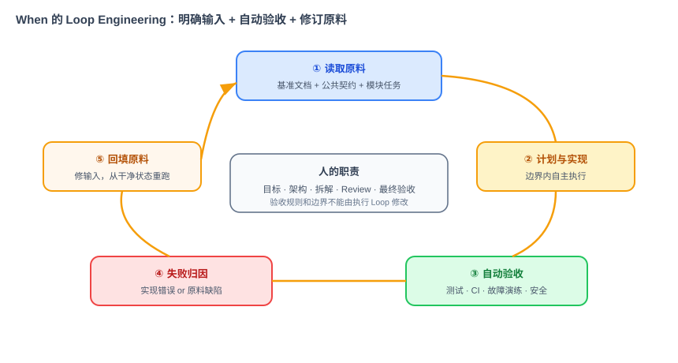
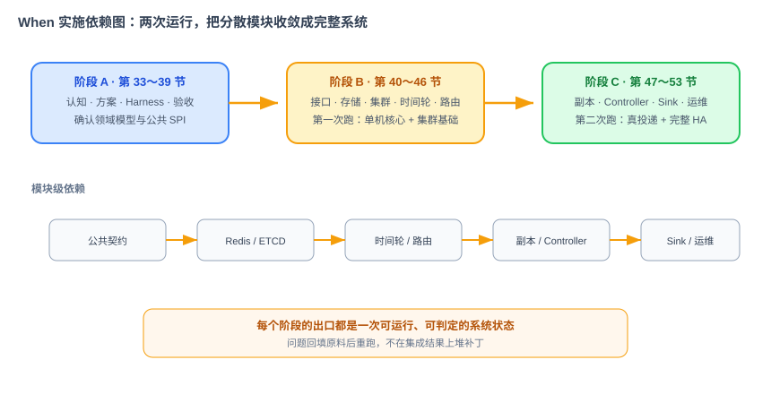

# When 项目 AI 编程实施指引

> 本文档定义如何用 AI 编程完成 When。它不重复需求和架构，而是把《When 项目需求文档》和《When 项目技术方案文档》转换成可被执行、验证和迭代的工作流。
>
> 核心方法：SDD 负责把目标说清楚，Harness 负责守住边界和验收，Loop Engineering 让 AI 按“实现—验证—修正”的顺序持续工作，直到验收通过。不是把整个项目一次性扔给 AI，而是把系统拆成契约稳定、可以独立验收并且有明确停止条件的部件。

## 1. 实施目标

三周内完成的不是代码生成演示，而是一条可复现的工程链路：

```text
业界调研 → 需求 → 技术方案 → 公共契约 → 模块原料
        → Loop 实现 → 自动验收 → 集成运行 → 回填原料 → 完整 HA 验收
```

AI 负责大部分代码、测试、配置和文档草稿；人负责产品边界、架构决策、任务拆解、风险判断、Review 和最终验收。AI 代码占比可以记录，但真正的完成标准只有可运行、可验证、可维护。

## 2. 三层输入

### 2.1 项目级基准文档

执行前固定四份文档：

1. 《项目篇 When：业界调研》：说明为什么做、替代方案和边界；
2. 《When 项目需求文档》：定义范围、用户故事和最终验收；
3. 《When 项目技术方案文档》：定义架构、领域模型、状态、数据和故障语义；
4. 本文档：定义如何拆分、执行、验证和回填。

遇到冲突时，先修改基准文档并人工确认，再运行 Loop。禁止让不同 Agent 各自猜测。

### 2.2 公共底座

所有模块共享且不能重复发明：

- `Message`、`MessageStatus`、`SinkType`、`SinkConfig`；
- `StoragePlugin`、`TimeWheel`、`Sink`、`Router` 等 SPI；
- `TimeWheelRegistry`、`ClusterView`、`DueMessageHandler` 等用于连接模块的接口；
- HTTP/gRPC 字段语义；
- Redis 与 ETCD Key 空间；
- 状态机、至少一次语义和 Master/Slave 硬约束；
- 根级构建、代码规范、安全红线和 CI 自动验收。

公共底座应先实现并完成 Review，确认无误后，后续模块只引用它，不复制接口。

### 2.3 模块原料卡

每个模块使用相同的十一段模板：

1. 这一节做什么；
2. 为什么这么设计；
3. 它和 Loop 的关系；
4. 依赖与被依赖；
5. 功能与交互；
6. 接口与契约；
7. 字段与规则；
8. 验收标准和必须有的测试；
9. 边界与停止条件；
10. 专属 Harness；
11. 交付物清单。

原料卡既是讲义，也是执行输入。缺少可判定验收或边界的原料，不允许进入实现 Loop。

## 3. Loop 模型



一次模块 Loop 的标准动作：

1. 读取项目基准文档、公共底座和本模块原料；
2. 只读检查依赖模块和现有测试；
3. 输出实施计划、影响文件和风险点；
4. 人确认关键架构判断；
5. 在隔离分支或 Worktree 实现；
6. 运行格式化、静态检查、单元和模块集成测试；
7. 对照验收清单自检；
8. 若失败，判断是实现错误还是原料缺陷；
9. 实现错误则在边界内修正；原料缺陷则停止并回填原料；
10. 全绿后提交变更、测试证据、未决风险和交接说明。

停止条件必须在运行前定义。测试全绿但越界实现，不算完成；功能看起来能跑但验收标准被降低，也不算完成。

## 4. Harness 设计

### 4.1 根级 Harness

根级规则至少包含：

- 技术栈、目录和依赖方向；
- 公共领域模型与契约位置；
- Redis、ETCD、状态机和集群不变量；
- 禁止记录 payload 和密钥；
- 禁止硬编码 endpoint、密码和节点 ID；
- 禁止业务层直接依赖插件实现；
- 每次改动必须运行的命令；
- 验收文件、基准和 CI 配置不可由执行 Agent 修改；
- 任何协议和公共 SPI 变更必须先暂停并请求人工 Review。

### 4.2 模块 Harness

模块 Harness 是根级规则的增量，例如：

- 时间轮：调度线程禁止同步 IO，Clock 必须可注入；
- 应用启动：具体客户端和实现只在 Composition Root 创建一次，启动与停机顺序必须可验证；
- Redis：禁止全局大 ZSet/Hash，创建消息与索引必须原子；
- 集群：Controller 决策幂等，Master/Slave 必须异节点；
- Sink：HTTP/Kafka 客户端必须复用，超时必须有界；
- 管理台：不显示 payload 和密钥，不直接写核心存储；
- 部署：Secret 不得进入仓库、镜像和日志。

### 4.3 外部验收

执行 Agent 够不着、也无权修改的自动验收包括：

- CI 工作流；
- 契约快照；
- 故障测试脚本；
- 安全与密钥扫描；
- 端到端验收脚本；
- 性能基线与允许阈值。

## 5. 实施顺序



### 阶段 A：认知、设计与自动验收（第 33～39 节）

完成分布式与集群化认知、技术评审、Loop 模型和自动验收体系。最后确认公共领域模型和 SPI。

退出条件：四份项目文档一致；公共契约无歧义；根 Harness 与第一批自动验收可以执行。

### 阶段 B：第一批原料与单机核心（第 40～46 节）

按依赖顺序实现：

1. HTTP/gRPC 契约与 Server 骨架；
2. `StoragePlugin` 与 Redis；
3. ETCD Key 空间与客户端；
4. 节点注册、心跳、选举和成员 Watch；
5. 多层时间轮；
6. 接入、发号、路由、状态机和跨节点转发；
7. 第一次整合运行。

第一次运行允许使用桩 Sink 和静态时间轮分布，只验收：提交→落库→入轮→到期→桩投递、查询/取消、重启恢复，以及三节点注册和唯一 Controller。

第一次运行的替身必须实现公共接口：单节点使用 `StaticClusterView`，到期测试使用 `TestDueMessageHandler + RecordingTestSink`；三节点切换为 `EtcdClusterView` 并预置静态时间轮元数据。替身集中放在测试支持模块，不得散落到生产实现中。根 `app` 模块是唯一 Composition Root，负责创建客户端、时间轮和 Server，并管理它们的生命周期。

### 阶段 C：完整 HA 与真实投递（第 47～53 节）

继续实现：

1. Master/Slave 异步同步、out-of-sync 和恢复执行；
2. Controller 故障决策与 Rebalance；
3. HTTP/Kafka Sink 和重试；
4. Metrics、结构化日志、OpenTelemetry Trace 和健康检查；
5. Admin API 与 Web 管理台；
6. Make/TGZ、只包含 When 的 Docker 镜像、只部署 When 的 Kubernetes 清单和 CI；
7. 通过 `./loop run --phase second` 完成第 47—52 节、完整 HA 验收、制品验证、部署/使用手册和交付报告。

第二次运行必须使用真实 Sink、动态时间轮分布和完整故障切换，不再允许桩。

## 6. 并行策略

可以并行的工作必须同时满足：公共契约已经确定、修改文件集合不重叠、验收可独立运行。

推荐并行组：

- Redis 实现与 ETCD 客户端；
- HTTP Sink 与 Kafka Sink；
- 可观测埋点规范与管理台前端骨架；
- 部署制品与不依赖实现细节的 CI 基础。

不建议并行：

- 公共模型与依赖它的模块；
- 时间轮和状态机尚未确定时的 Sink 集成；
- 副本执行器和 Controller 决策接口未约定时同时实现；
- 多个 Agent 在同一模块或同一配置文件中写入。

使用 Worktree 隔离每个并行任务，主分支只负责公共决策、集成顺序和冲突 Review。合并顺序遵循依赖图，不按谁先完成决定。

## 7. 推荐的 Agent 分工

大型阶段可以使用以下角色，而不是让所有 Agent 都自由编码：

| 角色 | 职责 | 禁止事项 |
|---|---|---|
| 架构守门 Agent | 检查契约、依赖方向和跨模块影响 | 不直接大规模实现 |
| 实现 Agent | 在单张原料卡边界内编码和写测试 | 不改公共协议和自动验收 |
| 测试 Agent | 补边界、集成和故障用例 | 不放宽验收阈值 |
| Review Agent | 查正确性、并发、资源和安全问题 | 不以风格意见替代证据 |
| 文档 Agent | 同步 API、部署和变更说明 | 不虚构未验证能力 |

关键架构决策仍由人拍板。Subagent 用来隔离上下文和并行探索，不是转移责任。

## 8. 每个模块的执行提示词骨架

```text
你要实现 When 的 <模块名>。

必须先完整阅读：
1. When 项目需求文档中的 <章节>
2. When 项目技术方案文档中的 <章节>
3. 公共底座与 SPI
4. 本模块原料卡
5. 根 Harness 和模块 Harness

先只读检查仓库，然后输出：
- 现状与缺口
- 实施计划
- 预计修改文件
- 依赖与风险

获得确认后实施。不得修改公共契约、自动验收、CI 阈值或本模块边界之外的代码。
完成后必须运行原料卡列出的全部测试，并按验收项逐条给证据。
若需求、契约和现有实现冲突，停止编码并报告，不自行选择一个版本。
```

提示词本身不是关键资产。真正稳定的资产是文档、契约、Harness、自动验收和可复现环境。

## 9. 两次整合运行

### 9.1 第一次运行：证明零件能拼起来

输入是第 40～45 节原料，目标是验证单机核心与集群基础。出现问题时，按归属回填：

- 契约或字段：公共底座/接口原料；
- Redis 恢复：存储原料；
- 精度或漂移：时间轮原料；
- 发号、路由和状态：接入路由原料；
- 注册、选举和 Watch：集群原料。

禁止在整合分支堆放临时补丁掩盖原料缺陷。

### 9.2 第二次运行：证明完整 HA

继续使用第 46 节建好的 Runner，执行 `./loop run --phase second`。Runner 先按独立课程分支完成第 47—52 节，再在已准备外部依赖的干净环境部署 3 个 When 节点，依次完成：

1. Submit、Query、Cancel；
2. HTTP 与 Kafka 真投递；
3. 管理台查看时间轮、消息和节点；
4. 100 条消息到期前杀 Master；
5. 验证 10 秒内接管、一条不丢、可接受重复；
6. 杀 Controller，验证重新选举和后续决策；
7. 汇总指标、日志、Trace、健康状态、管理台和测试报告；
8. 验证 `make release` TGZ、只包含 When 的镜像和只部署 When 的 Kubernetes 清单；
9. 校准 `DEPLOY.md`，生成 `USER_GUIDE.md`、集成测试报告、部署验证报告和发布报告。

问题归属到第 47～52 节对应责任阶段，Runner 使该阶段和下游状态失效后继续；已经完成且指纹未变的上游课程不重跑。

## 10. Review 清单

### 正确性

- Redis 成功之前是否可能返回成功或进入时间轮；
- 到期触发是否错误删除了仍需重试/恢复的消息事实；
- 状态转换是否原子；
- Master/Slave 是否可能落在同一节点；
- 角色切换是否有 epoch/fencing，旧 Master 是否可能继续写；
- Controller 决策是否幂等可重放；
- 至少一次语义和下游幂等是否贯穿接口、实现和文档。

### 并发与资源

- 调度线程是否包含阻塞 IO；
- HTTP/Kafka/Redis/gRPC 客户端是否复用；
- 队列、线程池、连接池和响应体是否有上限；
- 停机是否能先摘流量、再交接、最后释放资源。

### 安全

- payload、密码、Token 是否进入日志、指标或管理 API；
- 配置和部署文件是否出现明文密钥；
- 管理 API 是否被误当作可直接暴露公网；
- URL 类 Sink 是否考虑 SSRF 边界，生产环境是否需要目标白名单。

### 可验证性

- Clock、网络、存储和故障是否可注入；
- 测试是否断言行为而不是实现细节；
- 故障测试结果是否有机器可判定的阈值；
- 部署文档是否在干净环境真实走过。

## 11. 完成定义

单个模块完成必须同时满足：

- 原料卡交付物齐全；
- 单元、契约和模块集成测试全绿；
- 无越界修改；
- 人工 Review 完成；
- 文档与实现同步；
- 变更可被后续模块直接消费。

项目完成必须满足《When 项目需求文档》第 10 章的全部最终验收，并保留：运行命令、版本、测试报告、指标截图或导出、故障时间线、回填记录和未解决风险。

## 12. 课程与社区交接

训练营结束时，不只交代码，还应交付一套可继续生长的工程资产：

- 四份项目文档；
- 公共底座和模块原料卡；
- 根 Harness 与各模块 Harness；
- 两次 Loop 运行记录；
- 测试、故障注入和 CI 自动验收；
- 部署与演示手册；
- 按依赖和难度整理的 Good First Issues。

社区增量遵循同一流程：先写 delta spec，补充自动验收，再实现和 Review。不能因为项目进入社区阶段就退回“直接让 AI 改代码”的协作方式。
