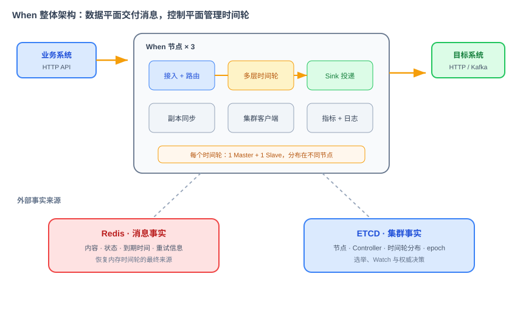
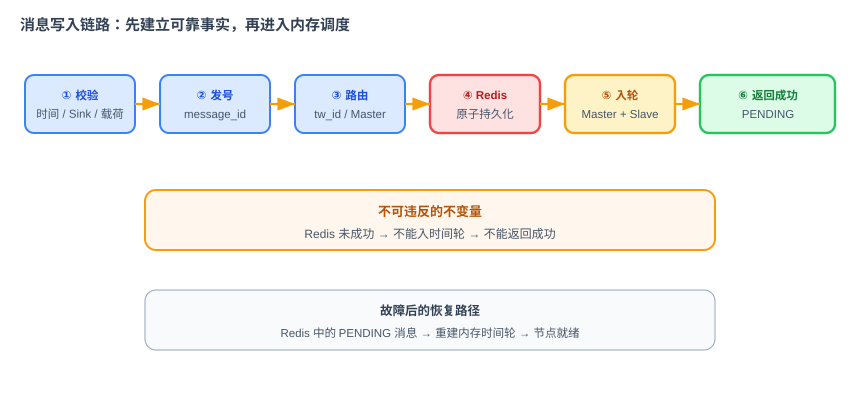
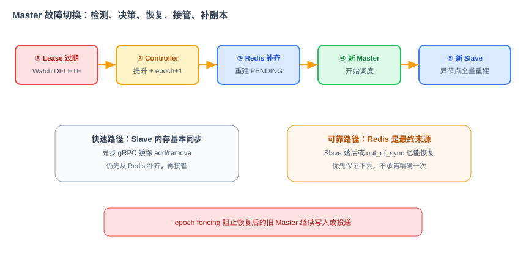

# When 项目技术方案文档

> 本文档承接《When 项目需求文档》，回答 How。方案以训练营第 39～53 节的完整 HA 规格为基线，并把分散在各节的领域模型、契约、状态、存储、集群、故障恢复、投递、可观测和部署统一成一套可实施设计。
>
> 当前代码尚未实现。本文档是后续 Spec、编码和验收采用的技术基准；模块实施时不得另起一套字段、状态或存储约定。

## 1. 方案摘要

When 采用 Java 实现，外部提供 HTTP，节点内部使用 gRPC；Redis 保存消息事实，ETCD 保存集群元数据；每个节点运行多个内存多层时间轮；每个时间轮由 1 Master + 1 Slave 承载；唯一 Controller 根据节点事件分配、切换和均衡时间轮；消息到期后由插件化 Sink 投递到 HTTP 或 Kafka。

六个核心决策：

1. ETCD 负责集群协调，不保存业务消息；
2. Redis 负责消息事实，不参与 Controller 选举；
3. 多层时间轮负责内存调度，不作为可靠性来源；
4. Master/Slave 提供快速热备，Redis 提供最终恢复来源；
5. 外部 HTTP 降低接入门槛，内部 gRPC 提供强类型高频通信；
6. Java 适配企业技术栈，并使用成熟的并发、gRPC、Redis、ETCD 和可观测生态。

## 2. 整体架构



### 2.1 数据平面

数据平面处理每条延时消息：接入、校验、发号、路由、持久化、入轮、到期、投递和状态更新。

### 2.2 控制平面

控制平面管理节点和时间轮：节点注册、Lease 心跳、Controller 选举、成员 Watch、时间轮分配、故障切换和 rebalance。

### 2.3 两类事实来源

| 数据 | 权威来源 | 内存中的作用 |
|---|---|---|
| 消息内容、状态、到期时间、重试信息 | Redis | 时间轮仅保存调度引用 |
| 节点、Controller、时间轮分布、同步状态 | ETCD | 各节点缓存集群视图 |

这条边界不可打破：Redis 不选主，ETCD 不存 payload，内存不承担“已确认消息”的最终可靠性。

## 3. 领域模型与公共契约

### 3.1 Message

```java
public record Message(
    String messageId,
    long createdAt,
    long deliverAt,
    String timeWheelId,
    SinkType sinkType,
    SinkConfig sinkConfig,
    byte[] payload,
    String businessTag,
    MessageStatus status,
    int retryCount,
    long nextAttemptAt,
    long deliveredAt,
    String lastError,
    String traceId
) {}
```

约束：

- `messageId` 全局唯一，由 Snowflake 生成；
- `deliverAt`、`createdAt` 等统一为 Unix 毫秒；
- `payload` 解码后不超过 64KB；
- `sinkConfig` 使用强类型 `oneof`，不得使用无约束 Map；
- `traceId` 从入口产生，跨节点转发时原样透传。

### 3.2 状态机

```text
PENDING ──到期占有权──> DELIVERING ──成功──> DELIVERED
   │                         │
   │取消                     ├─可重试失败──> PENDING(nextAttemptAt)
   ▼                         └─重试耗尽────> FAILED
CANCELLED
```

只有以下流转合法：

- `PENDING → CANCELLED`
- `PENDING → DELIVERING`
- `DELIVERING → DELIVERED`
- `DELIVERING → PENDING`（安排重试）
- `DELIVERING → FAILED`

状态更新使用原子条件写，避免两个节点同时获得投递权。至少一次语义允许故障窗口重复，但不能允许正常路径并发双投。

### 3.3 SPI

```java
public interface StoragePlugin {
    void create(Message message);
    Optional<Message> get(String messageId);
    boolean transition(String messageId, MessageStatus from, MessageStatus to, MessagePatch patch);
    List<Message> loadPendingByTimeWheel(String timeWheelId);
    void removeScheduleIndex(String messageId);
}

public interface TimeWheel {
    String id();
    void add(Message message);
    void remove(String messageId);
    void start();
    void stop();
}

public interface Sink {
    SinkType type();
    void validate(SinkConfig config);
    DeliveryResult deliver(Message message);
}

public interface Router {
    String routeToTimeWheel(String messageId);
}

public interface TimeWheelRegistry {
    TimeWheel require(String timeWheelId);
    Collection<TimeWheel> all();
}

public interface ClusterView {
    Optional<NodeEndpoint> masterOf(String timeWheelId);
}

public record NodeEndpoint(String nodeId, String host, int grpcPort) {}

public interface DueMessageHandler {
    void onDue(String messageId);
}
```

公共契约先于各模块实现定稿。实现只能依赖 SPI，禁止跨层直接调用具体 Redis、ETCD、HTTP 或 Kafka 实现。时间轮到期时只异步调用 `DueMessageHandler`；获取投递权、调用 Sink 和更新状态不在调度线程中执行。`TimeWheelRegistry` 与 `ClusterView` 分别隔离本地时间轮查找和远端 Master 定位，由应用启动时注入具体实现。

## 4. 接口设计

### 4.1 外部 HTTP API

```text
POST   /api/v1/messages
GET    /api/v1/messages/{message_id}
DELETE /api/v1/messages/{message_id}
```

提交请求示例：

```json
{
  "delay_seconds": 30,
  "sink_type": "HTTP",
  "sink_config": {
    "url": "https://example.internal/callback",
    "method": "POST"
  },
  "payload": "base64...",
  "business_tag": "order-timeout"
}
```

HTTP 层只做协议映射、基础校验和错误码转换，业务编排统一进入 `IngressHandler`。

### 4.2 内部 gRPC

内部契约包括两组服务：

- `WhenInternalService`：跨节点 Submit、Query、Cancel 转发；
- `ReplicaService`：时间轮 `add/remove` 的异步副本同步、重建与状态确认。

所有 proto 的枚举、字段语义与公共领域模型保持一致。禁止 HTTP 层和 gRPC 层分别实现发号、路由和状态机。

### 4.3 管理 API

```text
GET    /admin/v1/timewheels
POST   /admin/v1/timewheels
GET    /admin/v1/messages
GET    /admin/v1/messages/{id}
GET    /admin/cluster/nodes
GET    /metrics
GET    /health
GET    /ready
```

管理 API 是已有领域服务的薄壳，不直接修改 ETCD 或 Redis。MVP 无鉴权，只允许可信内网部署。

## 5. 写入、查询与取消



### 5.1 Submit

1. 校验时间、payload 和 SinkConfig；
2. 生成 `message_id` 与 `trace_id`；
3. 通过一致性 Hash 选择 `tw_id`；
4. 从集群视图查找该时间轮 Master；
5. 若 Master 不在本机，通过内部 gRPC 转发；
6. Master 在 Redis 原子创建 `PENDING` 消息和调度索引；
7. Redis 成功后，把消息加入本地时间轮；
8. 异步同步 `add` 给 Slave；
9. 返回 `message_id` 和 `PENDING`。

核心不变量：**Redis 未成功，不能入轮，不能返回成功。**

### 5.2 Query

任意节点都可以根据 `message_id` 直接读取 Redis 中的消息事实并返回，不需要把只读查询转发到 Master。这样不会因为时间轮数量变化导致一致性 Hash 环变化而查错位置。

### 5.3 Cancel

1. 从 Redis 读取消息中持久化的 `tw_id`，再定位当前 Master；
2. 原子执行 `PENDING → CANCELLED`；
3. 从 Master 时间轮移除并移除调度索引；
4. 异步同步 remove 给 Slave；
5. 保留不含敏感载荷的状态记录至审计保留期。

如果状态已经不是 `PENDING`，取消失败并返回当前状态。

## 6. Redis 存储设计

### 6.1 Key 结构

```text
when:msg:{message_id}                         HASH/JSON，消息事实
when:tw:{tw_id}:idx:{message_id}              STRING，deliver_at/next_attempt_at
when:tw:{tw_id}:slot:{slot_key}:{shard}       SET，可选的恢复加速索引
```

设计原则：

- 每条消息一个小 Key；
- 禁止全局大 ZSet 或大 Hash；
- 可选槽位集合必须分片，并设置容量上限；
- `loadPendingByTimeWheel` 只返回 `PENDING` 消息；
- Key 带 TTL 兜底，但不能依赖 TTL 完成正常状态流转。

### 6.2 保留策略

旧材料中“到期后立即删除 Redis”会与重试、查询和故障恢复冲突。统一后的规则是：

- 到期触发只移除当前调度索引，不删除消息事实；
- 可重试失败更新 `next_attempt_at` 并创建新的调度索引；
- `DELIVERED`、`CANCELLED` 默认保留 7 天状态记录，payload 可提前清空；
- `FAILED` 默认保留 7 天或由运维配置，以便排查；
- 后台清理器按状态和保留期删除最终记录。

### 6.3 原子性

创建消息与创建调度索引必须在同一原子操作中完成，可使用 Lua 或 Redis Transaction。状态转换使用 compare-and-set 语义。任何跨 Redis 与内存的操作都以 Redis 为先，内存失败可通过恢复扫描补齐。

## 7. 多层时间轮

默认四层：

| 层级 | 槽数 × 粒度 | 覆盖范围 |
|---|---|---|
| L1 | 60 × 1 秒 | 60 秒 |
| L2 | 60 × 1 分钟 | 60 分钟 |
| L3 | 24 × 1 小时 | 24 小时 |
| L4 | 30 × 1 天 | 30 天 |

`add` 根据目标时间与当前时间差计算层和槽；上层指针到点时把消息降级到下一层，最终在 L1 触发。

调度线程必须遵守：

- 槽操作和索引操作目标为 `O(1)`；
- 使用可注入 Clock，测试不依赖真实等待；
- 使用目标时刻补偿推进，不能简单固定 sleep 累积漂移；
- 调度线程只移动引用并异步调用 `DueMessageHandler`，不执行 Redis、gRPC 或 Sink 的同步 IO；
- 同一槽内不承诺业务顺序。

节点启动或角色提升时，从 Redis 加载该 `tw_id` 的待投递消息，重建内存时间轮后才能进入就绪状态。

## 8. ETCD 与集群成员

### 8.1 Key 空间

```text
/when/nodes/{node_id}             节点信息，Lease 默认 6s
/when/workers/{worker_id}         Snowflake worker ID 占用关系，与节点使用同一 Lease
/when/controller                  当前 Controller，Lease 默认 6s
/when/timewheels/{tw_id}          时间轮分布，持久化
/when/config/*                    集群配置，持久化
```

节点信息包含 `node_id`、IP、gRPC/HTTP 端口、启动时间和负载。节点注册时用一个事务同时占用 node ID 和 0—1023 范围内的 worker ID，任一冲突都拒绝启动。节点、worker ID 与 Controller Key 随 Lease 过期自动删除；时间轮和配置不能绑定临时 Lease。

### 8.2 节点生命周期

节点启动后：连接 ETCD → 用同一个 Lease 原子注册 node ID 和 worker ID → 独立线程每 2 秒续约 → Watch 成员和时间轮前缀 → 参与 Controller 选举 → 加载自己承载的时间轮。Lease 默认 6 秒，可配置但必须满足故障切换 SLO。

续约线程必须与业务线程隔离。主动停机先标记不接收新流量，再注销 Lease 并完成时间轮交接。

### 8.3 Controller 选举

所有节点通过 ETCD Transaction 竞争 `/when/controller`。获胜节点续约并运行 Controller 事件循环；失败节点只 Watch。Controller Key 消失后重新竞争。

## 9. 副本同步与故障切换



### 9.1 副本模型

每个时间轮固定 1 Master + 1 Slave，必须位于不同节点：

- Master 接受写入、运行调度、执行投递；
- Slave 通过 gRPC 异步镜像 `add/remove`，但不投递；
- Redis 是二者共同的最终恢复来源。

异步同步降低写入延迟，但意味着 Slave 可能短暂落后。同步失败时不阻塞 Master，而是把 `sync_state` 标为 `out_of_sync`，随后由 Controller 触发从 Redis 全量重建。

### 9.2 时间轮元数据

```json
{
  "master": "node-1",
  "slave": "node-2",
  "status": "running",
  "sync_state": "in_sync",
  "epoch": 17
}
```

在课程原料的基础上增加 `epoch`。每次角色变更递增 epoch，旧 Master 的请求因 epoch 过期而被拒绝，降低网络分区或暂停恢复造成双 Master 的风险。

### 9.3 故障切换

1. ETCD Lease 到期，Watch 收到节点 DELETE；
2. Controller 找出受影响时间轮；
3. Controller 原子更新元数据：提升原 Slave、递增 epoch、状态置为 `switching`；
4. 新 Master 从 Redis 补齐 `PENDING` 消息；
5. 重建完成后开始调度，状态置 `running`；
6. Controller 在其他健康节点分配新 Slave并触发重建。

目标是从节点故障发生到新 Master 开始调度不超过 10 秒。默认 Lease 为 6 秒、每 2 秒续约，为角色更新、Redis 补齐和启动调度预留约 4 秒；最终必须通过故障测试验证，不能只根据配置推算。

### 9.4 至少一次语义

节点可能在 Sink 已成功但 `DELIVERED` 状态尚未写回时故障，新 Master 会再次投递。因此系统保证至少一次而不是精确一次。所有 Sink 请求携带 `message_id` 作为幂等键；下游承担最终去重责任。

## 10. Controller 与 Rebalance

Controller 处理五类事件：上任加载、节点加入、节点离开、Slave out-of-sync、周期负载检查，以及管理台创建时间轮请求。

Rebalance 原则：

- 所有决策是纯计算，执行与决策分离；
- 目标是各节点承载副本数差不超过 1；
- 优先迁移 Slave，尽量不移动 Master；
- 每次渐进迁移，避免扩容引发大规模抖动；
- 每个动作携带操作 ID 和期望 epoch，支持幂等重放；
- 任何计划都必须满足 1M+1S 和异节点约束。

Controller 只通过更新 ETCD 权威元数据发布决策。新 Controller 可以加载已有状态继续执行，不依赖前任的内存。

## 11. Sink 与重试

### 11.1 插件加载

Sink 通过 Java SPI 加载，启动时形成 `SinkType → Sink` 注册表。新增 Sink 只需实现 `validate` 和 `deliver`，并在 `META-INF/services` 注册，不修改核心调度代码。

### 11.2 HTTP Sink

- 支持配置 URL、方法和非敏感 Header；
- 自动添加 `X-When-Message-Id`；
- 2xx 成功；
- 4xx 默认不可重试；
- 5xx、连接异常和超时可重试；
- 必须限制连接、请求和响应体大小，禁止无限等待。

### 11.3 Kafka Sink

- 配置 bootstrap servers、topic 和可选 key；
- Producer 按配置池化复用，不允许每条消息创建；
- `message_id` 写入 Header，并可作为默认 key；
- Broker 或客户端异常标记为可重试。

### 11.4 重试

默认最多 5 次：30 秒、1 分钟、2 分钟、4 分钟、8 分钟，单次上限可配置为 30 分钟。失败后执行：

1. 写入 `last_error` 和 `retry_count`；
2. 若可重试且未耗尽，原子执行 `DELIVERING → PENDING`，设置 `next_attempt_at` 并重新入轮；
3. 否则执行 `DELIVERING → FAILED`。

## 12. 可观测性

核心指标：

| 指标 | 类型 | 主要标签 |
|---|---|---|
| `when_messages_submitted_total` | Counter | sink_type |
| `when_sink_deliveries_total` | Counter | sink_type,result |
| `when_messages_in_state` | Gauge | state |
| `when_delivery_lag_seconds` | Histogram | sink_type |
| `when_sink_delivery_duration_seconds` | Histogram | sink_type |
| `when_master_failover_total` | Counter | result,reason |
| `when_controller_elections_total` | Counter | result |
| `when_replica_sync_queue_size` | Gauge | node_id |
| `when_replica_rebuild_total` | Counter | result |
| `when_redis_operations_total` | Counter | operation,status |
| `when_etcd_operations_total` | Counter | operation,status |

`message_id`、`trace_id`、`tw_id`、URL、topic 和异常文本不能作为指标标签；具体对象信息写入日志。失败率由 `when_sink_deliveries_total` 在 Prometheus 中计算，不由应用维护单独的 Gauge。

日志统一输出 timestamp、level、node_id、trace_id、message_id、tw_id、operation、status、duration_ms 和 error_code，不输出 payload 与敏感配置。

`/health` 只表示进程活着；`/ready` 要求初始化完成、ETCD 和 Redis 可用、节点注册有效、本地承担的角色已经恢复，且入口能够安全接收流量。没有分配到时间轮但可以正常转发的节点仍可就绪。

## 13. 管理台

后端 `admin API` 只做聚合与映射；Vue 3 + Element Plus 前端构建为独立静态文件。核心页面包括时间轮、消息、投递详情和集群节点。

消息列表使用按小时、固定分片和固定容量拆分的管理查询索引，按 `deliver_at` 范围读取候选消息，再按状态和标签过滤。API 使用不透明游标，默认查询最近 24 小时、最大 7 天、每页最多 100 条。禁止 Redis `KEYS` 和无边界 `SCAN`。管理索引不参与提交、调度和恢复，写入失败由后台任务修复。

## 14. 部署

### 14.1 Make 与 TGZ

根目录 Makefile 统一构建入口。`make release` 完成测试和打包，生成可解压启动的 `when-server-{version}.tgz`、独立管理台静态包、校验和与 SBOM。服务端 TGZ 只包含 When 的启动脚本、Jar、示例配置和许可证，不包含 Redis、ETCD、Kafka 或观测后端。

传统主机解压 TGZ，通过同一套配置连接外部 Redis、ETCD 和按需使用的 Kafka、OTLP Collector。`bin/when run` 前台运行，`start/stop/status` 只管理当前 When 进程。

### 14.2 Docker

Docker 镜像只包含 JRE 和 When Server，以非 root 用户运行。Redis、ETCD、Kafka 和观测服务的地址通过环境变量或只读配置文件注入；依赖不可用时 `/ready` 返回 503，应用保持有界重连。镜像不包含依赖服务的二进制、数据或启动脚本。

### 14.3 Kubernetes

Kubernetes 清单只部署 When：StatefulSet、Headless Service、业务 Service、管理 Service、ConfigMap、Secret 引用、startup/readiness/liveness、PDB 与安全上下文。Pod 名作为稳定 node ID，Snowflake 使用独立的数字 worker ID，滚动升级至少保留 2 个可用节点。

清单不得创建 Redis、ETCD、Kafka、HTTP Mock、Prometheus、Loki、Tempo、Grafana 或 OpenTelemetry Collector。部署方连接组织已有集群、托管服务或平台提供的实例，When 项目只定义连接配置和健康要求。

统一环境变量：

```text
WHEN_NODE_ID
WHEN_WORKER_ID
WHEN_GRPC_PORT
WHEN_HTTP_PORT
WHEN_ETCD_ENDPOINTS
WHEN_REDIS_HOST
WHEN_REDIS_PORT
WHEN_REDIS_PASSWORD
WHEN_KAFKA_BOOTSTRAP_SERVERS
OTEL_EXPORTER_OTLP_ENDPOINT
WHEN_TIMEWHEEL_COUNT
WHEN_LOG_LEVEL
WHEN_LOG_FORMAT
```

## 15. 测试与验证

测试分五层：

1. 单元：槽位计算、状态机、路由、Rebalance 纯计算；
2. 契约：proto、HTTP Schema、SPI 兼容性；
3. 集成：Redis/ETCD/Kafka/HTTP Mock 的真实交互；
4. 端到端：提交、查询、取消、到期投递、重试、恢复；
5. 故障测试：停止 Master、停止 Controller、阻断副本同步、让依赖短暂不可用。

CI 顺序：构建 → 单元/契约 → 集成 → 端到端 → 故障测试 → 安全与密钥扫描。验收规则和阈值由 Harness 管理，执行 Loop 无权修改。

## 16. 模块边界

建议按以下逻辑模块组织，物理 Maven 模块可在初始化阶段合并，但依赖方向不能改变：

| 模块 | 职责 |
|---|---|
| common | Message、枚举、公共 SPI、proto |
| api | HTTP/gRPC 传输与映射 |
| ingress-router | 校验、发号、状态机和路由编排 |
| storage-spi / storage-redis | 消息事实与恢复索引 |
| timewheel | 多层时间轮与调度循环 |
| cluster | ETCD、成员、选举、Controller、Rebalance |
| replication | 副本同步、重建与切换执行 |
| sink-spi / sink-http / sink-kafka | 投递与重试 |
| observability | 指标、日志、健康检查 |
| admin-api / admin-web | 运维 API 和管理台 |
| app | 依赖初始化、启动与配置 |

训练营第一次整合运行可以额外包含 `test-support` 与 `acceptance` 模块，提供静态集群视图、成功型测试 Sink 和黑盒验收；它们不得进入生产运行时，真实投递由 Sink 模块替换。

业务核心依赖接口，不依赖插件实现；控制面不直接操作 Sink；管理台不承载业务规则。

## 17. 关键风险

| 风险 | 处理 |
|---|---|
| 旧 Master 恢复造成双主 | epoch fencing + ETCD 条件更新 |
| 到期即删 Redis 导致丢失 | 投递完成前保留消息事实，调度索引与事实分离 |
| 管理台扫描影响主链路 | 限制时间范围/分页，后续独立查询索引 |
| Lease 检测与 10 秒总切换预算过紧 | 默认 6 秒 TTL / 2 秒续租，通过故障测试验证并按结果调整 |
| Slave 异步同步落后 | out-of-sync 标记 + Redis 全量重建 |
| Sink 成功后状态写回失败 | 至少一次 + message_id 幂等 |
| 一致性 Hash 环变化导致重映射 | 时间轮 ID 稳定，Controller 管副本迁移，路由不直接 Hash 节点 |

## 18. 演进方向

鉴权、多租户、限流、死信队列、优先级、更多 Sink、完整投递历史、跨地域、Operator 和 MCP Server 均在稳定 MVP 之后推进。演进不得破坏公共领域模型、至少一次语义和两类事实来源的边界。
