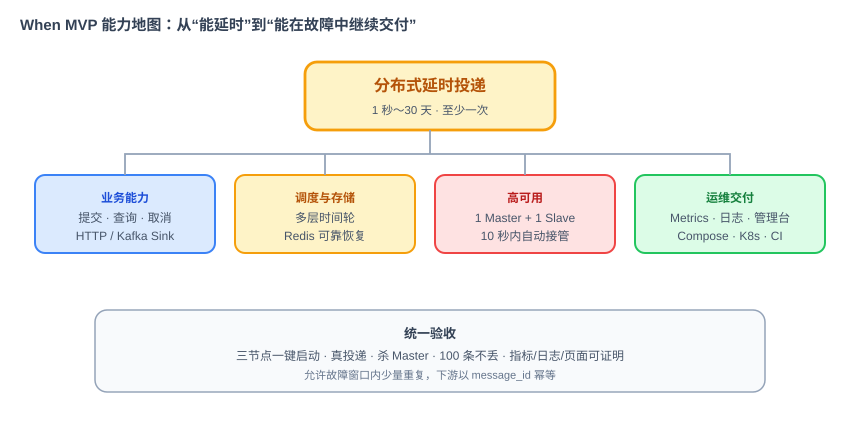
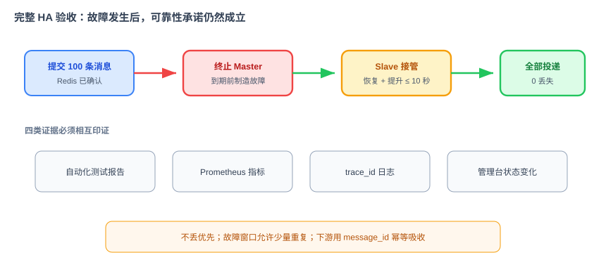

# When 项目需求文档

> 本文档定义 When 的功能需求、非功能需求、范围和验收标准，回答 What，不回答 How。领域依据见《项目篇 When：业界调研》，技术实现见《When 项目技术方案文档》，AI 研发方式见《When 项目 AI 编程实施指引》。
>
> 当前基线：训练营第 39～53 节形成的完整 HA 规格。代码尚未实现，因此本文档中的“交付”均表示目标与验收口径，而不是已上线能力。

## 1. 项目概述

### 1.1 产品定义

When 是一个可私有部署的分布式延时投递组件。业务方提交一条消息，指定到期时间和目标 Sink；When 可靠保存消息，在指定时间触发，并把消息投递到 HTTP 或 Kafka。

它解决的是“数据在未来某个时刻被可靠交付”，不是执行任意业务代码，也不是消息队列、Cron 平台或工作流引擎。

### 1.2 双重目标

When 同时承担产品目标和教学目标：

- 产品目标：交付一个可部署、可运维、具备基本高可用能力的延时投递组件；
- 教学目标：作为 Loop Engineering 的真实样本，展示如何把需求、技术方案、模块规格、Harness 和自动验收组织成可重复运行的 AI 编程循环。

产品正确性优先于教学展示。任何为了演示 AI 编程而降低可靠性或跳过验证的做法都不被接受。

### 1.3 目标用户

- 需要订单关闭、权益到期、延时通知等能力的业务研发团队；
- 希望统一治理延时需求的平台或基础架构团队；
- 需要私有部署、跨语言接入和异构下游的企业；
- 学习用 AI 构建分布式基础设施的训练营学员与社区贡献者。

## 2. 术语

| 术语 | 定义 |
|---|---|
| 延时消息 | 包含载荷、到期时间和目标 Sink 的待投递数据 |
| 投递 | 到期后把消息发送到目标系统的动作 |
| Sink | 投递目标的抽象；MVP 支持 HTTP、Kafka |
| 时间轮 | 在内存中管理到期触发的数据结构 |
| 时间轮实例 | 集群中的调度与分片单元，拥有唯一 `tw_id` |
| 节点 | 一个独立运行的 When 服务进程 |
| Master / Slave | 同一时间轮的主副本；Master 调度投递，Slave 热备 |
| Controller | 由集群选举出的唯一决策者，负责分配、切换和均衡 |
| 至少一次 | 消息不会因故障丢失，但极端情况下可能重复投递 |
| Harness | 不允许 AI 修改的规则、测试、门禁和运行环境 |

## 3. 范围

### 3.1 MVP 必须交付

1. 延时消息提交、查询和取消；
2. 1 秒至 30 天的延时范围；
3. HTTP 和 Kafka 两种 Sink；
4. 三节点集群运行；
5. 每个时间轮 1 Master + 1 Slave；
6. Controller 自动选举、节点上下线感知；
7. Master 故障后 10 秒内完成接管；
8. Redis 持久化，节点重启与切换后消息不丢；
9. 至少一次投递与统一重试；
10. Prometheus 指标、结构化日志、健康检查；
11. Web 管理台；
12. docker-compose、单机生产和 Kubernetes 三种部署资料；
13. CI 中的单元、集成、故障和安全检查。

### 3.2 MVP 明确不做

- 不做精确一次投递；下游必须按 `message_id` 幂等；
- 不做任意代码执行、DAG、Cron 和工作流编排；
- 不做消息消费组、保序消费和完整 MQ 能力；
- 不做多租户、SSO、精细权限、调用方限流；
- 不做死信队列、优先级队列和完整投递历史；
- 不做跨地域容灾；
- 不做 Kubernetes Operator；
- 不负责 Redis、ETCD、Kafka 自身的生产级高可用；
- 不在 MVP 中提供 gRPC、RocketMQ、NATS 等其他 Sink。

## 4. 核心用户故事

### US-1：提交延时消息

作为业务开发者，我希望通过统一接口提交一条延时消息并立即得到全局唯一 ID，以便业务系统不再自行维护定时扫描逻辑。

验收标准：

- 可用绝对时间 `deliver_at` 或相对时间 `delay_seconds` 指定到期时间，二者必须且只能提供一个；
- 延时范围为 1 秒至 30 天；
- `payload` 解码后不超过 64KB；
- HTTP 与 Kafka 的 Sink 配置必须强类型校验；
- 只有消息成功持久化后才能返回成功；
- 成功响应包含全局唯一 `message_id` 和 `PENDING` 状态；
- 参数非法或持久化失败时，不得把消息留在内存调度结构中。

### US-2：查询消息状态

作为业务开发者，我希望通过 `message_id` 查询消息状态和关键时间，以便诊断业务流程。

状态集合为：

- `PENDING`：等待到期；
- `DELIVERING`：正在投递；
- `DELIVERED`：投递成功；
- `FAILED`：重试耗尽；
- `CANCELLED`：投递前已取消。

查询至少返回 `message_id`、状态、创建时间、到期时间、实际投递时间、重试次数和最近错误。不得返回载荷原文或 Sink 中的敏感配置。

### US-3：取消待投递消息

作为业务开发者，我希望取消仍处于等待状态的消息，以便业务状态变化时阻止无效投递。

只有 `PENDING` 状态允许取消。取消成功后，消息不得再被触发；`DELIVERING`、`DELIVERED`、`FAILED` 或已取消消息不得被当作首次取消成功处理。

### US-4：可靠到期投递

作为业务开发者，我希望消息在指定时间附近被发送到目标系统，并在临时故障时自动重试。

验收标准：

- 默认调度精度为秒级；
- 正常负载下，到期触发误差应控制在 ±1 秒；
- HTTP 2xx 视为成功，4xx 默认不可重试，5xx、超时和网络异常可重试；
- Kafka 成功写入目标 Topic 视为成功，客户端异常可重试；
- 默认最多重试 5 次，采用指数退避；
- 重试耗尽进入 `FAILED`，消息保留用于排查；
- 交付语义为至少一次，响应中必须暴露 `message_id` 供下游幂等。

### US-5：集群和自动故障恢复

作为平台运维人员，我希望 When 节点能自动组成集群，并在节点故障时自动恢复服务。

验收标准：

- 默认用 3 个 When 节点组成集群；
- 集群任一时刻只能有一个 Controller；
- 每个时间轮拥有 1 Master + 1 Slave，且必须分布在不同节点；
- 节点停止续约后，其他节点应在 6 秒左右感知；
- Master 故障后，Slave 应在 10 秒内完成提升、恢复并开始调度；
- 已确认提交的消息一条不丢；
- 新节点加入后，时间轮副本应渐进迁移，最终各节点副本数差不超过 1；
- Controller 故障后，新 Controller 能从持久化元数据继续决策，不重不漏。

### US-6：运维与管理

作为运维人员，我希望通过标准指标、日志、健康检查和管理台观察系统状态。

必须支持：

- 查看节点、Controller、时间轮及 Master/Slave 分布；
- 创建时间轮；
- 按状态、业务标签和时间范围筛选消息；
- 查看消息详情、重试次数和最近错误；
- Prometheus `/metrics`；
- `/health` 存活检查与 `/ready` 就绪检查；
- 结构化日志通过 `trace_id` 串联接入、路由、存储、调度和投递链路。

## 5. 接口需求

### 5.1 业务接口

MVP 对业务方提供 HTTP 门面，同时保留内部 gRPC 契约。业务语义统一为：

| 操作 | 语义 |
|---|---|
| Submit | 提交消息，返回 `message_id` 和 `PENDING` |
| Query | 查询状态和时间信息 |
| Cancel | 取消仍处于 `PENDING` 的消息 |

### 5.2 提交字段

| 字段 | 必填 | 约束 |
|---|---:|---|
| `deliver_at` | 二选一 | Unix 毫秒，必须晚于当前时间 |
| `delay_seconds` | 二选一 | 1～2,592,000 秒 |
| `sink_type` | 是 | `HTTP` 或 `KAFKA` |
| `sink_config` | 是 | 与 Sink 类型匹配的强类型配置 |
| `payload` | 否 | 解码后 ≤ 64KB |
| `business_tag` | 否 | 用于检索和归类 |

### 5.3 管理接口

MVP 至少提供：时间轮列表与创建、消息列表与详情、消息取消、集群节点列表。管理接口当前不含鉴权，因此只能部署在可信内网；公网暴露不属于 MVP 支持范围。

## 6. 可靠性与一致性需求

### 6.1 消息事实

- 已成功响应的消息必须已经落入持久化存储；
- 内存时间轮不是事实来源，节点启动和故障切换必须能从持久化数据重建；
- 正常投递成功后可以删除消息主体；失败消息需保留排查窗口；
- Redis 中每条消息应使用独立小 Key，禁止把全部消息聚合到单个大 ZSet 或大 Hash。

### 6.2 集群事实

- 节点在线状态、Controller 和时间轮分布必须有统一权威来源；
- Controller 的决策必须幂等、可重放；
- 集群元数据不能存放消息载荷；
- Master/Slave 异节点是不可违反的硬约束。

### 6.3 故障语义

系统优先保证不丢，允许在故障窗口内产生少量重复。调用方必须以 `message_id` 做幂等去重。When 不承诺跨系统的精确一次语义。

## 7. 非功能需求

### 7.1 性能

以下是 MVP 的验收基线，不代表最终容量上限：

- 支持秒级触发精度；
- 单条消息最大 64KB；
- 时间轮的增加和取消操作目标复杂度为 `O(1)`；
- 调度循环中不得执行同步网络或磁盘 IO；
- HTTP/Kafka 投递和持久化清理必须与调度线程隔离；
- 具体吞吐量和积压容量以基准测试结果发布，文档不在无代码阶段虚构数字。

### 7.2 可用性

- When 三节点部署时允许任一 When 节点故障；
- Master 故障到新 Master 接管不超过 10 秒；
- Controller 必须可重新选举；
- 外部依赖不可用时 `/ready` 返回非就绪，避免继续接收新流量。

### 7.3 安全

- 密钥只通过环境变量或 Secret 注入；
- 日志、管理 API 和指标不得暴露 `payload` 原文及 Sink 密钥；
- CORS 必须使用白名单，禁止生产环境 `*`；
- 配置、镜像和仓库中不得包含明文密钥；
- MVP 无鉴权，必须明确限定为可信内网部署。

### 7.4 可观测性

至少覆盖消息提交/投递/状态、投递延迟、Sink 失败、Master 切换、Controller 选举、Redis/ETCD 操作；日志使用统一字段并携带 `trace_id`。

### 7.5 可部署性

- 本地：一条 docker-compose 命令启动依赖和 3 个 When 节点；
- 传统生产：支持多机 When + 外置 Redis/ETCD + 负载均衡；
- Kubernetes：提供 StatefulSet、Headless/业务/管理 Service、ConfigMap、Secret 引用、探针和 PDB 示例；
- 新手按部署文档应能在 30 分钟内完成环境启动和冒烟验证。

## 8. 管理台需求

管理台是独立静态前端，不与服务端进程绑定。MVP 包含：

1. 时间轮页：显示 `tw_id`、Master、Slave、状态、同步状态和消息数；
2. 消息列表页：按状态、时间、Sink 和业务标签筛选；
3. 消息详情页：展示关键时间、状态、重试次数和最近错误；
4. 集群页：展示节点、负载和 Controller；
5. 创建时间轮操作。

管理台不展示完整载荷和敏感 Sink 配置，不承担核心业务逻辑。

## 9. AI 编程与工程治理需求

When 是 AI 编程训练项目，研发过程本身也是交付物：

- 每个模块必须先有可执行规格，再让 AI 实现；
- AI 负责主要代码产出，人负责需求、架构、拆解、Review 和验收；
- 每个 PR 必须有人工 Review 记录；
- 根级 Harness 与模块自动验收不能由执行循环自行修改；
- 问题优先回填规格和 Harness，再从干净状态重跑，不在生成结果上无限打补丁；
- 代码量比例可以记录，但不能替代质量指标；最终只以测试、联调、故障演练和可维护性验收。

## 10. 最终验收场景

### 10.1 基础链路

1. 启动 Redis、ETCD、Kafka 和 3 个 When 节点；
2. 提交 HTTP 与 Kafka 两类延时消息；
3. 查询看到 `PENDING`；
4. 到期后目标收到消息，状态变为 `DELIVERED`；
5. 取消一条 `PENDING` 消息，确认不再投递。

### 10.2 重启恢复

提交一批未到期消息，重启承载时间轮的节点；节点从 Redis 重建后，消息仍在预期时间投递，一条不丢。

### 10.3 Master 故障

提交 100 条延时消息，在到期前终止某个 Master：

- 节点在 6 秒左右从集群视图消失；
- 原 Slave 被提升为 Master；
- 新 Slave 被补齐；
- 100 条消息全部投递；
- 允许少量重复，但可用 `message_id` 去重；
- 指标、日志和管理台都能证明切换过程。

### 10.4 Controller 故障

终止 Controller，确认新 Controller 被选出；随后执行节点加入或时间轮创建，新 Controller 能继续作出正确、无重复的决策。

### 10.5 CI 门禁

构建、单元测试、集成测试、故障测试、安全扫描全部通过。使用专门的失败样例或假密钥验证门禁时，CI 必须阻止合并。

## 11. 版本之后的路线

MVP 后按实际需求逐步增加：更多 Sink、鉴权与限流、死信队列、优先级、完整投递历史、多语言 SDK、自定义存储、跨地域部署、Kubernetes Operator 和 MCP Server。它们是演进方向，不是当前承诺。
