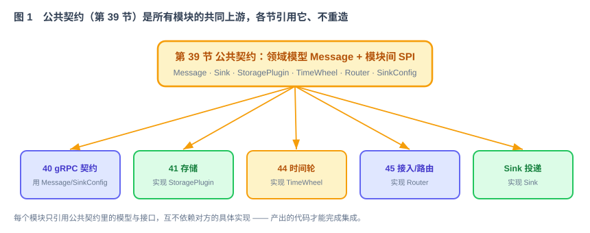
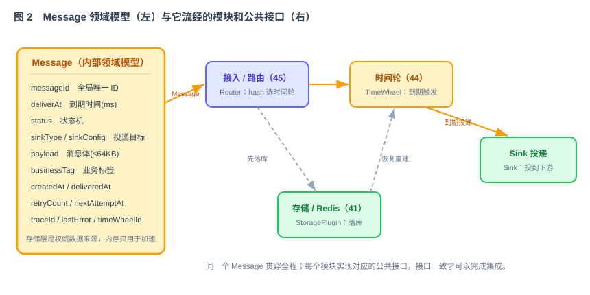

# 第 39 节：定义 When 的公共模型与模块接口（Loop 原料）

> **Loop 原料**是交给 AI 执行的模块任务规格。本节是第一份公共任务规格，第 40 节起的所有模块都依赖它。本节不实现业务功能，只完成两件事：
>
> 1. **领域模型**：统一定义一条延时消息包含哪些字段、处于哪些状态。
> 2. **模块接口**：统一定义存储、调度、投递和路由模块的调用方式。这里的 SPI 指“接口与实现分离”的扩展接口。
>
> 后续模块必须直接引用这些类型和接口，不得重新定义含义相同的对象。这样，各节生成的代码才能按同一套契约完成集成。

---

## 1. 这一节做什么

一句话：**先定义所有模块共用的数据结构、状态和接口，再分别实现各模块。**

When 会拆成十几个模块，由多个 Loop 分别实现。如果每个模块自行定义消息对象、状态和调用接口，单个模块可能通过测试，集成时仍会因为字段和接口不一致而失败。本节先统一**内部领域模型**和**模块接口**，后续模块只实现自己的职责。

这份公共契约在整条链路里的位置：它是所有模块任务的共同上游。



---

## 2. 为什么这么设计

**为什么要单独定义公共契约。** 跨模块共享的消息模型、状态和接口如果分散在不同任务中，很容易产生多个不兼容版本。集中定义后，存储、时间轮、路由和 Sink 都使用同一个 `Message` 和同一组接口，公共变更也可以集中评审。

**为什么用 SPI（接口 + 实现分离）。** When 的存储、投递都要插件化（技术方案 §3.1、§11）。把接口（`StoragePlugin`、`Sink`）定在公共契约里，具体实现（Redis 存储、HTTP/Kafka 投递）在各自的节里产出。调用方只依赖接口，不依赖实现，换插件不改核心代码。

**为什么内部领域模型和网络传输契约分开。** 第 40 节的 proto 定义请求如何在客户端和服务端之间传输；`Message` 定义消息在路由、时间轮、存储和投递模块之间如何表示。两者字段相近，但演进规则不同。接入层负责把 proto 请求转换成 `Message`。

---

## 3. 它和 Loop 的关系

这份文档是后续模块共同依赖的 Loop 原料，本身不包含业务功能，但会直接约束所有模块的实现：

- 每节的模块任务文档在“依赖与被依赖”段里，声明自己**依赖公共契约中的哪些模型/接口**。
- Loop 实现某个模块时，直接 import 这里定义的 `Message`、`Sink`、`StoragePlugin` 等类型和接口。
- 公共 Harness 也定义在这里。Harness 指所有模块必须遵守的运行环境、实现约束和验收规则。

一句话：**本节交付公共依赖，第 40 节起只实现各模块的增量。**

---

## 4. 核心领域模型：Message

`Message` 是一条延时消息在 When 内部的统一表示，从接入到投递全程用它。字段是各模块所需的并集：



```java
// 内部领域模型：一条延时消息（所有模块共用）
public class Message {
    String        messageId;     // 全局唯一 ID（Snowflake），路由/查询/取消都靠它
    String        traceId;       // 串联接入、转发、调度和投递日志
    long          deliverAt;     // 到期时间, epoch 毫秒
    long          nextAttemptAt; // 下一次尝试时间；首次投递等于 deliverAt
    MessageStatus status;        // 状态机见下
    SinkType      sinkType;      // 投递目标类型
    SinkConfig    sinkConfig;    // 强类型投递配置（见第 6 节）
    byte[]        payload;       // 消息体, <= 64KB
    String        businessTag;   // 业务标签, 可空
    long          createdAt;     // 创建时间
    long          deliveredAt;   // 投递时间, 0 表示未投递
    int           retryCount;    // 已重试次数
    String        lastError;     // 最近失败原因, 可空
    String        timeWheelId;   // 归属时间轮 ID（路由算出）
}
```

**状态机**（`MessageStatus`，与技术方案 §8.4 保持一致）：

```
PENDING ──→ DELIVERING ──→ DELIVERED
   │             ├────────→ PENDING（可重试失败，写入 nextAttemptAt）
   │             └────────→ FAILED（不可重试或超过重试次数）
   └──→ CANCELLED（投递前被取消）
```

所有状态转换必须通过 `StoragePlugin.transition` 原子执行。只有一个执行者可以把同一条消息从 `PENDING` 转为 `DELIVERING`，从而避免重复获得投递权。

Redis 保存可恢复的消息状态，是消息状态的权威数据来源；时间轮和副本保存可重建的内存调度索引。节点重启或切换后，只加载仍需处理的消息并重新加入时间轮（技术方案 §6.5）。

---

## 5. 模块间接口（SPI）

各模块之间只通过下面这几个接口对接。接口定义在公共契约，实现分散在各节。

```java
// 存储插件：延时消息的持久化（第 41 节产出 Redis 实现）
public interface StoragePlugin {
    String type();                                  // 插件类型标识, 如 "redis"
    void create(Message m);                         // 首次持久化；成功后才可返回业务方
    Optional<Message> get(String messageId);        // 按 ID 读
    boolean transition(String messageId,
                       MessageStatus expected,
                       MessageStatus target,
                       StatePatch patch);           // 原子状态转换，expected 不匹配则失败
    List<Message> loadPendingByTimeWheel(String twId); // 重建仍需调度的消息
    void deleteExpired(String messageId);           // 终态保留期结束后清理
}

// 状态转换时需要同时写入的字段；未提供的字段保持原值
public class StatePatch {
    Integer retryCount;
    Long    nextAttemptAt;
    Long    deliveredAt;
    String  lastError;
}

// 投递插件：到期后把消息投到下游（Sink 投递节产出 HTTP/Kafka 实现）
public interface Sink {
    SinkType type();                                // 对应 SinkType
    void validateConfig(SinkConfig cfg) throws InvalidConfigException;  // 接入层校验
    DeliveryResult deliver(Message m);              // 实际投递
    default boolean healthCheck() { return true; }
}

public class DeliveryResult {
    boolean success;
    boolean retryable;    // 失败是否可重试（HTTP 5xx/网络异常=可重试, 4xx=不可）
    String  errorMessage; // 不回显敏感字段
    long    durationMs;   // 投递耗时, 用于监控
}

// 时间轮：内存里的延时调度（第 44 节产出实现）
public interface TimeWheel {
    String id();
    void add(Message m);            // 按 deliverAt 放入对应层/槽
    void remove(String messageId);  // 取消时 O(1) 移除
    void start();
    void stop();
}

// 路由：按 messageId 一致性 hash 选定目标时间轮（第 45 节产出实现）
public interface Router {
    String routeToTimeWheel(String messageId);   // 只返回稳定 tw_id；节点定位与 gRPC 转发由接入编排完成
}

// 时间轮注册表：接入层只按 ID 取时间轮，不直接依赖具体实现
public interface TimeWheelRegistry {
    TimeWheel require(String timeWheelId);        // 不存在时明确失败，不静默创建
    Collection<TimeWheel> all();
}

// 集群视图：路由层通过它查询某个时间轮当前由哪个节点承载
public interface ClusterView {
    Optional<NodeEndpoint> masterOf(String timeWheelId);
}

public record NodeEndpoint(String nodeId, String host, int grpcPort) {}

// 到期交接点：时间轮只报告“某条消息到期”，不在调度线程里做存储或 Sink IO
public interface DueMessageHandler {
    void onDue(String messageId);
}
```

第 46 节会用下面三个接口连接各模块：`TimeWheelRegistry` 让接入层找到本节点时间轮，`ClusterView` 让路由层定位远端 Master，`DueMessageHandler` 把“到期触发”与“取得投递权并调用 Sink”分开。第 44 节只调用 `DueMessageHandler`，不得在调度线程内直接访问 Redis 或 Sink。

**契约地图**（谁定义、谁实现、谁消费）：

| 契约 | 定义在 | 实现/产出在 | 主要消费方 |
|---|---|---|---|
| `Message` / `MessageStatus` | 本节 | —（纯模型） | 所有模块 |
| `SinkType` / `SinkConfig` | 本节的 `when-common.proto` | — | 接入(45)、Sink 投递(49) |
| `StoragePlugin` | 本节 | 第 41 节（Redis） | 接入(45)、时间轮(44)、故障恢复(47) |
| `Sink` / `DeliveryResult` | 本节 | 第 49 节（HTTP/Kafka） | 投递器 |
| `TimeWheel` | 本节 | 第 44 节 | 路由(45)、副本(47)、Controller(48) |
| `Router` | 本节 | 第 45 节 | 接入层、gRPC 服务(40) |
| `TimeWheelRegistry` | 本节 | 第 44 节创建并注册实例 | 接入层(45)、应用集成(46) |
| `ClusterView` / `NodeEndpoint` | 本节 | 第 43 节提供 ETCD 视图；第 46 节提供静态实现 | 路由(45)、应用集成(46) |
| `DueMessageHandler` | 本节 | 第 46 节提供测试实现；第 49 节替换为真实投递实现 | 时间轮(44) |

> 这张表就是“后面某节能不能据前面产出”的答案：Sink 投递节实现的 `Sink` 接口在这里、它消费的 `SinkConfig`/`payload` 由第 40 节的 proto 定义并在第 45 节转成 `Message`——链路是接得上的。
>
> 这张表是后续任务拆分的依据。任何接口或职责变化，都必须先修改本节并检查全部消费方。

---

## 6. 枚举与强类型 SinkConfig

`sink_config` 不用松散的 `map<string,string>`（装不下 HTTP 的 headers、timeout 等），改为**按 Sink 类型的强类型配置**，proto 用 `oneof`。以下均放在 `when-common.proto`，供各节 import：

```proto
enum SinkType {
  SINK_TYPE_UNSPECIFIED = 0;
  HTTP  = 1;
  KAFKA = 2;
}

enum MessageStatus {
  MESSAGE_STATUS_UNSPECIFIED = 0;
  PENDING    = 1;  // 等待投递
  DELIVERING = 2;  // 投递中
  DELIVERED  = 3;  // 已投递
  FAILED     = 4;  // 多次重试后失败
  CANCELLED  = 5;  // 已取消
}

message HttpSinkConfig {
  string url        = 1;   // 必填
  string method     = 2;   // 默认 POST
  map<string, string> headers = 3;  // 敏感头（token 等）由环境注入, 不落日志
  int32  timeout_ms = 4;   // 默认 5000
}

message KafkaSinkConfig {
  string bootstrap_servers = 1;  // 必填
  string topic             = 2;  // 必填
  string key               = 3;  // 默认用 message_id
  map<string, string> headers = 4;
}

message SinkConfig {
  oneof config {
    HttpSinkConfig  http  = 1;
    KafkaSinkConfig kafka = 2;
  }
}
```

新增一种 Sink 时，只增加一个配置 message 和一个 `oneof` 分支。编译器可以检查配置类型，代码不需要从松散的 Map 中读取不确定的键名。

---

## 7. 公共 Harness（所有模块共同遵守的规则）

Harness 指 Loop 的运行环境、实现约束和验收机制。各模块在以下公共规则之上，再增加自己的模块规则。

**安全（强制约束）**

- 任何密钥 / token / 密码 / 连接串里的凭据**绝不硬编码、绝不落日志**，一律用环境变量 `${ENV_VAR}` 注入。
- 错误信息、监控指标、日志里不回显敏感字段原文。
- 依赖只用官方 / 主流稳定库，不引未经审计的组件。

**代码规范**

- 分层：本节公共 Java 类型放 `when-common`；proto 也由 `when-common` 发布给 `when-api` 引用；后续实现分别进入第 46 节固定的 Maven 模块，禁止再创建第二套 `common/core` 根目录。
- 领域模型 `Message`、各 SPI 接口一经定稿不随意改；确需改，先改本公共契约并通告所有依赖节。
- 每个模块只依赖接口，不依赖其它模块的具体实现。

**测试与验收**

- 自动化验收测试不可被 Loop 修改、删除或禁用（见第 38 节）。
- 停止节点、网络分区等故障测试由 CI 或人工执行；Loop 本地只执行快速测试。

**上下文**

- 仓库根 `AGENTS.md` 固化以上约束 + 领域模型/接口位置，作为 Codex 每轮自动读取的公共上下文。

---

## 8. 完成标准

- [ ] `Message`、`MessageStatus`、`SinkType`、`SinkConfig`、`StoragePlugin`、`StatePatch`、`Sink`、`DeliveryResult`、`TimeWheel`、`Router`、`TimeWheelRegistry`、`ClusterView`、`DueMessageHandler` 全部定义并可编译。
- [ ] `StoragePlugin.transition` 的并发测试证明：同一条 `PENDING` 消息只有一个调用方能成功转换为 `DELIVERING`。
- [ ] 终态消息在保留期内仍可查询，保留期结束后才允许清理。
- [ ] proto 里 `SinkConfig`（oneof HTTP/Kafka）、`MessageStatus`、`SinkType` 编译通过。
- [ ] 契约测试证明：时间轮到期时只调用一次 `DueMessageHandler.onDue(messageId)`，调度线程不直接调用 Redis 或 Sink。
- [ ] 契约地图（第 5 节表）与后续各节的“依赖与被依赖”一致，无悬空引用。
- [ ] 根 `AGENTS.md` 写入公共 Harness 与模型/接口索引。

---

## 9. 交付物清单

- [ ] `when-common` 模块：`Message`、`MessageStatus`、`StatePatch` 及各 SPI 接口（`StoragePlugin`、`Sink`、`DeliveryResult`、`TimeWheel`、`Router`、`TimeWheelRegistry`、`ClusterView`、`DueMessageHandler`）。
- [ ] `when-common/src/main/proto/when-common.proto`：`SinkType`、`MessageStatus`、`SinkConfig`（含 `HttpSinkConfig`/`KafkaSinkConfig`），打包后可被 `when-api` 的 protoc import。
- [ ] 根 `AGENTS.md`：公共 Harness + 模型/接口索引。
- [ ] 本文档：作为第 40 节起所有模块共同引用的公共任务规格。

> 本节完成后，第 40 节起只实现本模块的职责，不再重复定义公共模型和接口。
