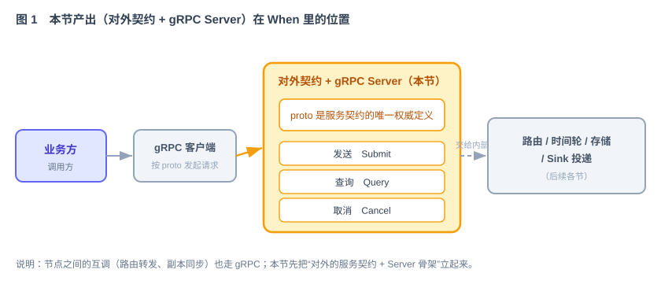
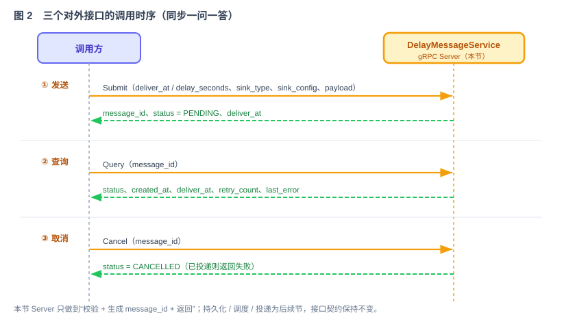
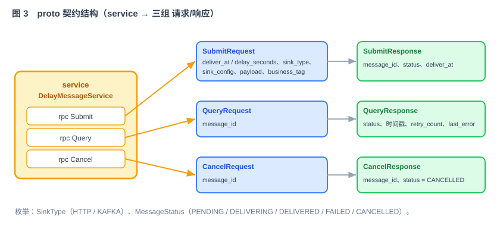

# 第 40 节：定义消息操作契约并实现 gRPC 服务骨架（Loop 原料）

> 本节是第一个功能模块的 **Loop 原料（AI 模块任务规格）**。它先帮助学员理解消息服务的边界，再提供 Loop 可以直接执行的接口、约束和验收标准。
>
> 结构固定为十一段：**这一节做什么 → 为什么这么设计 → 它和 Loop 的关系 → 依赖与被依赖 →（功能与交互 / 接口 / 字段 / 验收 / 边界 / Harness）→ 交付物清单**。40 起每节都用这套骨架，且都引用第 39 节公共契约《领域模型与模块间契约》。

---

## 1. 这一节做什么

一句话：**定义 Submit、Query、Cancel 三个操作的 proto 契约，并实现只负责协议处理和委托的 gRPC 服务骨架。**

When 提供三种消息操作：**提交**延时消息、**查询**消息状态、**取消**尚未投递的消息。本节用 Protocol Buffers（下称 proto）定义请求和响应，并生成客户端与服务端代码。gRPC 服务只处理协议转换、基础参数校验和调用委托；消息 ID 生成、持久化、路由、调度和投递由后续模块实现。

它在 When 整体里的位置：



---

## 2. 为什么这么设计

**为什么用 proto 定义契约。** proto 是与编程语言无关的接口定义文件，可以生成客户端和服务端代码（生成代码也称 stub）。Submit、Query、Cancel 的字段和类型以 proto 为准；服务端、客户端以及第 51 节的 HTTP API 都映射到这套操作语义。

**为什么内部用 gRPC。** When 是多节点集群，节点之间要频繁互调（一条消息路由到别的节点、Master 把写入同步给 Slave）。这种内部高频调用，gRPC 的二进制协议传得快、强类型契约不容易调错，比裸 HTTP 更合适。这与技术方案里“**外部 HTTP、内部 gRPC**”的选择一致。

**gRPC 和 HTTP 分别由谁使用。** gRPC 用于节点间调用，也可供内部客户端使用；第 51 节提供面向管理台和业务调用方的 HTTP API。两种协议共享 Submit、Query、Cancel 的操作语义，但各自拥有独立的传输契约。第 45 节实现真正的应用处理流程。

**为什么先做它。** 传输契约是客户端、gRPC 服务和后续应用层的共同依赖。先定义请求、响应和错误语义，后续模块才有稳定接口可引用。

---

## 3. 它和 Loop 的关系

本节既包含给学员的解释，也包含可直接交给 Loop 执行的模块任务规格：

- **明确输入**：功能（第 5 节）、交互与时序（第 5 节）、接口与 proto（第 6 节）、参数字段（第 7 节）。
- **可判定的验收**（自动化验收）：第 8 节的验收标准和必须有的测试 —— Loop 每轮拿它判断“做对没、能不能停”。
- **边界**：第 9 节明确本模块不得实现的职责，防止 Loop 修改其他模块。
- **专属 Harness**：第 10 节的代码与安全约束，叠加在公共 Harness 之上。

第 1—3 节帮助学员理解问题；第 4—11 节共同构成 Loop 的执行规格，其中第 4 节的上下游依赖也必须提供给 Loop。

---

## 4. 依赖与被依赖

这一段把本节在原料链里的位置说清楚 —— Loop 据此知道“我该引用什么、我产出的东西谁会用”。

**本节依赖（上游）**

- 第 39 节公共契约的领域模型 `Message`、状态机 `MessageStatus`。
- 第 39 节公共契约的 `SinkType`、强类型 `SinkConfig`（`when-common.proto`），本节 proto 直接 import，不重复定义。
- 第 45 节将实现的应用处理接口；本节通过依赖注入调用，不在 gRPC 层实现业务状态。

**本节产出、被谁消费（下游）**

| 本节产出的契约 | 被哪节消费 | 怎么用 |
|---|---|---|
| `when-api.proto`（Submit/Query/Cancel + 请求响应 message） | 第 45 节应用层、第 51 节 HTTP API | gRPC 与 HTTP 都映射到同一组操作语义 |
| `payload` / `sink_type` / `sink_config` 语义 | Sink 投递节 | Sink 拿这三样决定“投什么、投到哪、怎么投” |
| gRPC 服务委托边界 | 第 45 节应用层 | 第 45 节实现消息 ID 生成、存储、路由和状态转换 |
| `MessageStatus` 返回语义（查询/取消结果） | 管理台节 | 列表页/详情页展示状态 |

> 本节定义 `sink_config`、`payload` 和 `sink_type` 的传输格式；第 45 节把请求转换为 `Message`；第 49 节实现 `Sink`。三节通过第 39 节的公共类型和接口衔接。

---

## 5. 功能与交互

这个模块任务定义三个同步 RPC 操作：

- **发送（Submit）**：业务方给一条消息 + 延时时长/到期时间 + 投递目标（Sink），换回一个全局唯一的 `message_id`，此时状态是 `PENDING`。
- **查询（Query）**：拿 `message_id` 换回这条消息的当前状态和时间信息。
- **取消（Cancel）**：拿 `message_id` 取消一条还没投出去的消息；已经投过的取消不了。

本节的 Server 骨架只完成“解析请求 → 基础校验 → 调用注入的应用处理接口 → 映射响应”。测试时使用测试实现验证 gRPC 调用；第 45 节再提供真正的应用处理实现。三个接口的调用时序：



---

## 6. 接口 / 契约设计

契约用一份 `when-api.proto` 定义。service 三个方法，配套请求/响应 message；`SinkType`、`SinkConfig`、`MessageStatus` 从第 39 节公共契约的 `when-common.proto` import，不在本节重复定义。



完整 proto（`when-api/src/main/proto/when-api.proto`）：

```proto
syntax = "proto3";
package when.v1;
option java_package = "com.when.api.grpc";
option java_multiple_files = true;

// SinkType / SinkConfig / MessageStatus 定义在第 39 节公共契约, 这里直接引用
import "when-common.proto";

// 延时消息服务：发送 / 查询 / 取消
service DelayMessageService {
  rpc Submit (SubmitRequest) returns (SubmitResponse);
  rpc Query  (QueryRequest)  returns (QueryResponse);
  rpc Cancel (CancelRequest) returns (CancelResponse);
}

message SubmitRequest {
  int64      deliver_at    = 1;  // 到期时间, Unix 毫秒; 与 delay_seconds 二选一
  int32      delay_seconds = 2;  // 延时秒数, 与 deliver_at 二选一
  SinkType   sink_type     = 3;  // 来自 when-common.proto
  SinkConfig sink_config   = 4;  // 强类型(HTTP/Kafka), 来自 when-common.proto
  bytes      payload       = 5;  // 消息体, <= 64KB
  string     business_tag  = 6;  // 业务标签, 可选
}

message SubmitResponse {
  string        message_id = 1;
  MessageStatus status     = 2;  // 正常为 PENDING
  int64         deliver_at = 3;
}

message QueryRequest { string message_id = 1; }

message QueryResponse {
  string        message_id   = 1;
  MessageStatus status       = 2;
  int64         created_at   = 3;
  int64         deliver_at   = 4;
  int64         delivered_at = 5;  // 0 表示未投递
  int32         retry_count  = 6;
  string        last_error   = 7;
  SinkType      sink_type    = 8;
  string        business_tag = 9;
}

message CancelRequest { string message_id = 1; }

message CancelResponse {
  string        message_id = 1;
  MessageStatus status     = 2;  // 正常为 CANCELLED
}
```

`sink_config` 是强类型（`oneof http / kafka`），定义见第 39 节公共契约第 6 节。这样 Sink 投递节实现 HTTP / Kafka Sink 时，拿到的是带 `url / headers / timeout_ms` 或 `bootstrap_servers / topic` 的强类型对象，不用在松散的 map 里猜键名。

gRPC 服务依赖下面的应用处理接口。本节定义接口并使用测试实现完成 gRPC 验收；第 45 节提供正式实现。

```java
public interface DelayMessageHandler {
    SubmitResult submit(SubmitCommand command);
    MessageView query(String messageId);
    CancelResult cancel(String messageId);
}
```

---

## 7. 参数字段定义

**SubmitRequest（发送）**

| 字段 | 类型 | 必填 | 约束 / 说明 |
|---|---|---|---|
| `deliver_at` | int64 | 二选一 | 到期时间，Unix 毫秒；必须晚于当前时间 |
| `delay_seconds` | int32 | 二选一 | 延时秒数；范围 1 秒 ~ 30 天；与 `deliver_at` 二选一 |
| `sink_type` | SinkType | 是 | `HTTP` 或 `KAFKA`；不可为 `UNSPECIFIED` |
| `sink_config` | SinkConfig | 是 | 强类型 oneof：HTTP 必含 `url`；Kafka 必含 `bootstrap_servers`、`topic`；密钥类值由环境注入 |
| `payload` | bytes | 否 | 消息体，解码后 ≤ 64KB |
| `business_tag` | string | 否 | 业务标签，便于查询筛选 |

**QueryResponse / CancelResponse（关键字段）**

| 字段 | 类型 | 说明 |
|---|---|---|
| `message_id` | string | 全局唯一 ID（Snowflake 生成） |
| `status` | MessageStatus | `PENDING` / `DELIVERING` / `DELIVERED` / `FAILED` / `CANCELLED` |
| `created_at` / `deliver_at` / `delivered_at` | int64 | Unix 毫秒；`delivered_at` 为 0 表示未投递 |
| `retry_count` | int32 | 已重试次数 |
| `last_error` | string | 最近一次失败原因，可空 |

**参数校验规则（Server 侧必须实现）**

- `deliver_at` 与 `delay_seconds` 恰好提供其一；`deliver_at` 必须是未来时间；`delay_seconds` 在 1 ~ 2592000 之间。
- `sink_type` 必须是已支持类型；`sink_config` 的 oneof 分支必须与 `sink_type` 一致。本节只检查 proto 可以表达的结构约束；第 49 节的具体 Sink 再检查 URL、Kafka 地址等运行时配置。
- `payload` 解码后不超过 64KB。
- 任一不满足 → 返回 gRPC 状态码 `INVALID_ARGUMENT`，并在 message 里说明哪个字段。

---

## 8. 验收标准 + 必须有的测试（自动化验收）

Loop 每轮拿这些判断“做对没、能不能停”。全部可自动执行、可打勾。

**功能验收**

- [ ] `when-api.proto` 能 import `when-common.proto` 并被 protoc 编译，生成 Java stub，构建通过。
- [ ] gRPC Server 能启动在 `${WHEN_GRPC_PORT}`，标准健康检查（gRPC Health Checking）返回 SERVING。
- [ ] `Submit` 合法请求会调用注入的应用处理接口，并把处理结果正确映射为 `SubmitResponse`。
- [ ] `Submit` 非法请求（过去时间 / 延时超范围 / `sink_config` 分支与 `sink_type` 不符 / 缺必填）→ 返回 `INVALID_ARGUMENT`。
- [ ] 应用处理接口返回“消息不存在”时，`Query` 映射为 `NOT_FOUND`。
- [ ] 应用处理接口返回“当前状态不可取消”时，`Cancel` 映射为 `FAILED_PRECONDITION`。

**必须有的测试**

- [ ] 单元测试：参数校验逻辑（时间边界、二选一、sink 分支一致性、payload 上限）逐条覆盖。
- [ ] 单元测试：使用测试应用处理器，验证三个 gRPC 方法的委托、异常映射和响应字段。
- [ ] 集成测试：启动真实 gRPC Server 和客户端，依次调用 Submit / Query / Cancel，断言状态码与关键字段。

> 验收只认“可判定的断言”，不写“覆盖率 ≥ X%”。这些断言就是本节的自动化验收，写进专属 Harness，Loop 不得修改（见第 38 节）。

---

## 9. 边界（本节不做什么）

- **不实现**消息 ID 生成、状态存储、时间轮调度、真实 Sink 投递和跨节点路由。这些职责由第 41、44、45、49 节实现。
- **不定义** `Message` 领域模型、`SinkConfig`、各 SPI —— 那些在第 39 节公共契约里，本节只引用。
- **不做** HTTP API；HTTP API 在第 51 节实现。鉴权和限流属于扩展阶段。
- **只做**：`when-api.proto`、生成代码配置、gRPC Server、基础参数校验、应用处理接口委托和 gRPC 状态码映射。
- **停止条件**：三接口契约稳定、stub 生成成功、Server 起得来、上面的验收测试全部通过 —— 即可交接，不继续往下做属于别节的功能。

---

## 10. 专属 Harness（叠加在公共 Harness 之上）

> 公共 Harness（安全强制约束、分层规范、自动化验收不可改）见第 39 节公共契约第 7 节。以下是本节增量。

**代码**

- proto 放在 `when-api/src/main/proto/`，包名 `when.v1`，Java 包 `com.when.api.grpc`；`import "when-common.proto"`。
- `when-api` 通过 Maven 依赖 `when-common`，protobuf 插件从依赖制品解析并 import `when-common.proto`；不得复制一份公共 proto 到本模块。
- 生成的 stub 不手改；改契约只改 proto，重新生成。
- 接口实现层（`DelayMessageServiceImpl`）只做“校验参数 + 委托”，不写业务逻辑；业务逻辑属于后续模块。

**安全**（强制约束，Loop 不得违反）

- `sink_config` 中的密钥 / token 等敏感值**一律不落日志、不硬编码**，示例与配置用 `${ENV_VAR}` 占位。
- gRPC 监听端口、地址等从环境变量读取（`${WHEN_GRPC_PORT}` 等），不写死在代码里。
- 生成的错误信息里不回显敏感字段原文。

**依赖**

- 只引 gRPC-Java、protobuf 官方库；不额外引入重框架。

---

## 11. 交付物清单（这节结束应产出）

- [ ] `when-api/src/main/proto/when-api.proto` —— import 公共契约，service + 三组 message。
- [ ] 构建配置（protobuf 插件），能连同 `when-common.proto` 一起生成 Java stub。
- [ ] `DelayMessageHandler` 应用处理接口和仅用于本节测试的实现。
- [ ] `DelayMessageServiceImpl` 骨架 —— 三个方法、基础参数校验、应用处理接口委托和异常映射。
- [ ] gRPC Server 启动类 —— 读 `${WHEN_GRPC_PORT}`，注册服务与健康检查。
- [ ] 单元测试（校验、委托、异常映射）与集成测试（启动 Server 并调用三个接口）。
- [ ] 本文档第 4—11 节作为该模块的 Loop 输入规格。

> 交齐以上，第一个功能模块的 Loop 原料就完整了：契约清晰、依赖显性、自动化验收可跑、边界明确。下一节（第 41 节 存储层插件化 + Redis）实现第 39 节公共契约的 `StoragePlugin`，在此基础上继续产出原料。
