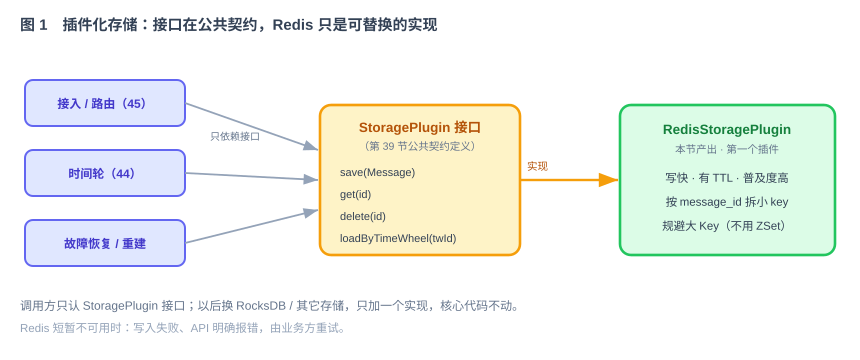
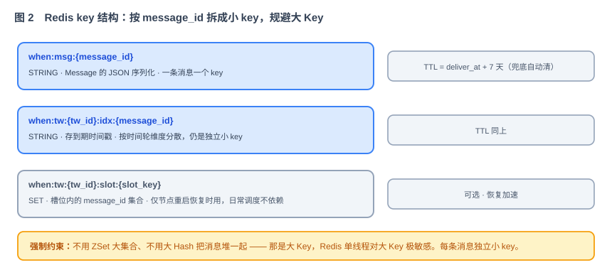

# 第 41 节：存储层插件化 + Redis 插件（Loop 原料）

> 本节是逐模块产出的第二份 **Loop 原料**，实现第 39 节公共契约定义的 `StoragePlugin`，并产出第一个插件：Redis。
>
> 结构固定为十一段：**这一节做什么 → 为什么这么设计 → 它和 Loop 的关系 → 依赖与被依赖 →（功能与交互 / 接口 / 字段 / 验收 / 边界 / Harness）→ 交付物清单**。引用第 39 节公共契约《领域模型与模块间契约》。

---

## 1. 这一节做什么

一句话：**定义 When 要存哪些数据，设计一套可插拔的存储机制，并实现第一个插件——Redis。**

延时消息在投递前必须持久化，节点退出或重启后仍可恢复。本节先明确需要保存的数据和索引，再实现插件化存储接口的 Redis 版本。插件化表示调用方只依赖 `StoragePlugin`，不直接依赖 Redis 客户端。

它在链路里的位置：



---

## 2. 为什么这么设计

**为什么存储要插件化。** 不同企业的基础设施不一样，有的重度用 Redis，有的想换 RocksDB。把存储抽象成 `StoragePlugin` 接口，调用方（接入、时间轮、恢复）只依赖接口，换存储只加一个实现、不改核心代码。这也和 When 整体"存储/投递都插件化"的取舍一致（技术方案 §3.1）。

**为什么第一个插件选 Redis。** 延时消息对存储就三个硬要求：写得快、按 key 读写快、有 TTL 方便清理——Redis 全满足。加上它在企业里普及度极高，几乎每家都有现成集群，接入门槛最低（技术方案 §2.2）。RocksDB 要单独部署、MySQL 在海量随机小 key 读写上不如 Redis，都先不选。

**为什么必须规避大 Key。** 很多 SDK 类延时方案（Redisson、Curator 的延时队列）存在相同问题：把所有延时消息塞进一个 ZSet，score 是到期时间。消息一多、score 跨度一大，这个 ZSet 就成了大 Key，而 Redis 单线程模型对大 Key 操作极其敏感，阻塞其他 Redis 操作。When 从数据结构上避免：**每条消息一个独立小 key，索引也按时间轮维度拆散，绝不用 ZSet/大 Hash 堆一起**（技术方案 §9.3）。代价是 key 数量多（几十万到几百万个小 key），但 Redis 适合处理大量独立小 key，这个代价值得。

**为什么必须先持久化再返回。** 业务方拿到 `message_id` 时，消息必须已经写入 Redis。即使节点随后退出，系统仍能读取消息并重建调度。因此固定顺序为：**Redis 写入成功 → 加入内存时间轮 → 返回业务方**（技术方案 §6.5、§9.2）。

---

## 3. 它和 Loop 的关系

这份是本节是提供给 Loop 的模块任务规格：Loop 直接引用 公共契约中的 `Message` 和 `StoragePlugin`，产出 `RedisStoragePlugin` 实现 + key 设计 + 测试。

- **明确输入**：功能（第 5 节）、接口（第 6 节，来自公共契约）、key/字段（第 7 节）。
- **自动化验收**：第 8 节验证创建与查询、原子状态转换、待处理消息恢复、终态清理和大 Key 约束。
- **边界**：第 9 节——只做存储插件，不碰调度、投递、集群。
- **专属 Harness**：第 10 节——大 Key 强制约束、密钥用环境变量。

---

## 4. 依赖与被依赖

**本节依赖（上游）**

- 第 39 节公共契约：领域模型 `Message`、接口 `StoragePlugin`、状态机 `MessageStatus`。
- 公共 Harness（安全强制约束、分层规范）——第 39 节公共契约第 7 节。

**本节产出、被谁消费（下游）**

| 本节产出 | 被哪节消费 | 怎么用 |
|---|---|---|
| `RedisStoragePlugin`（实现 `StoragePlugin`） | 第 45 节 接入层 | 先 `create(Message)`，成功后才返回业务方 |
| `transition` | 第 45、47、49 节 | 原子更新消息状态，防止多个执行者同时获得投递权 |
| `loadPendingByTimeWheel(twId)` | 第 44、47 节 | 重启或故障切换后，只加载仍需处理的消息 |
| `deleteExpired` | 清理任务 | 终态消息超过保留期后再清理 |
| Redis key 结构约定 | 第 44 节、恢复节 | 按约定读写，不各写各的 key |

---

## 5. 功能与交互

`RedisStoragePlugin` 实现公共契约 `StoragePlugin` 的五个方法：

- **create(Message)**：首次保存消息，必须在“加入内存时间轮 / 返回业务方”之前完成。
- **get(messageId)**：按 ID 读回一条消息（查询、恢复用）。
- **transition(messageId, expected, target, patch)**：只有当前状态等于 `expected` 才更新为 `target`，并同时更新重试次数、错误信息和下次尝试时间。必须使用 Lua 或等价事务保证原子性。
- **loadPendingByTimeWheel(twId)**：读取某个时间轮下仍需调度的 `PENDING` 消息。
- **deleteExpired(messageId)**：仅在终态消息超过配置的保留期后清理消息和索引。

**写入顺序（不可乱）**：生成序列化 → `SET` 消息体 → `SET` 索引（两步用 Pipeline 一次发出，减少往返）→ Redis 成功 → 才进内存、才返回。任一步失败，直接给业务方返回失败，不写内存——保证"内存里的消息一定也在 Redis 里"。

**调度线程不执行同步 Redis IO**：时间轮触发后把任务交给异步执行器；执行器通过 `transition` 获得投递权并更新结果。终态消息在保留期内继续支持查询，由独立清理任务异步删除。

---

## 6. 接口 / 契约设计

接口就是公共契约中的 `StoragePlugin`（本节不重新定义，只实现）：

```java
public interface StoragePlugin {
    String type();                              // 返回 "redis"
    void create(Message m);
    Optional<Message> get(String messageId);
    boolean transition(String messageId, MessageStatus expected,
                       MessageStatus target, StatePatch patch);
    List<Message> loadPendingByTimeWheel(String twId);
    void deleteExpired(String messageId);
}
```

Redis key 结构如下（后续模块必须共同遵守）：



---

## 7. 字段 / key 定义

| key | 类型 | 内容 | TTL |
|---|---|---|---|
| `when:msg:{message_id}` | STRING | `Message` 的 JSON 序列化（一条消息一个 key） | 计划执行时间 + 终态保留期 |
| `when:tw:{tw_id}:idx:{message_id}` | STRING | `nextAttemptAt`；按时间轮维度分散，仍是独立小 key | 同上 |

约定要点：

- **消息体按 `message_id` 拆 key**：单条 ≤ 64KB，加元数据也就几十 KB，体积可控。
- **索引按 `tw_id` 前缀分散**：某个时间轮十万条消息，就是十万个独立小 key，不形成大 Key。
- **每个 key 都设置 TTL**：TTL 不早于 `max(deliverAt, nextAttemptAt, deliveredAt) + retention`。状态变化导致计划时间延后时，必须同步延长 TTL。

---

## 8. 验收标准 + 必须有的测试（自动化验收）

**功能验收**

- [ ] `RedisStoragePlugin.type()` 返回 `"redis"`，被公共契约中的插件注册机制加载。
- [ ] `create` 后 `get` 能读回同一条 `Message`，字段完全一致。
- [ ] 100 个并发调用同时执行 `PENDING → DELIVERING`，只有一个 `transition` 返回成功。
- [ ] `loadPendingByTimeWheel(twId)` 只返回仍需调度的消息，数量与内容正确。
- [ ] 终态消息在保留期内仍可查询；超过保留期执行 `deleteExpired` 后，消息体和索引都被删除。
- [ ] 每个写入的 key 都设置了 TTL（`deliver_at + 7 天`）。
- [ ] 写入用 Pipeline 合并消息体 + 索引两次写；删除用 Pipeline 批量。

**必须有的测试**

- [ ] 集成测试（由 `harness/local/start-deps.sh redis` 启动真实的本机临时 Redis）：create/get/transition/loadPendingByTimeWheel/deleteExpired 全链路。连接信息从 `.loop/runtime.env` 读取，测试结束后执行 `harness/local/stop-deps.sh`。
- [ ] 大 Key 防回归测试：断言实现里**没有**把消息塞进单个 ZSet/Hash——key 数量随消息数线性增长，不存在单个大集合。
- [ ] 写入失败测试：Redis 不可用时 `create` 抛错，调用方返回失败且不加入内存时间轮。

> 这些断言就是本节自动化验收，写进专属 Harness，Loop 不得修改（见第 38 节）。

---

## 9. 边界（本节不做什么）

- **不实现**时间轮调度、Sink 投递、集群协调、故障切换——只做存储插件。
- **不定义** `Message`、`StoragePlugin` 接口——那在第 39 节公共契约，本节只实现。
- **不负责** Redis 自身高可用（Cluster / Sentinel / AOF / 跨机房）——那由部署方在生产环境保证（技术方案 §9.4）。本节按"单实例或主从"即可。
- 第 51 节为了管理列表增加独立的、有数量上限的分桶 ZSet 索引。它不属于调度和恢复索引，不改变本节“一条消息一个主记录、不能把全部消息塞进单个大集合”的要求。
- **只做**：`RedisStoragePlugin` 实现 + key 结构 + 原子状态转换 + 恢复与清理策略 + 测试。
- **停止条件**：五个方法已经实现、key 约定已经完成、原子状态转换验证通过，并且没有大 Key。

---

## 10. 专属 Harness（叠加在公共 Harness 之上）

> 公共 Harness 见第 39 节公共契约第 7 节。以下是本节增量。

**代码**

- 放在 `plugin/storage/redis` 包；只依赖公共接口，不反向依赖调用方。
- key 前缀统一 `when:`，拼接规则集中在一处常量/工具类，不散落。
- 用官方 / 主流 Redis 客户端（Lettuce 或 Jedis），不自造连接管理。

**安全**（强制约束）

- Redis 地址、密码从环境变量读取（`${WHEN_REDIS_HOST}` / `${WHEN_REDIS_PORT}` / `${WHEN_REDIS_PASSWORD}`），**绝不硬编码**。
- 消息 `payload` 可能含业务敏感内容，**不整条打进日志**；日志只记 `message_id` 等非敏感字段。

**存储强制约束**

- **禁止**用 ZSet / 大 Hash 把多条消息聚在一个 key；每条消息独立小 key。
- 每个写入的 key 必须设 TTL，不留永不过期的孤儿 key。

**依赖**

- 实现与资源放在 `when-storage-redis`，只依赖 `when-common` 和 Redis 客户端；集成测试连接 Harness 启动的本机临时 Redis，不得用 mock 替代，也不得自行启动容器。

---

## 11. 交付物清单（这节结束应产出）

- [ ] `RedisStoragePlugin` —— 实现公共契约 `StoragePlugin` 五个方法。
- [ ] key 结构常量 / 工具类 —— `when:msg:*`、`when:tw:*:idx:*`。
- [ ] 写入 Pipeline、原子状态转换和终态清理封装，读写策略按第 5 节。
- [ ] 本机临时 Redis 集成测试 + 大 Key 防回归测试 + 写入失败测试；端口和数据目录由 Harness 隔离并在测试后清理。
- [ ] 本文档第 4—11 节作为该模块的 Loop 输入规格。

> 完成本节后，消息的创建、查询、原子状态转换、恢复和清理都有统一实现。下一节转向集群元数据存储。
