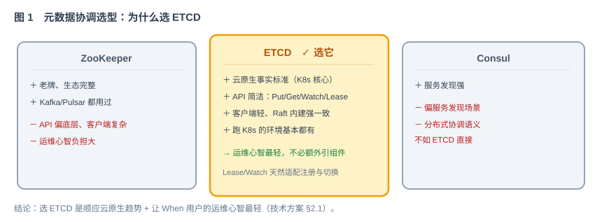
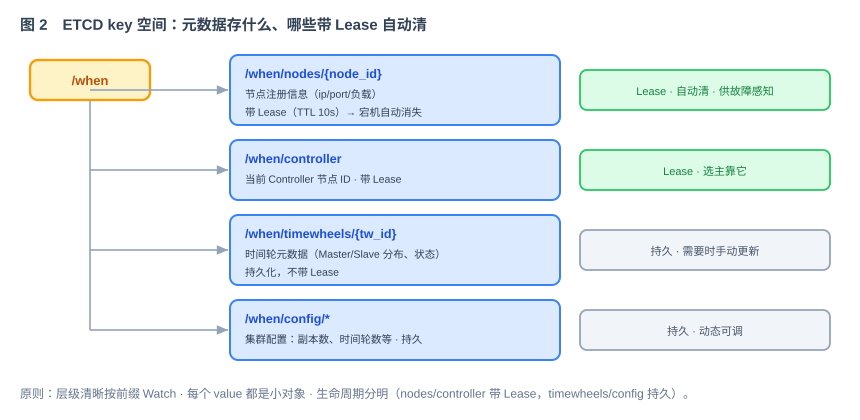

# 第 42 节：元数据存储 ZK vs ETCD 选型（Loop 原料）

> 本节处理集群元数据。元数据是描述系统结构和运行状态的小规模数据，例如节点列表、Controller 和时间轮副本分布。本节选择 etcd，并定义后续集群模块共同使用的 key 和数据结构。
>
> 本节额外产出一组集群契约（etcd key 空间 + 元数据结构），供第 43、47、48 节直接引用。

---

## 1. 这一节做什么

一句话：**选择集群元数据存储，并定义统一的 key 与字段结构。**

延时消息和索引保存在 Redis。节点列表、Controller、时间轮 Master/Slave 分布等集群元数据规模较小，但要求一致性和变更通知。本节比较 ZooKeeper、etcd 和 Consul，选择 etcd，并定义需要保存的字段和 key。

---

## 2. 为什么这么设计

**为什么选择 etcd（而不是 ZooKeeper / Consul）。**

三者都能用于分布式协调。ZooKeeper 功能成熟，但客户端和运维复杂度较高；Consul 更偏向服务发现；etcd 提供 Put、Get、Watch、Lease 和事务等直接适合本项目的能力，并通过 Raft 保证一致性。When 使用独立或平台提供的业务 etcd 集群，不直接连接 Kubernetes 控制平面的 etcd（技术方案 §2.1）。

**为什么元数据和消息数据分开存。** 消息数据海量、生命周期短、只要求快，交给 Redis。元数据量小、要求强一致和"实时感知节点存活"，交给 ETCD。两类需求不同，用两个组件各司其职，比硬塞一个里更简单。

**为什么需要 Lease 和 Watch。** Lease（租约）为 key 设置有效期；节点停止续约后，key 自动删除。Watch 用于订阅 key 或前缀的变化。第 43 节通过这两个机制实现节点注册、存活检测、Controller 选举和成员变化通知。

---

## 3. 它和 Loop 的关系

这份是本节是提供给 Loop 的模块任务规格，但它偏"契约 + 选型讲解"：Loop 据此**建立 ETCD 客户端封装 + 元数据 key 空间的读写**，第 43 节再在上面实现注册/选主/感知。

- **明确输入**：元数据存什么（第 5 节）、ETCD key 空间与结构（第 6、7 节）。
- **自动化验收**：第 8 节——key 空间读写正确、Lease 到期 key 自动消失、Watch 能收到变化。
- **边界**：第 9 节——只做选型 + 元数据契约 + ETCD 客户端封装，不实现注册/选主流程（那是 43）。

---

## 4. 依赖与被依赖

**本节依赖（上游）**

- 第 39 节公共契约：公共 Harness（安全强制约束、分层）。
- ETCD 作为外部依赖（部署方提供，不自建）。

**本节产出、被谁消费（下游）**

| 本节产出 | 被哪节消费 | 怎么用 |
|---|---|---|
| ETCD key 空间约定（`/when/nodes`、`/when/controller`、`/when/timewheels`、`/when/config`） | 第 43 节 节点集群 | 按约定注册、选主、Watch |
| 元数据结构（节点信息、时间轮元数据） | 第 43 节、第八周 HA 各节 | 读写同一套结构，不各写各的 |
| ETCD 客户端封装（Put/Get/Watch/Lease） | 第 43 节及后续集群节 | 统一入口，不各自连 ETCD |

> 本节定义集群元数据的存储位置、key 命名和字段结构。第 43、47、48 节不得重复定义同类数据。

---

## 5. 功能与交互

本节交付两样东西：**元数据的 key 空间约定** + **一层 ETCD 客户端封装**。

**元数据存什么（四类）**

- **节点注册**：每个在线节点一条，含 ip/port/负载；带 Lease，宕机自动消失。
- **Controller**：当前 Controller 是哪个节点；带 Lease。
- **时间轮元数据**：每个时间轮的 Master/Slave 分布、状态；持久化。
- **集群配置**：副本数、时间轮总数等；持久、动态可调。

**ETCD 客户端封装提供什么**

- `putWithLease(key, value, ttl)` / `keepAlive(lease)`：注册 + 心跳续约。
- `get(key)` / `getPrefix(prefix)`：读单个 / 按前缀读一批。
- `watch(prefix, handler)`：订阅前缀变化（PUT/DELETE 事件）。
- `txnPutIfAbsent(key, value, lease)`：原子创建（选主用，见第 43 节）。

---

## 6. 接口 / 契约设计

etcd key 空间（后续集群模块必须共同遵守）：

设计三原则：

- **层级清晰**：`nodes` / `controller` / `timewheels` / `config` 各管一类，便于按前缀 Watch。
- **小 key 优先**：每个 value 都是几百字节内的小对象，不拿 ETCD 存大对象。
- **生命周期分明**：`nodes`、`workers`、`controller` 带 Lease 自动清；`timewheels`、`config` 持久化，需要时手动更新。

---

## 7. 字段 / key 定义

| key | 内容 | 生命周期 |
|---|---|---|
| `/when/nodes/{node_id}` | `{ip, port, start_time, load}` | 带 Lease（TTL 6s），续约停止即自动删除 |
| `/when/workers/{worker_id}` | 当前占用该 Snowflake worker ID 的 `node_id` | 与节点使用同一个 Lease |
| `/when/controller` | 当前 Controller 的 `node_id` | 带 Lease，Controller 挂即消失 |
| `/when/timewheels/{tw_id}` | `{master, slave, status}` | 持久化 |
| `/when/config/*` | `replica_count`、`timewheel_count` 等 | 持久化，动态可调 |

Lease TTL 与心跳约定（第 43 节实现时遵守）：

- 节点 Lease TTL = 6 秒；心跳续约间隔 = 2 秒（为 10 秒总切换预算预留恢复时间；最终通过故障测试验证）。
- 续约必须用独立线程 + 独立 ETCD 连接，不与业务线程共用（避免 GC / 繁忙导致误判）。

---

## 8. 验收标准 + 必须有的测试（自动化验收）

**功能验收**

- [ ] ETCD 客户端封装的 Put/Get/GetPrefix/Watch/Lease/Txn 均可用（对真实 ETCD）。
- [ ] `putWithLease` 写入的 key，在停止续约后于 TTL 内自动消失。
- [ ] `keepAlive` 持续续约时，key 不消失。
- [ ] `watch(prefix)` 能收到该前缀下的 PUT / DELETE 事件。
- [ ] `txnPutIfAbsent` 在 key 已存在时不覆盖、返回失败（供后续选主使用）。
- [ ] 节点注册事务可以同时检查 node ID 与 worker ID 均未被占用，并把两个 key 绑定到同一个 Lease。

**必须有的测试**

- [ ] 集成测试（由 `harness/local/start-deps.sh etcd` 启动真实的本机临时 ETCD）：Lease 自动过期、Watch 事件、Txn 原子性。连接信息从 `.loop/runtime.env` 读取，测试结束后执行 `harness/local/stop-deps.sh`。
- [ ] key 空间约定测试：四类前缀的读写与结构符合第 7 节。

---

## 9. 边界（本节不做什么）

- **不实现**节点注册流程、Controller 选举、故障感知——那是第 43 节（本节只提供机制封装和 key 约定）。
- **不实现**时间轮 rebalance、Master/Slave 副本切换——第八周。
- **不负责** ETCD 自身高可用——部署方保证（3 节点容忍 1 故障，技术方案 §15.1）。
- **只做**：选型结论 + 元数据 key 空间契约 + ETCD 客户端封装 + 测试。
- **停止条件**：封装可以使用、key 约定已经实现、Lease/Watch/Txn 验收全部通过。

---

## 10. 专属 Harness（叠加在公共 Harness 之上）

**代码**

- 放在 `cluster/etcd` 包；封装是集群侧唯一的 ETCD 入口，别处不直接连 ETCD。
- key 拼接规则集中在常量/工具类，前缀统一 `/when/`。

**安全**（强制约束）

- ETCD endpoints、证书 / 用户名密码从环境变量读取（`${WHEN_ETCD_ENDPOINTS}` 等），**绝不硬编码**。
- 节点元数据里不写入任何敏感凭据。

**依赖**

- ETCD 封装和元数据类型放在 `when-cluster`，只依赖 `when-common` 与 ETCD 官方 Java 客户端（jetcd）；集成测试连接 Harness 启动的本机临时 ETCD，不自行启动容器。

---

## 11. 交付物清单（这节结束应产出）

- [ ] ETCD 客户端封装（Put/Get/GetPrefix/Watch/Lease/KeepAlive/Txn）。
- [ ] key 空间常量 / 工具类（`/when/nodes`、`/when/controller`、`/when/timewheels`、`/when/config`）。
- [ ] 元数据结构定义（节点信息、时间轮元数据）。
- [ ] 本机临时 ETCD 集成测试：Lease / Watch / Txn；端口和数据目录由 Harness 隔离并在测试后清理。
- [ ] 本文档第 4—11 节作为该模块的 Loop 输入规格。

> 交齐以上，集群侧的元数据契约就立好了。下一节（第 43 节 节点集群：注册、组集群、切换）在这套 key 空间和封装之上，实现节点怎么加入、怎么保活、怎么选出 Controller、怎么感知上下线。
