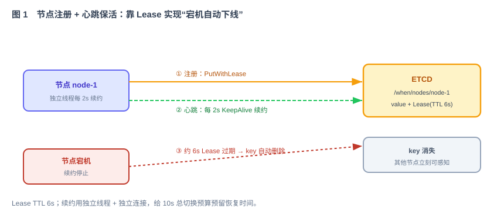
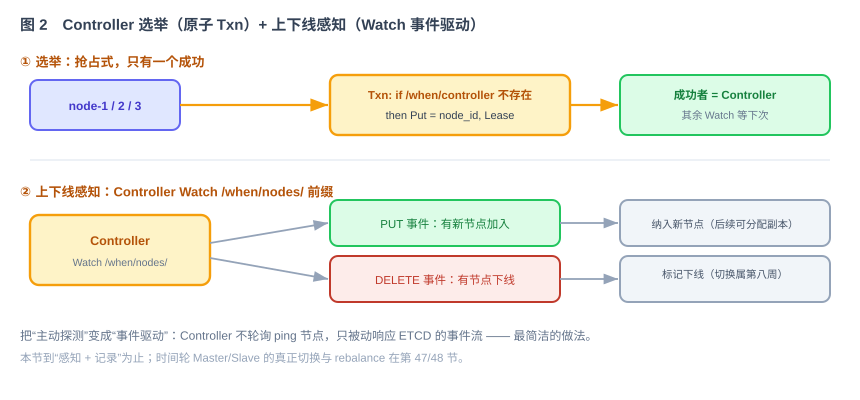

# 第 43 节：节点集群——注册、组集群、切换（Loop 原料）

> 本节基于第 42 节的 etcd 元数据契约，实现节点注册、Lease 续约、Controller 选举和成员变化通知。
>
> 十一段模板，引用第 39 节公共契约 + 第 42 节集群契约。

---

## 1. 这一节做什么

一句话：**让多个 When 节点通过 ETCD 组成一个集群，并能实时感知成员变化。**

节点启动后向 etcd 注册并持续续约 Lease，然后参与 Controller 选举。Controller 通过 Watch 接收节点加入和离线事件。本节定义完整流程及其数据结构。

> 范围说明：本节做到"**注册 + 组集群 + 成员感知 + Controller 选举**"。感知到节点变化后，时间轮 Master/Slave 的**真正切换与 rebalance** 属于第 47/48 节（第八周），本节只到"感知并记录"。

---

## 2. 为什么这么设计

**为什么注册信息绑定 Lease。** 节点把信息写入 `/when/nodes/{node_id}`，并绑定有效期为 6 秒的 Lease。节点停止续约后，key 自动删除，其他节点因此能够识别该节点已离线。按照技术方案，TTL 为 6 秒、续约间隔为 2 秒，为后续 10 秒故障切换预留恢复时间。

**为什么心跳使用独立线程和连接。** 如果续约与业务请求共用线程池或连接，业务拥塞可能导致 Lease 续约延迟并触发错误下线。独立资源可以降低业务负载对心跳的影响，但仍需通过超时和测试处理 GC 停顿与网络故障（技术方案 §4.2）。

**为什么选举使用原子事务（Txn）。** 多个节点可能同时竞争 Controller。etcd 事务执行“如果 `/when/controller` 不存在，则写入当前 `node_id`”，从而保证同一时刻只有一个节点成功。Controller key 绑定 Lease；Lease 失效后，其余节点通过 Watch 收到事件并重新选举（技术方案 §4.3）。

**为什么感知用 Watch 而不是主动 ping。** Controller Watch `/when/nodes/` 前缀，任何节点的 PUT（加入）/ DELETE（下线）都变成事件推过来。把"主动探测"变成"事件驱动"，是这套架构最简洁的地方（技术方案 §4.4）。

---

## 3. 它和 Loop 的关系

本节是提供给 Loop 的模块任务规格：Loop 据此实现节点生命周期（注册/心跳/退出）+ Controller 选举 + 成员 Watch。

- **明确输入**：注册/心跳/选举/感知的流程（第 5 节）、要存的数据结构（第 7 节）。
- **自动化验收**：第 8 节——节点能注册、心跳维持在线、杀掉节点 10s 内 key 消失、选举唯一、Watch 收到上下线事件。
- **边界**：第 9 节——到"感知 + 记录"为止，不做时间轮切换/rebalance。

---

## 4. 依赖与被依赖

**本节依赖（上游）**

- 第 42 节：ETCD 客户端封装（Put/Get/Watch/Lease/Txn）、`/when/nodes`、`/when/controller` key 约定。
- 第 39 节公共契约：`ClusterView`、`NodeEndpoint` 与公共 Harness。

**本节产出、被谁消费（下游）**

| 本节产出 | 被哪节消费 | 怎么用 |
|---|---|---|
| 节点注册 / 心跳 / 退出流程 | 所有节点启动路径 | 每个 When 进程启动即注册、保活 |
| Controller 选举 + 角色 | 第 47/48 节 HA | Controller 承担 rebalance / 故障切换决策 |
| 成员名单 + 上下线事件 | 第 47/48 节 HA | 感知到 DELETE 后，触发时间轮切换（第八周实现） |
| `EtcdClusterView`（谁在线、时间轮 Master 在哪） | 第 45、46 节 路由与集成 | Watch 节点和时间轮元数据，为跨节点转发提供统一视图 |

---

## 5. 功能与交互

**节点注册 + 心跳保活**



流程：节点启动 → 用一个 ETCD 事务检查 `/when/nodes/{node_id}` 和 `/when/workers/{worker_id}` 都不存在 → 把两个 key 绑定到同一个 6 秒 Lease → 起独立线程每 2 秒 `KeepAlive`。任一 ID 已被存活节点占用都拒绝启动。宕机后续约停止，两个 key 一起过期，其他节点可在 10 秒验收窗口内感知。

**Controller 选举 + 上下线感知**



- 选举：各节点用 `txnPutIfAbsent(/when/controller, node_id, Lease)` 抢占，只有一个成功当 Controller，其余 Watch 等待。
- 新 Controller 上任先做：从 ETCD 加载当前集群状态（节点列表、时间轮分布），检查有无遗留待处理，再进入正常循环。
- 感知：Controller Watch `/when/nodes/` 前缀，PUT = 新节点加入（纳入集群视图）、DELETE = 节点下线（标记，切换动作留给第 47/48 节）。
- 路由视图：所有节点同时 Watch `/when/timewheels/`，把 `{tw_id → master node_id → NodeEndpoint}` 缓存在 `EtcdClusterView`。第 46 节只负责预置静态时间轮元数据，不在这里实现动态分配。

**节点主动退出**（滚动升级）：收到 SIGTERM → 主动 `DELETE /when/nodes/{id}` 注销 → Controller 感知 DELETE。与宕机的区别只是"主动删" vs "Lease 到期删"，感知路径一致。

---

## 6. 接口 / 契约设计

本节复用第 42 节的 etcd 封装，并增加一个统一的集群成员管理接口：

```java
// 节点生命周期 + 集群视图（本节产出）
public interface ClusterMembership {
    void registerSelf(NodeInfo self, int workerId); // 原子占用 node/worker ID + 心跳
    void deregisterSelf();                 // 主动退出时注销两个 key
    boolean tryBecomeController();         // 原子 Txn 抢占, 返回是否当选
    void watchMembers(MemberEventHandler h); // Watch /when/nodes/ 前缀
    List<NodeInfo> listNodes();            // 当前在线节点
    Optional<String> currentController();  // 当前 Controller node_id
}
```

本节还实现第 39 节的 `ClusterView`。`masterOf(twId)` 只能返回同时满足“时间轮元数据存在、对应节点仍在线”的 Master；数据缺失或节点离线时返回空，由第 45 节明确报错，禁止随意挑选其他节点。

`NodeInfo`、成员事件结构见第 7 节。

---

## 7. 字段 / 数据结构定义

| 数据 | 存哪（ETCD key） | 结构 | 生命周期 |
|---|---|---|---|
| 节点信息 | `/when/nodes/{node_id}` | `{node_id, ip, grpc_port, start_time, load}` | Lease 6s |
| Worker ID | `/when/workers/{worker_id}` | `node_id` | 与节点相同的 Lease |
| Controller | `/when/controller` | `node_id` | Lease 6s |
| 时间轮分布 | `/when/timewheels/{tw_id}` | `{master, status, epoch}`（第一次运行可静态预置） | 持久化 |
| 成员事件 | （Watch 推送，不落 key） | `{type: PUT/DELETE, node_id, nodeInfo?}` | 瞬时事件 |

约定：

- `node_id` 集群内唯一，来自 `${WHEN_NODE_ID}`，用于节点注册、日志和角色分配。Snowflake 使用单独的数字 `${WHEN_WORKER_ID}`，见第 45、52 节；不能把任意字符串 node ID 直接塞进 Snowflake 节点位。
- Lease TTL 6s、心跳 2s（沿用技术方案与第 42 节）。
- 心跳线程独立、独立连接；续约失败要有告警日志（不含敏感信息）。

---

## 8. 验收标准 + 必须有的测试（自动化验收）

**功能验收**

- [ ] 节点启动后 `/when/nodes/{id}` 出现，且持续在线（心跳维持）。
- [ ] 杀掉某节点进程后，其 key 在 10 秒内自动消失。
- [ ] 三节点同时启动，最终**有且仅有一个** `/when/controller`。
- [ ] 三节点使用不同 worker ID 时注册成功；第四个节点使用已占用 worker ID 时拒绝启动。
- [ ] Controller 挂掉后，剩余节点在 Lease TTL 内重新选出唯一 Controller。
- [ ] Controller 能通过 Watch 收到节点加入（PUT）与下线（DELETE）事件。
- [ ] 主动退出（DELETE）与宕机（Lease 过期）都能被感知，路径一致。
- [ ] 三个节点读取同一份 `/when/timewheels/*` 后，`EtcdClusterView.masterOf(twId)` 返回完全一致的 Master；Master 节点离线后返回空。

**必须有的测试**

- [ ] 集成测试（Harness 启动本机临时 ETCD + 多节点进程/线程模拟）：注册、心跳、杀节点、选举唯一性、Watch 事件。ETCD 连接信息从 `.loop/runtime.env` 读取，验收结束后由停止脚本清理。
- [ ] 选举并发测试：N 个节点并发抢占，断言只有一个当选。
- [ ] 误判防护测试：模拟业务线程繁忙 / GC，心跳线程独立时 key 不误删。
- [ ] 集群视图测试：预置静态时间轮元数据，验证 Watch 更新、节点离线过滤和未知 `tw_id` 的空结果。
- [ ] worker ID 租约测试：节点停止后 node/worker 两个 key 一起过期，该 worker ID 随后可以由新节点取得。

---

## 9. 边界（本节不做什么）

- **不实现**时间轮 Master/Slave 的切换、rebalance、副本同步——第 47/48 节。本节感知到节点变化后，只更新集群视图 + 记录，不触发切换。
- **不实现**消息路由/调度/存储——那是 44/45/41。
- **只做**：节点注册 + 心跳 + 主动退出 + Controller 选举 + 成员/时间轮 Watch + 只读集群视图；不产生动态分配决策。
- **停止条件**：注册/保活/选举/感知全部可用、验收测试全部通过。

---

## 10. 专属 Harness（叠加在公共 Harness 之上）

**代码**

- 放在 `when-cluster` 模块的 `cluster/membership` 与 `cluster/view` 包；只经第 42 节的 ETCD 封装访问 ETCD，不另开连接（心跳的独立连接除外，且也走封装）。
- 心跳线程命名清晰、可监控；续约异常有结构化日志。

**安全**（强制约束）

- `node_id`、ip/port 等非敏感；`NodeInfo` 里**不写**任何凭据。
- ETCD 连接凭据从环境变量注入（沿用第 42 节）。

**依赖**

- 复用第 42 节 ETCD 封装；不新引组件。

---

## 11. 交付物清单（这节结束应产出）

- [ ] `ClusterMembership` 实现——原子占用 node/worker ID、心跳、主动退出、选举、Watch 和集群视图。
- [ ] `EtcdClusterView implements ClusterView`——联合节点与时间轮元数据，提供 `masterOf(twId)`。
- [ ] `NodeInfo` 及成员事件结构。
- [ ] Controller 上任初始化逻辑（加载集群状态）。
- [ ] 集成测试（多节点 + ETCD）：注册、心跳、杀节点、选举唯一、Watch。
- [ ] 本文档第 4—11 节作为该模块的 Loop 输入规格。

> 交齐以上，集群能组起来、成员变化能实时感知、Controller 能选出来。下一节（第 44 节 时间轮）转回单机核心：延时消息在内存里怎么被精确调度、到期触发。
