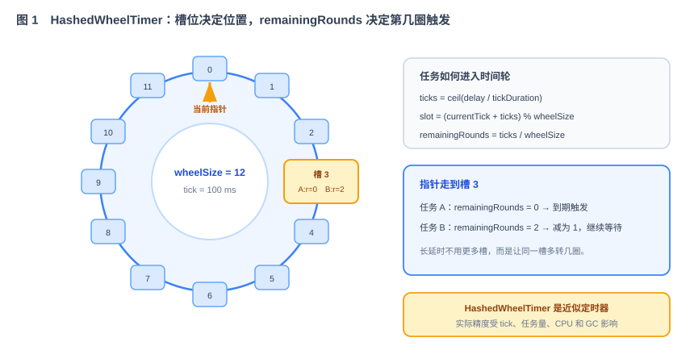
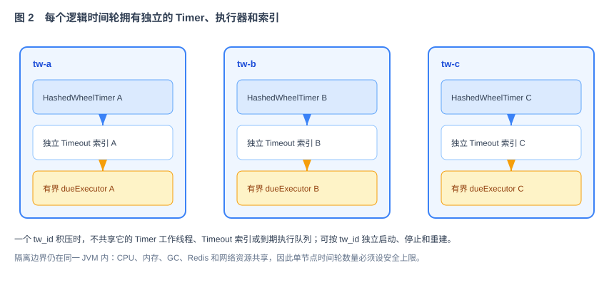
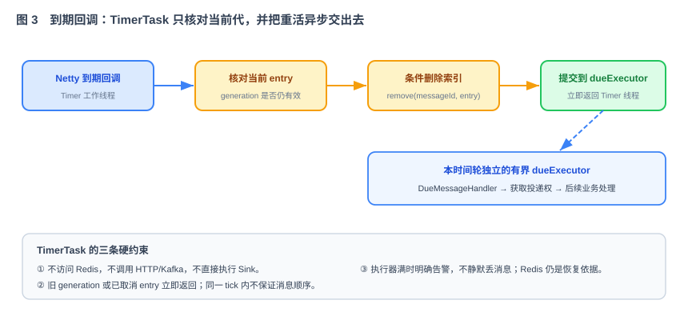

# 第 44 节：时间轮——延时机制原理与实现（Loop 原料）

> 本节实现第 39 节的 `TimeWheel`：封装 Netty `HashedWheelTimer` 调度延时消息，在允许误差内触发，并支持节点重启后从 Redis 重建。
>
> 十一段模板，引用第 39 节公共契约 + 第 41 节存储。

---

## 1. 这一节做什么

一句话：**使用 Netty `HashedWheelTimer` 实现内存调度，在 `deliverAt` 到达后按允许误差触发消息。**

生产实现不再自行编写秒、分、时、天四层槽结构，而是在 `when-timewheel` 中包装 `io.netty.util.HashedWheelTimer`。Netty 负责槽位、轮次、工作线程和超时句柄；When 负责 `tw_id` 隔离、`message_id → Timeout` 索引、取消竞态、到期交接以及从 Redis 重建。最大 30 天是 When 的业务校验上限，不要求时间轮建立 30 天数量的槽。

---

## 2. 为什么这么设计

**为什么选择 Netty `HashedWheelTimer`。** When 需要的是大量一次性延时任务的近似到点触发，不是 cron 调度。`HashedWheelTimer` 已经实现哈希时间轮、轮次计算、取消句柄和工作线程，能覆盖本项目 1 秒到 30 天的延时范围；When 无需为了教学项目再维护一套复杂的多层槽算法。它是近似定时器，因此精度由 tick 和系统负载共同决定，不能宣传成实时定时器。

**Java 选型结论。**

| 方案 | 结论 | 原因 |
|---|---|---|
| Netty `io.netty.util.HashedWheelTimer` | **采用** | 轻量、适合大量近似定时任务，提供 `Timeout` 取消句柄 |
| JDK `DelayQueue` | 不采用 | 插入和删除为 O(log n)，大量任务下不符合目标 |
| Quartz | 不采用 | 面向持久化作业和 cron，能力与依赖都过重 |
| Kafka 内部时间轮 | 不采用 | 不是面向业务项目的稳定公共 Java API，不复制内部实现 |
| 自研四层时间轮 | 不采用 | 实现和验证成本高；本项目的差异化价值不在重复造时间轮 |

**HashedWheelTimer 怎么处理短延时和长延时。**



定时器把时间切成固定 tick，并让指针每个 tick 前进一个槽。短延时任务落入后面的槽；超过一圈的长延时任务仍落在某个槽，但额外记录 `remainingRounds`。指针每次走到该槽时，轮数大于 0 就减一，等于 0 才执行 TimerTask。因此一个有限大小的圆环可以表达最长 30 天的延时，不需要画秒、分、时三层圆环。

Maven 直接依赖使用 `io.netty:netty-common`，Java 类型使用 `io.netty.util.HashedWheelTimer`、`io.netty.util.Timeout` 和 `io.netty.util.TimerTask`。版本统一放在根工程的 dependency management 中，不在本模块单独写版本；不能因为 gRPC 使用了 shaded Netty，就导入 `io.grpc.netty.shaded.*` 下的内部类型。



每个逻辑 `tw_id` 创建一个独立的 `HashedWheelTimer`、一个独立的有界 `dueExecutor` 和一份独立的消息句柄索引，并由 Composition Root 统一创建和管理，并按 `tw_id` 管理生命周期。一个时间轮积压或执行器队列塞满时，不会直接阻塞另一个时间轮的指针推进和到期交接。这里的隔离是调度资源隔离，不是进程级隔离；不同时间轮仍共享 JVM 的 CPU、内存、GC、Redis 和网络资源，因此必须限制单节点时间轮数量。

**到期回调为什么只做“核对 + 交接”。**



Netty 已经负责指针推进和槽位扫描，When 不再自己编写 `sleep` 循环。TimerTask 是时间精度的关键路径，只核对当前 entry、从索引条件删除并提交到本时间轮的 `dueExecutor`，不能执行 Redis、网络或 Sink 等同步 IO。

**为什么重启要从 Redis 重建。** 时间轮是可丢失的内存索引。节点启动时调用 `StoragePlugin.loadPendingByTimeWheel(twId)`，读取仍需处理的消息，并按 `nextAttemptAt` 重新注册到本时间轮（技术方案 §8.5）。

---

## 3. 它和 Loop 的关系

本节是提供给 Loop 的模块任务规格：Loop 实现 `TimeWheel`（Netty 包装 + 独立资源 + 增加/取消 + 重建）。

- **明确输入**：Netty 选型和包装规则（第 2、5 节）、到期线程三强制规则（第 5 节）、接口（第 6 节）、定时器参数（第 7 节）。
- **自动化验收**：第 8 节——到点精度、增加/取消、取消竞态、时间轮间隔离和重启后消息不漏。
- **边界**：第 9 节——只做内存调度与重建，不做真正投递（Sink）、不做副本。

---

## 4. 依赖与被依赖

**本节依赖（上游）**

- 第 39 节公共契约：`Message`、`TimeWheel`、`TimeWheelRegistry`、`DueMessageHandler` 接口。
- 第 41 节存储：`StoragePlugin.loadPendingByTimeWheel(twId)`（重启重建）和 `transition`（投递权与状态更新）。

**本节产出、被谁消费（下游）**

| 本节产出 | 被哪节消费 | 怎么用 |
|---|---|---|
| `TimeWheel` 实现（Netty 包装层） | 第 45 节 接入/路由 | 路由选定时间轮后，把 `Message` `add` 进去 |
| `TimeWheelRegistry` 实现 | 第 45、46 节 | 按 `tw_id` 找到本节点已启动的时间轮 |
| `add` / `remove` | 第 45 节 | 提交时 `add`；取消时 `remove`（O(1)） |
| 到期触发点（`DueMessageHandler`） | 第 46、49 节 | Netty TimerTask 到点后只报告 `message_id`，不直接做存储或 Sink IO |
| 重建逻辑（从 Redis） | 故障恢复节（第 47 节） | 切换/重启后重建内存时间轮 |

---

## 5. 功能与交互

**每个时间轮独立调度**：见图 2。Composition Root 为本节点承载的每个逻辑 `tw_id` 创建一个 `NettyTimeWheel`，每个实例内部拥有自己的 `HashedWheelTimer`、`dueExecutor` 和 `ConcurrentHashMap`。禁止每次 `add`、每条消息或每个请求创建新的 Timer；Timer 的生命周期必须与该逻辑时间轮一致。

**增加消息**：逻辑时间轮计算 `delay = max(0, nextAttemptAt - clock.millis())`，调用 `timer.newTimeout(...)`，再把 `message_id → ScheduledEntry(Timeout, generation)` 放进 `ConcurrentHashMap`。同一 `message_id` 再次加入时先使旧 entry 失效，防止旧回调删除或触发新任务。

**到期回调**：见图 3。每个时间轮自己的 Netty 工作线程只核对 entry 是否仍是当前代、从索引条件删除，并把 `message_id` 提交给本时间轮独立的有界 `dueExecutor`。三个必须遵守的规则：TimerTask 不执行 Redis 或网络 IO、不直接调用 Sink、同一 tick 内不保证消息顺序。

**到期交接**：时间轮不负责获取投递权、调用 Sink 或更新最终状态。它只调用公共契约 `DueMessageHandler.onDue(messageId)`。第 46 节注入成功型测试实现闭合第一次运行；第 49 节替换为真实投递与重试实现。这样第 44 节无需知道测试 Sink 或具体 HTTP/Kafka Sink。

**取消消息**：`remove(messageId)` 先从索引中原子移除当前 entry，再调用 `Timeout.cancel()`。取消与到期可能并发，因此时间轮只能尽力阻止回调；最终是否允许投递仍由第 41/49 节的原子状态转换裁决。不得把 `cancel()` 返回成功等同于业务取消已经成功。

**重启重建**：节点启动 → `loadPendingByTimeWheel(twId)` 读取未完成消息 → 按 `nextAttemptAt` 逐条 `add` 回时间轮 → 重建完成后执行 `start()`。重建期间 `/ready` 必须返回未就绪。

---

## 6. 接口 / 契约设计

实现公共契约 `TimeWheel`（本节不重定义，只实现）：

```java
public interface TimeWheel {
    String id();
    void add(Message m);            // 按 nextAttemptAt 注册 Netty Timeout
    void remove(String messageId);  // 从索引移除并 cancel Timeout
    void start();                   // 起调度线程
    void stop();
}
```

包装层伪代码（关键路径）：

```text
add(message):
    entry = new ScheduledEntry(messageId, nextGeneration())
    old = handles.put(messageId, entry)
    if old != null: old.timeout.cancel()
    entry.timeout = timer.newTimeout(
        ignored -> onTimeout(entry),
        max(0, message.nextAttemptAt - clock.millis), MILLISECONDS)

onTimeout(entry):
    if handles.remove(entry.messageId, entry):
        dueExecutor.submit(() -> dueHandler.onDue(entry.messageId))

remove(messageId):
    entry = handles.remove(messageId)
    if entry != null: entry.timeout.cancel()
```

伪代码表达并发语义，不要求照抄字段赋值顺序；真实实现必须避免 `newTimeout` 立即到期与 entry 尚未完整发布之间的竞态。`dueExecutor` 必须有界；队列满时不得静默丢弃到期消息，应记录可监控错误并保留可从 Redis 重建的事实。时间轮触发时不删除 Redis 消息事实。

---

## 7. 字段 / 参数定义

| 参数 | 默认 | 说明 |
|---|---|---|
| Netty Maven artifact | `io.netty:netty-common` | 由根工程统一锁版本 |
| Java 类 | `io.netty.util.HashedWheelTimer` | 生产调度后端 |
| tick | 100 ms（`${WHEN_TIMEWHEEL_TICK_MS}`） | 近似精度单位；最终阈值以验收为准 |
| wheel size | 512（`${WHEN_TIMEWHEEL_SIZE}`） | 必须为 2 的幂；长延时由轮次覆盖 |
| 物理 Timer 数 | 每个本地 `tw_id` 1 个 | 独立工作线程和任务队列，生命周期随逻辑时间轮 |
| 最大挂起任务数 | `${WHEN_TIMEWHEEL_MAX_PENDING}` | 必须配置容量上限，达到上限明确拒绝并告警 |
| 最大业务延时 | 30 天 | 在接入层校验，不等于 30 天数量的槽 |
| 每节点时间轮数 | 4（`${WHEN_TIMEWHEEL_COUNT}`） | 默认 4；同时作为资源规划基线，必须配置安全上限 |

约定：

- tick、wheel size 和最大挂起数统一配置，压测后再调整，不在业务代码中散落常量。
- 每个时间轮唯一 `tw_id`，元数据在 ETCD（第 42 节）。
- 一个节点可跑多个逻辑时间轮；每个时间轮拥有独立 Netty 工作线程和独立有界 `dueExecutor`。
- 独立 Timer 只能隔离调度队列和工作线程，不能隔离 JVM 级 CPU、内存和 GC；单节点时间轮数量超过上限时必须拒绝分配并告警。

---

## 8. 验收标准 + 必须有的测试（自动化验收）

**功能验收**

- [ ] 延时 N 秒的消息，在第 N 秒（±可接受误差）被触发，触发时间记录可断言。
- [ ] `add` 通过 `newTimeout` 注册；`remove` 通过索引定位并调用 `Timeout.cancel()`，不扫描全部任务。
- [ ] 同一 `message_id` 重复加入时只有最新 generation 可以触发，旧 Timeout 回调不能误删新 entry。
- [ ] 取消与到期并发时，不出现未捕获异常或索引泄漏；业务状态机保证已取消消息不会真正投递。
- [ ] 1 秒到 30 天范围均能注册；长延时测试使用调度后端替身或缩短参数，不真实等待 30 天。
- [ ] 每个本地 `tw_id` 恰好创建一个 `HashedWheelTimer` 和一个有界 `dueExecutor`；不同 `tw_id` 不共享这两类资源。
- [ ] 隔离测试：阻塞或塞满 `tw-a` 的 `dueExecutor`，`tw-b` 仍能在允许误差内推进并触发。
- [ ] 重启重建：`stop` 后重新 `loadByTimeWheel` + `add` + `start`，之前未投递的消息**一条不漏**、仍在正确时间触发。
- [ ] 同一条正常到期消息只调用一次 `DueMessageHandler.onDue(messageId)`；取消后的消息不调用。

**必须有的测试**

- [ ] 单元测试：delay 计算、重复加入、取消、取消/到期竞态、独立 Timer、独立执行器和容量上限。
- [ ] 精度测试：批量提交不同延时的消息，统计触发延迟分布，并满足第 38 节“投递精度”的验收要求。
- [ ] 重建测试：注入一批消息到 Redis，重建后断言全部按时触发。
- [ ] 到期交接测试：注入记录调用的假 `DueMessageHandler`，断言调用 ID、次数和线程隔离正确。
- [ ] 小规模真实 Netty 集成测试；大跨度和边界测试通过可控的 `TimerBackend` 替身执行，测试不能依赖真实等待。

---

## 9. 边界（本节不做什么）

- **不实现**获取投递权、真正的 Sink 投递和更新最终状态——TimerTask 到点只异步调用 `DueMessageHandler`；测试实现由第 46 节提供，真实实现由第 49 节提供。
- **不实现** Master/Slave 副本同步与切换——第 47 节；本节只管本地内存时间轮。
- **不实现**路由（消息怎么被分到本时间轮）——第 45 节。
- **不自研**秒/分/时/天四层槽结构，也不复制 Kafka/Netty 内部源码。
- **只做**：Netty Timer 包装层 + 逻辑时间轮隔离 + 增加/取消 + 并发保护 + 从 Redis 重建。
- **停止条件**：精度、增删、下移、重建的验收全部通过。

---

## 10. 专属 Harness（叠加在公共 Harness 之上）

**代码**

- 放在 `when-timewheel` 模块；只依赖 `when-common` 中的 `Message`/`TimeWheel`/`DueMessageHandler`/`StoragePlugin` 接口，不依赖 `when-storage-redis` 具体实现。
- Netty Timer 线程和 `dueExecutor` 线程命名清晰、可监控；TimerTask 里禁止任何同步阻塞 IO。

**安全**（强制约束）

- 触发/下移日志只记 `message_id`、`tw_id`、时间，不打 `payload` 原文。

**性能强制约束**

- TimerTask 内不得执行 Redis 同步读写，也不得同步调用 Sink；到期事件必须提交给有界异步执行器。
- `HashedWheelTimer` 只能在 Composition Root 创建 `NettyTimeWheel` 时按 `tw_id` 建立；同一 `tw_id` 不得重复创建，两个 `tw_id` 不得共享实例。
- `dueExecutor` 必须按 `tw_id` 独立且有界；禁止使用一个全节点共享的无界线程池，否则一个时间轮积压会拖慢其他时间轮。

**依赖**

- 生产依赖固定为 `io.netty:netty-common`，核心类固定为 `io.netty.util.HashedWheelTimer`；不得擅自替换 Quartz、Redisson、Kafka 内部类或另一套时间轮库。
- 在 Netty 之上定义很薄的 `TimerBackend` 接口：生产实现委托 HashedWheelTimer，测试实现支持手动推进；仅注入 `Clock` 不足以控制 Netty 内部时钟。

---

## 11. 交付物清单（这节结束应产出）

- [ ] `NettyTimeWheel implements TimeWheel` —— 每个 `tw_id` 包装独立的 `HashedWheelTimer`、有界 `dueExecutor` 和消息 Timeout 索引。
- [ ] `NettyTimerBackend` + 可手动推进的测试 `TimerBackend`，不向其他业务模块暴露 Netty 类型。
- [ ] `DefaultTimeWheelRegistry implements TimeWheelRegistry` —— 注册并按 ID 查找本节点时间轮。
- [ ] `add` / `remove`（O(1)）+ 到期后异步调用 `DueMessageHandler`。
- [ ] 从 `StoragePlugin.loadPendingByTimeWheel` 重建内存时间轮的逻辑。
- [ ] 单元 + 精度 + 重建测试（用可控时钟）。
- [ ] 本文档第 4—11 节作为该模块的 Loop 输入规格。

> 交齐以上，"到点按允许误差触发 + 重启不丢"就成立了。下一节（第 45 节 接入层 + 路由层）把入口补上：消息进来怎么校验、生成消息 ID、选到哪个时间轮、跨节点怎么转发——写入链路的关键一环。
