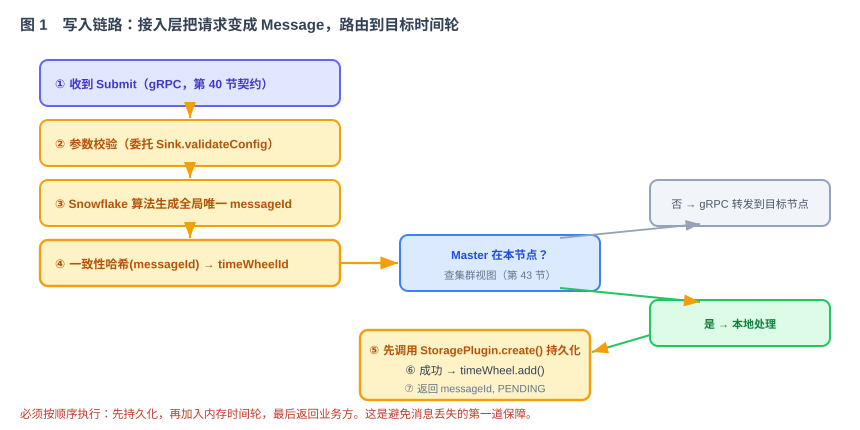
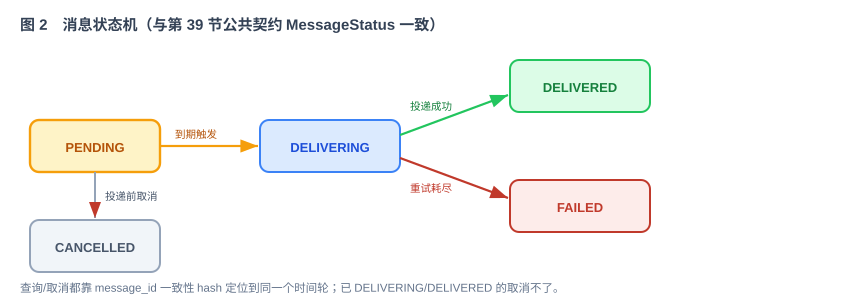

# 第 45 节：接入层 + 路由层（Loop 原料）

> 本节实现消息操作的应用层：参数校验、生成消息 ID、选择时间轮、跨节点转发、持久化和加入时间轮。它实现第 39 节的 `Router`，并向第 40 节的 gRPC 服务和第 51 节的 HTTP API 提供统一处理接口。
>
> 十一段模板，引用第 39 节公共契约 + 40 契约 + 41 存储 + 43 集群视图 + 44 时间轮。

---

## 1. 这一节做什么

一句话：**实现 Submit、Query、Cancel 的应用流程，以及消息到时间轮的路由。**

第 40 节定义传输契约，第 41 节实现存储，第 44 节实现调度。本节把它们组成完整的应用流程：收到 Submit → 校验参数 → 生成 `message_id` → 选择目标时间轮 → 必要时转发到目标节点 → 本地持久化 → 加入时间轮 → 返回。Query 和 Cancel 也通过本层处理。

---

## 2. 为什么这么设计

**为什么用 Snowflake 生成消息 ID。** 每条消息都需要全局唯一 ID。Snowflake 由时间戳、数字节点位（来自 `${WHEN_WORKER_ID}`）和序列号组成，可以在各节点本地生成，不依赖中心 ID 服务。`WHEN_NODE_ID` 是可读的节点名称，不能代替 0—1023 范围内的 worker ID（技术方案 §8.1）。

**为什么按 message_id 一致性 hash 选时间轮。** 一条消息的提交、查询、取消必须落到**同一个**时间轮，否则查不到、取不掉。用 `message_id` 做一致性 hash 选 `tw_id`，保证同一个 ID 永远映射到同一个时间轮——这正是第 39 节公共契约 `Router.routeToTimeWheel` 的语义。注意：这里 hash 的是 message_id → 时间轮，跟"消息副本集合/Master 记录"是两回事（后者是元数据表，第 42/43 节）。

**为什么 Master 不在本节点要 gRPC 转发。** 时间轮分布在集群各节点，某个时间轮的 Master 可能在别的节点。接入的节点算出 `tw_id` 后，查集群视图（第 43 节）看 Master 在哪；不在本机就用内部 gRPC（第 40 节传输）把请求转过去。对业务方无感，它连的是哪个节点都行。

**为什么"先落库、再加入时间轮、才返回"。**



这是消息可恢复的第一道保证：`storage.create()` 成功后才能加入内存时间轮并返回 `message_id`。如果 Redis 写入失败，直接返回失败，不修改内存调度状态（技术方案 §6.5、§8.1）。

**状态由谁维护。** 本节发起创建和取消相关的状态转换；第 49 节发起投递成功、失败和重试相关的状态转换。所有模块都必须通过第 41 节的原子 `transition` 接口更新状态。



---

## 3. 它和 Loop 的关系

本节是提供给 Loop 的模块任务规格：Loop 实现 `Router` + Submit/Query/Cancel 的真实管线 + 状态机。

- **明确输入**：写入链路七步（第 5 节）、路由与转发规则（第 5 节）、接口（第 6 节）、状态机（第 5、7 节）。
- **自动化验收**：第 8 节——消息 ID 唯一、同一 ID 路由结果稳定、跨节点转发正确、先持久化后返回、状态转换原子执行。
- **边界**：第 9 节——不实现时间轮内部/存储内部/投递，只做"接入 + 路由 + 编排"。

---

## 4. 依赖与被依赖

**本节依赖（上游）**

- 第 40 节：gRPC 契约（Submit/Query/Cancel）、内部 gRPC 转发通道。
- 第 41 节：`StoragePlugin.create/get/transition`。
- 第 44 节：`TimeWheel.add/remove` 与 `TimeWheelRegistry`。
- 第 43 节：ETCD 驱动的集群视图（`listNodes` / 时间轮 Master 在哪）。
- 第 39 节公共契约：`Message`、`MessageStatus`、`Router`、`ClusterView`、`NodeEndpoint`。

**本节产出、被谁消费（下游）**

| 本节产出 | 被哪节消费 | 怎么用 |
|---|---|---|
| `Router` 实现（一致性 hash） | 第 44 节时间轮、gRPC 转发 | 定位消息归属时间轮 |
| Submit/Query/Cancel 真实管线 | 第 40 节 gRPC Server | Server 把请求委托给本层处理 |
| 状态机流转 | 管理台节、Sink 投递节 | 投递成功/失败时更新状态 |
| gRPC 内部转发逻辑 | 集群跨节点 | Master 不在本机时转发 |

---

## 5. 功能与交互

**写入（Submit）七步**：见图 1。① 收到 Submit → ② 检查时间、payload 和 `sink_config` 结构 → ③ 生成 `message_id` → ④ 一致性 hash 选择 `tw_id` → 判断 Master 是否在本机：不在则通过 gRPC 转发；在本机则 ⑤ `storage.create()` 持久化 → ⑥ 成功后 `timeWheel.add()` → ⑦ 返回 `message_id` 和 `PENDING`。第 49 节接入后，再调用具体 Sink 的运行时配置校验。

本机时间轮必须通过 `TimeWheelRegistry.require(twId)` 获取；Master 位置必须通过注入的 `ClusterView.masterOf(twId)` 获取。路由层不得自行读取 ETCD，也不得在找不到时间轮或 Master 时静默创建默认值。

第 46 节第一次运行分两步：单节点阶段注入 `StaticClusterView`，所有 `tw_id` 指向本节点；三节点阶段改用预置静态映射或第 43 节提供的 ETCD 集群视图，验证跨节点 gRPC 转发。动态分配与迁移仍留到第 48 节。

**查询（Query）**：`message_id` 一致性 hash 定位时间轮 → 转发到 Master（如需）→ 从内存/存储读状态返回。MVP 阶段查询也走 Master 路由，简化实现；后续可优化成任意节点可查。

**取消（Cancel）**：先执行原子转换 `PENDING → CANCELLED`；转换成功后从时间轮移除。消息在终态保留期内仍可查询，不立即删除。当前状态不是 `PENDING` 时取消失败。

**状态机**：见图 2。所有转换使用 `StoragePlugin.transition`。可重试失败执行 `DELIVERING → PENDING` 并写入 `nextAttemptAt`；不可重试或超过次数后转为 `FAILED`。

---

## 6. 接口 / 契约设计

实现公共契约 `Router`，并实现第 40 节定义的 `DelayMessageHandler`：

```java
public interface Router {
    String routeToTimeWheel(String messageId);  // 一致性 hash → tw_id
}

// Router 的实现通过构造参数注入 ClusterView 与 TimeWheelRegistry；
// 接口本身只返回稳定 tw_id，定位节点是应用编排的一部分。

// 第 40 节定义，本节提供正式实现
public interface DelayMessageHandler {
    SubmitResult submit(SubmitCommand cmd);   // 校验→生成消息 ID→路由→(转发/落库加入时间轮)→返回
    MessageView  query(String messageId);
    CancelResult cancel(String messageId);
}
```

`SubmitCommand` 是与传输协议无关的内部命令。第 40 节把 gRPC 请求转换为它，第 51 节把 HTTP 请求转换为它；`submit` 构造 `Message` 并完成持久化和调度。

---

## 7. 字段 / 规则定义

**message_id（Snowflake）**：`时间戳 | 节点位(${WHEN_WORKER_ID}) | 序列号`；本地生成、并发不重复、大致有序。节点启动时必须确认 worker ID 未被其他存活节点占用，冲突时拒绝启动。

**一致性 hash**：`tw_id = consistentHash(message_id) % 时间轮环`；同一 `message_id` 恒定映射到同一 `tw_id`。

**校验规则**（沿用第 40 节，由接入层执行）：

| 检查 | 规则 |
|---|---|
| 时间 | `deliver_at` 与 `delay_seconds` 二选一；`deliver_at` 未来；`delay` 1~2592000 秒 |
| sink | `sink_config` 分支与 `sink_type` 一致，委托 `Sink.validateConfig` |
| payload | 解码 ≤ 64KB |
| 不合法 | 返回 `INVALID_ARGUMENT`，指明字段 |

**状态机**：`PENDING / DELIVERING / DELIVERED / FAILED / CANCELLED`（第 39 节公共契约 `MessageStatus`）。

---

## 8. 验收标准 + 必须有的测试（自动化验收）

**功能验收**

- [ ] Snowflake 生成消息 ID：单机并发生成不重复；ID 大致随时间递增。
- [ ] 一致性 hash：同一 `message_id` 多次路由结果恒定，落到同一 `tw_id`。
- [ ] Submit 合法 → `create` 成功后才加入时间轮并返回 `PENDING`；持久化失败 → 返回失败且不修改内存。
- [ ] Master 不在本节点 → 请求被 gRPC 正确转发到目标节点并成功处理。
- [ ] `ClusterView` 找不到 Master、`TimeWheelRegistry` 找不到本地时间轮时明确失败，不静默路由到任意节点。
- [ ] Query 返回正确状态；Cancel 对 `PENDING` 成功、对已投递失败。
- [ ] 状态转换符合状态机；100 个并发取消请求中只有一个 `PENDING → CANCELLED` 成功。

**必须有的测试**

- [ ] 单元测试：Snowflake 并发唯一、一致性 hash 恒定、校验规则逐条。
- [ ] 集成测试（端到端单机）：Submit→（存储+时间轮桩/真实）→Query 查到→到期→状态变化。
- [ ] 集成测试（两节点）：目标时间轮在对端 → gRPC 转发路径打通。
- [ ] 静态视图测试：同一份时间轮映射在所有节点得到相同 Master 结果。
- [ ] 持久化失败测试：`storage.create` 抛错时不加入时间轮并返回失败。

---

## 9. 边界（本节不做什么）

- **不实现**时间轮内部结构（第 44 节）、存储内部（第 41 节）、真正投递（第 49 节）——本层只**编排**它们。
- **不实现** Master/Slave 副本与故障切换（第 47 节）——本层只在写入时"查 Master 在哪并转发"，不管切换。
- **只做**：接入（校验/生成消息 ID/状态机）+ 路由（一致性 hash + 转发）+ Submit/Query/Cancel 编排。
- **停止条件**：写入/查询/取消端到端打通、转发正确、先落库后返回、验收全部通过。

---

## 10. 专属 Harness（叠加在公共 Harness 之上）

**代码**

- 放在 `when-ingress-router` 模块的 `core/ingress` 与 `core/router` 包；只依赖各模块**接口**，不依赖 Redis、ETCD 或具体时间轮实现。
- `ClusterView`、`TimeWheelRegistry`、内部 gRPC 客户端均通过构造参数注入；测试可替换为静态实现或假实现。
- gRPC Server（第 40 节）和 HTTP API（第 51 节）只处理传输与委托；消息 ID 生成和应用流程只在本层实现。
- proto ↔ 内部 `Message`/命令 的转换集中一处。

**安全**（强制约束）

- 日志只记 `message_id`/`tw_id`/状态，不打 `payload`、不打 `sink_config` 里的敏感值。
- 转发的 gRPC 通道凭据（如启用）从环境变量注入。

**依赖**

- Snowflake 用成熟实现或简洁自实现（数字节点位来自 `${WHEN_WORKER_ID}`）；不引重框架。

---

## 11. 交付物清单（这节结束应产出）

- [ ] `Router` 实现（一致性 hash）+ `DelayMessageHandler` 实现（Submit/Query/Cancel 管线）。
- [ ] Snowflake 消息 ID 生成器（节点位 `${WHEN_WORKER_ID}`）及启动冲突检查。
- [ ] proto ↔ `Message`/命令 转换；gRPC Server 改为委托本层。
- [ ] 跨节点 gRPC 转发逻辑（查集群视图定位 Master）。
- [ ] 单节点和两节点测试使用第 46 节 `when-test-support` 提供的 `StaticClusterView`，本模块不再实现另一份静态视图。
- [ ] 状态机流转 + 单元/集成/两节点/落库失败测试。
- [ ] 本文档第 4—11 节作为该模块的 Loop 输入规格。

> 完成以上内容后，写入流程就可以完整运行：消息从 gRPC 进入，经过校验并生成 ID，路由到本地或远端时间轮，先保存到 Redis，再加入时间轮并按时触发。第七周的模块原料到此备齐，下一节（第 46 节）把 40—45 节集成起来，正式运行第一次 Loop。
