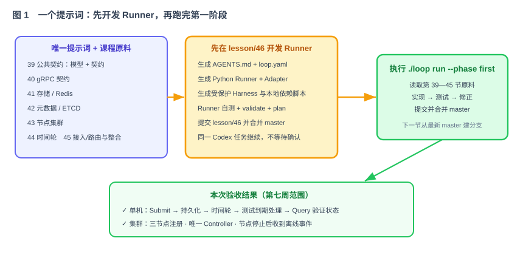
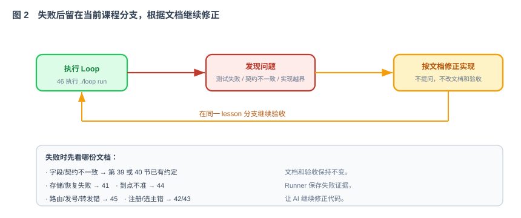

# 第 46 节：Loop 运行演示课（第一次运行）

> 第 39—45 节已经准备好第一阶段原料，第 47—53 节已经准备好第二阶段原料和交付规则。本节只给 Codex **一个提示词**。Codex 先开发并验证支持 phase 的 Loop Runner，再直接执行 `./loop run --phase first`，直到第一阶段全部完成。
>
> 学员不需要在 Runner 建好后再发第二个提示词，也不需要手动接力。创建工具、运行 Loop、处理失败和完成验收都在同一个 Codex 任务中连续进行。
>
> 完整的配置、状态结构、Adapter、重试、恢复、退出码和排错规则见《[第 46 节附件：Loop Runner 完整使用与实现手册](第46节附件：Loop Runner 完整使用与实现手册.md)》。

---

## 1. 这一节做什么

一句话：**把一个提示词交给 Codex；Codex 先在 `lesson/46` 分支开发支持两个阶段的 Loop Runner 并合并 `master`，随后运行 `./loop run --phase first`，按照第 39—45 节顺序开发，直到第一阶段验收全部通过。**

本节分为两部分：

1. **原理**：Runner、AI、验收命令怎么配合；状态怎么保存；失败怎么重试；为什么完成的课程不用重跑。
2. **演示**：执行哪些命令；屏幕上看什么；怎么演示失败重试、中断恢复和最终完成。



## 2. 唯一需要交给 Codex 的提示词

项目初始只有四份 When 项目文档和课程资料，没有代码、`AGENTS.md`、构建文件、测试、Runner 或 `./loop`。把下面这段话交给 Codex 后，后续工作由它连续完成。

把下面这段作为唯一提示词交给 Codex：

```text
这是一个没有任何代码的 When 空项目。当前输入只有 docs/ 中的四份项目文档和课程资料。

你现在只负责建立 Loop 运行环境，暂时不要实现任何 When 业务模块。

请先完整阅读：
1. docs/项目篇 When：业界调研.md
2. docs/When 项目需求文档.md
3. docs/When 项目技术方案文档.md
4. docs/When 项目 AI 编程实施指引.md
5. docs/第39—45节的第一阶段 Loop 原料文档
6. docs/第47—53节的第二阶段 Loop 原料与交付文档
7. docs/第46节：Loop 运行演示课（整合运行）.md
8. docs/第46节附件：Loop Runner 完整使用与实现手册.md

如果还没有 Git 仓库，先初始化并建立干净的 `master` 基线；然后从 `master` 创建并切换到 `lesson/46`。第一步只创建并验证以下内容：
- 根据上述文档生成适用于 Codex 的 AGENTS.md
- 仓库根目录的可执行入口 loop
- loop.yaml
- harness/loop/loop_runner.py
- harness/loop/agent_adapter.py
- harness/loop/schema/loop.schema.json
- harness/loop/schema/state.schema.json
- harness/loop/prompts/stage.md
- harness/loop/protected-paths.txt
- harness/contracts/ 下由文档提取的契约检查、验收入口和必要测试数据
- Loop Runner 自身的自动化测试
- harness/local/start-deps.sh、wait-deps.sh、stop-deps.sh，用本机进程启动和停止 Redis、ETCD
- 必要的 .gitignore；如果当前目录还不是 Git 仓库，则初始化本地 Git 仓库，建立 `master` 基线提交，但不要配置远端、不要 push

强制要求：
1. loop 是一个很薄的 Bash 脚本，只负责把参数转给 Python Runner。
2. 循环、课程依赖、状态、锁、课程提交、失败重试、指纹失效和报告由 Python Runner 实现。
3. Agent Adapter 使用 Codex 非交互命令，通过标准输入传入当前阶段提示词；命令为 codex exec --sandbox workspace-write --json -。
4. 不使用 --full-auto。
5. AGENTS.md 只能整理四份项目文档和课程资料中已经明确的约束，不能发明新的产品或技术要求。
6. harness/contracts/ 只负责从外部检查结果，不能包含 When 业务实现。
7. 开发 Runner 时不实现 when-common、when-api、when-storage-redis、when-timewheel、when-cluster、when-app 等业务模块，也不创建这些模块的业务源码。
8. Runner 自身测试、./loop validate 和 ./loop plan 全部通过后，提交 `lesson/46`，以 --no-ff 合并回 master，然后切换到 master。
9. 不修改课程原料、验收测试和受保护文件来让检查通过。
10. 状态文件必须原子写入；同一时间只允许一个 Runner；失败只重试当前阶段；已经通过且指纹未变化的阶段必须跳过。
11. 不使用 Git Worktree。Runner 开发使用第一个分支 lesson/46；正式 Loop 使用 lesson/39、lesson/40、lesson/41、lesson/42、lesson/43、lesson/44、lesson/45。每个业务分支都从最新 master 创建，通过后提交并合并回 master，下一节再从更新后的 master 创建分支。
12. 不使用 Docker、Docker Compose 或 Testcontainers。Redis、ETCD 由 harness/local/ 下的脚本作为本机临时进程启动，数据目录和端口相互隔离，验收结束后停止。
13. 实现、编译或测试出现问题时，不询问用户、不等待确认。重新阅读四份项目文档、公共契约、当前课程文档和失败日志，在当前 lesson 分支继续修改并重试。
14. 文档没有规定实现细节时，选择满足现有接口和验收的最简单方案，并把选择写入本轮报告；不能借此改变需求、公共接口或降低测试标准。
15. 项目最初没有 mvnw、pom.xml 和业务模块。它们由 lesson/39 创建。validate 不能仅因这些尚未生成就失败，但必须验证它们会在后续使用前由 lesson/39 生成。
16. loop.yaml 定义 `first` 和 `second` 两个阶段；`first` 包含 lesson39—lesson45，`second` 包含 lesson47—lesson52、发布候选验收和 lesson53 交付阶段。第 46 节负责创建 Runner，不在任何 phase 中再次执行。
17. Runner 从建立时就支持 `--phase`。本节只运行 `first`；第 53 节运行 `second`，不需要到时重写 Runner。
18. 合并 lesson/46 后立即在 master 执行 ./loop run --phase first。不要停下来等我输入命令，也不要只告诉我“下一步可以运行”。
19. 持续运行，直到 lesson39 到 lesson45 全部完成、分别合并 master、第一阶段端到端验收通过并输出 FIRST PHASE COMPLETE。
20. 如果进程中断但仓库和环境仍可用，直接再次执行 ./loop run --phase first，从保存的状态继续。

最终只向我报告：lesson/46 Runner 提交和合并结果、第 39—45 节的提交与合并结果、第一阶段验收证据、FIRST PHASE COMPLETE 状态和仍存在的客观风险。
```

这就是第 46 节唯一需要学员提交的提示词。Codex 内部会先检查 `AGENTS.md`、Runner、受保护验收入口、两个 phase 的 `loop.yaml` 和自身测试；检查通过后，它自己执行 `./loop run --phase first`。Runner 为每节课程自动生成的内部任务不算学员提示词，学员无需再发送“继续”“开始运行”或任何修复提示词。

根目录的 `loop` 是 Shell 脚本，但它不承担循环逻辑：

```bash
#!/usr/bin/env bash
set -euo pipefail

repo_root="$(cd "$(dirname "${BASH_SOURCE[0]}")" && pwd)"
exec python3 "$repo_root/harness/loop/loop_runner.py" "$@"
```

还要保证它有执行权限：

```bash
chmod +x loop
```

---

# 第一部分：原理——Loop 为什么能稳定跑下去

## 3. 用一个独立 Runner 管理整个执行过程

这里固定采用一个独立的 **Loop Runner**。它运行在 AI 外面，负责课程顺序、分支、状态、重试、合并和最终验收；AI 每次只负责当前课程的实现。

| 角色 | 负责什么 | 不负责什么 |
|---|---|---|
| Runner | 创建课程分支、整理当前课程资料、调用 AI、执行验收、保存状态、合并 `master`、重试和恢复 | 不写 When 业务代码 |
| AI | 阅读当前原料、修改当前模块、根据失败证据修正 | 不决定自己是否通过，不靠记忆判断进度 |
| 验收程序 | 构建、测试、契约检查和端到端验收 | 不接受 AI 自报成功 |
| 人 | 启动 Runner、查看状态和最终报告 | 运行过程中不回答实现确认，也不手工替 AI 补代码 |

核心原则：

> **AI 解决当前问题；Runner 管理整个过程；验收命令决定结果。**

不能只在一次长对话里要求 AI“把 40—45 全部做完”。对话可能中断，AI 也可能忘记进度或错误判断测试结果。完成状态必须写在仓库外部状态文件中。

`lesson/46` 生成的 `AGENTS.md`、课程文档和 `harness/contracts/` 在正式 Loop 中是受保护输入。后续课程分支可以读取，但不能为了通过验收而修改。代码或测试失败时依据这些文档修正实现，不把问题改成一道确认题交给用户。

## 4. Runner 由什么组成

Runner 是 `lesson/46` 分支创建的工程工具，不属于 When 的生产代码。它必须先独立生成、测试并合并 `master`，随后才能在同一个 Codex 任务中启动正式 Loop。

```text
when/
├── loop                              # 薄 Bash 入口
├── loop.yaml                         # 阶段、依赖、原料、输出范围和验收命令
├── AGENTS.md                          # Codex 自动读取的项目公共约束
├── harness/loop/loop_runner.py       # 独立循环程序
└── .loop/
    ├── state.json                    # 当前状态
    ├── run.lock                      # 防止两个 Loop 同时修改仓库
    └── runs/{run_id}/                # 每次尝试、失败证据、交接和最终报告
```

根目录的 `./loop` 只是一个薄入口，内部调用 Python Runner。学员不需要记 Python 参数，也不需要直接编辑 `.loop/state.json`。

## 5. 第 39—45 节怎样变成可执行阶段

第一次运行严格按照课程顺序，不合并课程，也不调整先后：

```text
lesson/39 → 验收 → 合并 master
lesson/40 → 验收 → 合并 master
lesson/41 → 验收 → 合并 master
lesson/42 → 验收 → 合并 master
lesson/43 → 验收 → 合并 master
lesson/44 → 验收 → 合并 master
lesson/45 → 验收 → 合并 master
第一阶段最终验收 → FIRST PHASE COMPLETE
```

每一节的 Git 操作都相同：

```bash
git switch master
git status --porcelain                 # 必须为空
git switch -c lesson/41 master         # 示例：开始第 41 节
# AI 修改，Runner 执行验收
git add <第41节允许修改的文件>
git commit -m "lesson 41: implement redis storage"
git switch master
git merge --no-ff lesson/41 -m "merge lesson 41"
```

Runner 不删除课程分支，也不 push。下一节只能从刚合并完成的 `master` 创建，不能从上一节分支继续切分支。

`loop.yaml` 是唯一阶段清单。每个阶段至少声明：读什么、依赖谁、允许改哪里、用什么命令判定成功。

```yaml
version: 1

defaults:
  max_attempts: 5
  one_active_stage: true

git:
  base_branch: master
  branch_template: "lesson/{lesson}"
  use_worktree: false
  merge_after_pass: true
  merge_strategy: no_ff

phases:
  first:
    stages: [lesson39, lesson40, lesson41, lesson42, lesson43, lesson44, lesson45]
    completion_message: FIRST PHASE COMPLETE
  second:
    requires_phase: first
    stages: [lesson47, lesson48, lesson49, lesson50, lesson51, lesson52]
    delivery_stage: lesson53
    completion_message: SECOND PHASE COMPLETE

stages:
  - id: lesson41
    lesson: 41
    specs:
      - docs/第41节：存储层插件化 + Redis 插件（Loop 原料）.md
    depends_on: [lesson40]
    outputs:
      - when-storage-redis/
    judge: ./mvnw -q -pl when-storage-redis -am verify

  - id: lesson44
    lesson: 44
    specs:
      - docs/第44节：时间轮——延时机制原理与实现（Loop 原料）.md
    depends_on: [lesson43]
    outputs:
      - when-timewheel/
    judge: ./mvnw -q -pl when-timewheel -am verify
```

其他课程使用相同结构。第 45 节把第一阶段成果接入 `when-app` 和验收模块；第 47—52 节属于 `second`，第 53 节是发布候选验收通过后的交付阶段。Runner 启动时必须验证：phase 依赖、课程依赖、文档、输出范围和验收命令。校验失败时不能调用 AI。

## 6. `./loop run --phase first` 内部怎样循环

每次执行 `./loop run --phase first`，Runner 固定完成以下动作：

1. 获取 `.loop/run.lock`，防止两个 Runner 同时修改仓库；
2. 读取 `loop.yaml`、`.loop/state.json`，确认当前仓库没有无关修改；
3. 切到 `master`，验证已完成课程的 merge commit 和文件指纹；
4. 找到第 39—45 节中第一节未完成课程，从最新 `master` 创建或恢复 `lesson/{节号}`；
5. 只读取四份项目文档、第 39 节公共契约、当前课程文档、必要的上游结果和最近失败证据；
6. 调用 AI，让它只在当前课程分支修改允许的目录；
7. AI 返回后，由 Runner 在当前仓库执行该节验收命令；
8. 失败则保存证据，在同一分支重新调用 AI；通过则提交课程分支；
9. 切回 `master`，以 `--no-ff` 合并课程分支并记录 merge commit；
10. 从更新后的 `master` 开启下一节；第 45 节合并后重新执行完整验收。

```text
master → 创建 lesson/N → 调用 AI → Runner 执行验收
             ▲                         │
             │              失败：按文档修正并重试
             │                         │
             └──── 同一分支继续 ←─────┘
                                       │通过
                              提交并合并 master → lesson/N+1
```

每次只把当前课程所需信息交给 AI。不要每轮都把第 39—45 节全文塞进上下文，也不要让 Redis 课程提前实现 Controller 或 Sink。

## 7. AI 失败后怎样重试

Runner 不把实现问题转成确认问题。失败后先定位，再根据文档修正：

| 失败类型 | Runner 怎么处理 |
|---|---|
| AI 进程异常 | 保存退出码和脱敏错误，在当前 `lesson/{节号}` 分支重新调用 |
| 编译或测试失败 | 重新读取当前课程文档、失败测试和相关代码，只修当前课程 |
| 实现细节未写明 | 选择满足需求、技术方案、公共接口和验收的最简单实现，记录选择后继续 |
| 文档表述看起来不一致 | 按“需求范围 → 技术方案 → 第 39 节公共契约 → 当前课程细节 → 第 46 节运行规则”的顺序判断，不询问用户 |
| 修改越界或测试被改动 | 要求 AI 撤销越界修改，恢复受保护文件，再按当前课程重做 |
| 本机 Redis/ETCD 未启动 | Runner 执行本机依赖启动脚本并等待就绪，然后重新验收 |

重试时保留历史证据，不能覆盖上一轮结果。下一次 AI 重点读取当前课程、最新失败证据和现有代码，不从头重写已经通过的部分，也不切换到新的课程分支。

只有下面这些无法靠修改项目代码解决的问题才退出，并直接输出原因，不发起确认：

- Git 仓库损坏、`master` 或已经合并的历史记录不一致；
- 本机缺少 Java、Python、Codex、Redis 或 ETCD 可执行程序，Runner 无法启动；
- 文件系统只读、磁盘空间不足或进程没有必要权限；
- 课程文档或受保护验收文件缺失、损坏。

普通编译错误、测试失败、接口理解错误、分支内合并冲突和实现方案选择都不属于确认事项。达到单轮重试次数后，Runner 重新整理当前课程上下文和全部失败记录，开始下一组尝试，仍留在同一课程分支。



## 8. 为什么完成的课程不用重新跑

每节通过并合并 `master` 后，Runner 在 `.loop/state.json` 记录：

```json
{
  "stage": "lesson44",
  "lesson": 44,
  "branch": "lesson/44",
  "status": "PASSED",
  "attempts": 2,
  "spec_hash": "第44节原料内容哈希",
  "output_hash": "when-timewheel目录内容哈希",
  "judge_hash": "验收文件和命令哈希",
  "lesson_commit": "课程分支提交",
  "merge_commit": "合并master的提交"
}
```

重新运行时，以下四项全部一致才跳过：

1. 原料没有变化；
2. 当前课程负责的代码没有变化；
3. 验收命令和受保护文件没有变化；
4. `master` 中仍存在该节的 merge commit，提交关系正确。

如果某一项变化，Runner 会把当前课程重新标为 `PENDING`，并让依赖它的后续课程一起失效。因此“跳过”不是相信一条历史状态，而是重新验证输入、输出和验收规则的指纹。

修改公共契约后，必须显式执行：

```bash
./loop invalidate --stage lesson39 --downstream
```

---

# 第二部分：演示——现场怎么跑起来

## 9. 唯一提示词提交后，Codex 会执行哪些命令

以下命令用于帮助学员理解屏幕输出，不需要再作为第二个提示词交给 Codex。Codex 在同一个任务中依次执行：

```bash
./loop validate                 # 检查两个 phase、原料、依赖、验收命令和 Agent 适配器
./loop plan --phase first       # 只显示第一阶段，不调用 AI、不修改代码
./loop run --phase first        # 启动第一阶段
```

运行过程中，Codex 可以用下面的命令查看状态和失败证据：

```bash
./loop status --phase first         # 当前课程、lesson 分支、已合并课程和尝试次数
./loop logs --stage lesson44        # 第 44 节最近一次 AI 输出和验收结果
./loop report --phase first         # 生成第一阶段报告
```

如果执行进程意外中断，Codex 直接继续：

```bash
./loop run --phase first
```

同一条命令既用于首次运行，也用于恢复运行。Runner 自动跳过仍然有效且已经合并 `master` 的课程，从第一节未完成课程继续。整个过程仍属于最初那一个 Codex 任务。

实现或测试失败时不需要输入额外命令。Runner 留在当前 `lesson/{节号}` 分支，根据文档和失败日志继续修改。禁止直接修改状态文件，也不提供“强制标记成功”或“跳过本节”的命令。

## 10. 现场演示顺序

### 演示一：第一次启动

把本节唯一提示词交给 Codex。Codex 先展示 `lesson/46` 上的 Runner 自身测试以及 `validate`、`plan` 结果；全部通过并合并 `master` 后，不暂停，直接开始业务阶段：

```bash
./loop validate
./loop plan --phase first
./loop run --phase first
```

屏幕先显示课程顺序和分支，随后持续显示：

```text
run_id | lesson | branch | status | attempt | judge
```

### 演示二：一次真实失败和自动重试

选择一个准备好的失败样例，让某节课程的实现无法通过既有测试。不能临时篡改验收命令制造假失败。

观察 Runner：

1. 停留在当前课程分支；
2. 保存失败测试和错误摘要；
3. 再次调用 AI，只携带当前原料和失败证据；
4. 验收命令通过后才提交、合并 `master`，并进入下一节课程。

另开终端查看：

```bash
./loop status --phase first
./loop logs --stage lesson44
```

### 演示三：中断后恢复

在某节课程执行过程中按 `Ctrl+C`，然后再次执行：

```bash
./loop run --phase first
```

已经合并且指纹不变的课程显示 `SKIPPED(PASSED)`；Runner 检查当前 `lesson/{节号}` 分支和未提交修改，从该节继续。不能重跑全部课程，也不能新建同名分支覆盖现场。

### 演示四：整体完成

所有课程通过并合并 `master` 后，Runner 必须从最终代码重新执行：

```bash
./mvnw -q verify
harness/local/start-deps.sh
harness/local/wait-deps.sh --timeout 30
./mvnw -q -pl when-acceptance -Pacceptance verify
harness/local/stop-deps.sh
```

本节所有 Redis、ETCD 验收都连接 Harness 启动的本机临时进程，不使用 Docker、Docker Compose 或 Testcontainers。启动脚本使用随机空闲端口和临时数据目录；无论成功、失败或中断，停止脚本都要运行。

最后查看：

```bash
./loop status --phase first
./loop report --phase first
```

## 11. 怎么判定真的跑完

Runner 只有同时跨过四道门，才输出 `FIRST PHASE COMPLETE` 并以退出码 0 结束：

1. `loop.yaml` 中第 39—45 节都仍然有效，并保持 `PASSED`；
2. 每一节都存在对应的 `lesson/{节号}` 提交和 `master` merge commit，验收命令由 Runner 执行成功；
3. 最终根构建和整体端到端验收重新执行成功，不能复用阶段缓存；
4. `.loop/runs/{run_id}/final-report.md` 写明每节课程、尝试次数、课程提交、合并提交、最终命令和证据位置。

只要有一道不成立，`./loop status` 就不能显示 `COMPLETE`。是否跑完由机器证据决定，不以 AI 回复“已经完成”为准。

第一次运行最终至少证明：

- 单节点：Submit → Redis → 时间轮 → 测试 Sink → `DELIVERED`；Query/Cancel 正确；
- 重启恢复：Redis 中未完成消息能重新加入时间轮；
- 三节点：节点注册、唯一 Controller、静态时间轮分布和跨节点转发成立；
- 本轮暂不包含真实 HTTP/Kafka Sink、Master/Slave 切换和动态 rebalance。

---

## 12. 本节验收

- [ ] 学员只提交一个提示词；同一个 Codex 任务先开发 Runner，再执行 `./loop run --phase first` 到 `FIRST PHASE COMPLETE`。
- [ ] 能从只有四份项目文档和课程资料的空项目开始，生成 `AGENTS.md`、受保护验收入口、Runner 和本地 Git 基线。
- [ ] `validate` 允许 lesson/39 尚未创建的构建文件暂时不存在，但能验证它们会在后续使用前生成。
- [ ] 不创建 Git Worktree；Runner 先在 `lesson/46` 开发并合并，正式 Loop 再依次使用 `lesson/39`—`lesson/45`，每节从最新 `master` 创建，通过后以 `--no-ff` 合并回 `master`。
- [ ] 不调用 Docker、Docker Compose 或 Testcontainers；Redis、ETCD 使用本机临时进程完成验收并自动清理。
- [ ] 仓库根存在可执行的 `./loop`，并提供 `validate`、`plan`、`run`、`status`、`logs`、`invalidate`、`report`；`plan/run/status/report` 支持 `--phase`。
- [ ] `./loop validate` 能发现文档缺失、课程依赖成环、输出范围冲突、验收命令不存在和 Agent 适配器不可用。
- [ ] `./loop plan --phase first` 打印第 39—45 节；`./loop plan --phase second` 打印第 47—52 节、发布候选验收和第 53 节交付阶段；两者都不调用 AI、不修改代码。
- [ ] 第一次 `./loop run --phase first` 从第 39 节开始；中断后再次运行从当前课程分支恢复。
- [ ] 验收命令失败时在当前 lesson 分支根据文档自动修正，不询问用户，已合并课程不重跑。
- [ ] `PASSED` 课程只有四项指纹一致且合并提交仍在 `master` 时才跳过；原料或公共契约变化会让当前及后续课程失效。
- [ ] 普通实现、编译和测试问题不会进入确认等待；只有宿主机或仓库本身无法继续时才退出并报告原因。
- [ ] 只有第一阶段课程都已合并 `master` 且最终端到端验收通过时，才输出 `FIRST PHASE COMPLETE` 和退出码 0。
- [ ] 最终报告可以追溯每节课程的输入、输出、尝试、验收命令、课程提交、合并提交和失败证据。

## 13. 交付物

- [ ] 根目录可执行入口 `./loop`。
- [ ] `loop.yaml` 包含 `first` 与 `second` 两个阶段。
- [ ] `harness/loop/loop_runner.py` 和 Agent Adapter。
- [ ] `.loop/state.json` schema、原子写入和运行锁。
- [ ] 课程报告、失败证据、lesson commit、master merge commit 和最终报告。
- [ ] Runner 自身测试：失败重试、跳过已完成课程、中断恢复、指纹失效、并发锁、分支合并和最终完成判定。

> 第 46 节的重点不是“看 AI 写了多少代码”，而是用一个提示词让 Codex 先把循环工具建好，再让这个工具按分支稳定地完成第 39—45 节和第一阶段整体验收。
