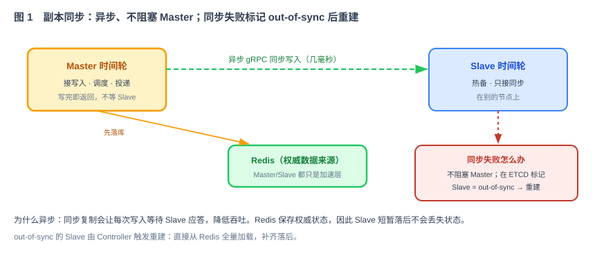
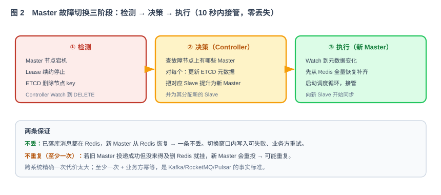

# 第 47 节：故障恢复——Master/Slave 副本同步（Loop 原料）

> HA（High Availability，高可用）表示单个节点故障后系统仍能恢复服务。本节为每个时间轮配置 Master/Slave 双副本，实现异步同步，并在 Master 故障后 10 秒内由 Slave 接管。
>
> 十一段模板，引用第 39 节公共契约 + 42 集群契约 + 43 集群感知 + 44 时间轮 + 41 存储。**本节还产出一组副本 HA 契约**（`ReplicaSync` + 时间轮 Master/Slave 元数据），第 48 节 Controller 用它做决策。

---

## 1. 这一节做什么

一句话：**给每个时间轮配置一个异节点 Slave，在 Master 故障后 10 秒内完成接管，并从 Redis 恢复未完成消息。**

第 44 节的时间轮只存在于一个节点的内存中。本节在另一个节点维护 Slave 副本。Master 异步同步时间轮的增加和移除操作；故障后，Controller 将可用 Slave 提升为新 Master，新 Master 从 Redis 补齐数据后启动调度。

---

## 2. 为什么这么设计

**为什么副本目的是"快速切换"而非"强一致"。** 延时消息的可靠性主要靠 Redis 保证（第 41 节，权威数据来源）。时间轮副本要的不是理论上的强一致，而是"节点挂了能快速接手"。所以不用 Raft/Paxos（太重、增延迟），用 Master/Slave 两副本覆盖单点故障就够（技术方案 §2.4）。

**为什么异步复制。**



同步复制会让 Master 等待 Slave 应答，增加写入延迟。Redis 保存权威消息状态，因此 Slave 可以短暂落后；发生切换时，新 Master 从 Redis 补齐。同步失败时，将 Slave 标记为 `out-of-sync`（副本状态不完整、不能直接提升），并由 Controller 触发全量重建（技术方案 §6.2）。

**故障切换为什么分三阶段。**



检测（Lease 过期 + Controller Watch 到 DELETE）→ 决策（Controller 更新元数据，把 Slave 提升为新 Master）→ 执行（新 Master 先从 Redis 恢复补齐、再启动调度接管）。整个过程 10 秒内完成（技术方案 §6.4）。

**为什么是“至少一次”而不是“精确一次”。** 如果下游已经处理成功，但 `DELIVERED` 状态尚未写入 Redis 时节点停止，新 Master 可能再次投递。系统保证消息不会因为切换而丢失，但允许重复；下游必须按 `message_id` 实现幂等处理（技术方案 §6.6）。

---

## 3. 它和 Loop 的关系

本节是提供给 Loop 的模块任务规格：Loop 实现副本同步器 + 切换执行 + out-of-sync 重建，并产出副本 HA 契约。

- **明确输入**：同步策略、out-of-sync 处理、切换三阶段（第 5 节）、契约（第 6 节）、元数据结构（第 7 节）。
- **自动化验收**：第 8 节——杀 Master 后 10 秒接管、不丢、至少一次语义可验、out-of-sync 能重建、异步不阻塞。
- **边界**：第 9 节——不做 Controller 的决策逻辑（第 48 节）、不做选主（第 43 节已有）。

---

## 4. 依赖与被依赖

**本节依赖（上游）**

- 第 44 节：`TimeWheel`（Master 与 Slave 都是它的实例）、从 Redis 重建能力。
- 第 41 节：`StoragePlugin.loadPendingByTimeWheel`（恢复 / 重建）。
- 第 42 节：ETCD 封装、`/when/timewheels` 元数据 key。
- 第 43 节：集群感知（Watch DELETE 触发切换检测）。
- 第 40 节：内部 gRPC（Master→Slave 同步通道）。

**本节产出、被谁消费（下游）**

| 本节产出 | 被哪节消费 | 怎么用 |
|---|---|---|
| `ReplicaSync` 契约（Master→Slave 同步） | 第 44 节时间轮写入路径 | 每次 `add`/`remove` 异步同步给 Slave |
| 时间轮 Master/Slave 元数据 + `sync_state` | 第 48 节 Controller | Controller 据此做提升 / 重建 / rebalance 决策 |
| 切换执行流程（提升+恢复+接管） | 第 48 节、第 53 节联调 | Controller 决策后由本流程执行 |

---

## 5. 功能与交互

**副本同步**：Master 每次执行 `add` 或 `remove` 后，通过内部 gRPC 异步通知 Slave；Slave 在自己的内存时间轮执行相同操作并应答。同步不阻塞 Master 的请求处理。

**增量同步**：每个时间轮维护独立的递增序号 `sequence`。Master 把 `add/remove` 写入该时间轮的有界同步队列，由后台线程发送给 Slave，不占用提交请求线程。Slave 只接受当前分配版本的数据，按序应用，并在响应中返回已经应用到的序号。重复操作按 `operation_id` 忽略；发现序号缺口时不猜测缺失内容，立即进入 `out_of_sync`。

**out-of-sync 处理**：以下任一情况都会把 Slave 标记为 `out_of_sync`：连续三次发送仍失败、同步队列已满、Slave 返回序号缺口、分配版本不一致。进入该状态后停止增量同步，Controller 触发全量重建。一次普通 RPC 超时不会影响 Master 对外写入，但失败原因、时间轮 ID 和最后确认序号必须记录。

**全量重建**：Slave 先停止本地调度并进入 `rebuilding`，记下 Master 当前序号，然后从 Redis 加载该时间轮的全部未完成消息。加载期间 Master 继续把新操作保存在同步队列中。快照加载完成后，Slave 继续应用起始序号之后的操作；当 `last_applied_sequence` 追上 Master，才把状态改回 `in_sync`。`add/remove` 都必须幂等，因此快照与增量记录短暂重叠不会造成两份任务。

**故障切换三阶段**（见图 2）：检测（Lease 过期→Watch DELETE）→ 决策（Controller 使用 ETCD 事务更新 `/when/timewheels/{tw}`，增加分配版本并指定新 Master）→ 执行（新 Master Watch 到新版本 → 从 Redis 补齐 → 确认自己仍是该版本的 Master → 启动调度 → 再分配新 Slave）。第 47 节只执行已经写入 ETCD 的分配结果，不自行决定谁是 Master，也不直接改写分配关系。

**不丢，但可能重复**：已经成功落入 Redis 的消息必须由新 Master 恢复。故障发生在“下游已处理、Redis 还没记为 `DELIVERED`”之间时，消息可能再次投递；下游按 `message_id` 去重。这是至少一次投递，不是精确一次。

**旧 Master 隔离**：每次分配变化都增加 `assignment_version`。节点在加入时间轮、接受写入和触发到期消息前都要核对 ETCD 中的 Master 与版本。节点失去 ETCD 连接或发现版本过期时，立刻停止该时间轮的提交和调度，并让 `/ready` 返回失败。这样旧 Master 即使进程仍然存活，也不能继续投递。

---

## 6. 接口 / 契约设计（本节新增 HA 契约）

```java
// 副本同步：Master 把内存写操作同步给 Slave（异步）
public interface ReplicaSync {
    CompletionStage<SyncAck> sync(ReplicaOperation operation);
    void markOutOfSync(String twId, long assignmentVersion, String reason);
    CompletionStage<RebuildResult> rebuildFromRedis(
        String twId, long assignmentVersion, long startSequence);
}

// 切换执行：只执行 Controller 已经写入 ETCD 的新分配
public interface FailoverExecutor {
    CompletionStage<PromotionResult> applyAssignment(TimeWheelAssignment assignment);
}
```

同步操作至少包含：

```java
public record ReplicaOperation(
    String operationId,
    String twId,
    long assignmentVersion,
    long sequence,
    OperationType type,       // ADD | REMOVE
    String messageId,
    long deliverAt
) {}

public record SyncAck(
    String twId,
    long assignmentVersion,
    long lastAppliedSequence
) {}
```

同步消息只携带恢复内存时间轮所需字段，不复制 payload、Sink 密钥等内容；完整消息仍从 Redis 读取。

时间轮元数据（在第 42 节 `/when/timewheels/{tw_id}` 基础上扩展）：

```json
{
  "master": "node-1",
  "slave":  "node-2",
  "status": "running",
  "sync_state": "in_sync",
  "assignment_version": 7
}
```

---

## 7. 字段 / 元数据定义

| 字段 | 含义 |
|---|---|
| `master` | 当前 Master 所在 node_id |
| `slave` | 当前 Slave 所在 node_id（必须与 master 不同节点） |
| `status` | `running` / `switching` / `rebuilding` |
| `sync_state` | `in_sync`（Slave 跟得上）/ `out_of_sync`（需重建） |
| `assignment_version` | 每次 Master/Slave 分配变化时递增，用于拒绝旧角色和旧同步请求 |

`master_sequence` 和 `last_applied_sequence` 是副本同步器的运行状态，用于确认增量进度、生成指标和排错，不要求每条操作都写 ETCD。ETCD 只保存角色、分配版本和是否需要重建，避免把高频同步变成高频元数据写入。

硬约束：

- Master 与 Slave **必须在不同节点**（否则一起挂，切换无意义）——这是第 48 节 rebalance 的硬约束。
- 切换目标：从"检测到 DELETE"到"新 Master 开始调度" ≤ 10 秒。
- 只有 `sync_state=in_sync` 且分配版本一致的 Slave 才能直接提升；否则先从 Redis 完整恢复。
- `operation_id` 在同一时间轮内唯一；相同操作重复到达时只能生效一次。
- 每个时间轮使用独立同步队列，默认上限 10,000；队列满时标记 `out_of_sync`，不能丢掉记录后继续假装同步正常。

角色状态按下面的顺序变化：

```text
SLAVE_IN_SYNC
  → SLAVE_OUT_OF_SYNC
  → SLAVE_REBUILDING
  → SLAVE_IN_SYNC

MASTER_RUNNING
  → MASTER_LOST
  → PROMOTING
  → RECOVERING
  → MASTER_RUNNING
```

任何进程重启都从 ETCD 重新读取角色和 `assignment_version`，不能根据本地文件沿用上一次角色。

---

## 8. 验收标准 + 必须有的测试（自动化验收）

**功能验收**

- [ ] Master 每次 `add`/`remove` 后，Slave 内存时间轮在规定同步延迟内出现同样变更。
- [ ] 同步失败时 Master 不阻塞、继续正常工作；ETCD 中该时间轮 `sync_state=out_of_sync`。
- [ ] out-of-sync 的 Slave 能从 Redis 全量重建、恢复 `in_sync`。
- [ ] 杀掉 Master 节点后，对应 Slave 在 **10 秒内**被提升并开始调度。
- [ ] 切换后消息**一条不丢**（切换前已落库的都被新 Master 从 Redis 恢复并按时触发）。
- [ ] Master 与 Slave 始终不在同一节点。
- [ ] 重复同步操作只应用一次；乱序或缺号操作使 Slave 进入 `out_of_sync`。
- [ ] 旧 Master 恢复或网络分区结束后，因 `assignment_version` 过期而停止调度，不能再次投递。
- [ ] 重建期间新增的消息在快照加载后可以继续追上，不会停留在 Slave 同步队列中。

**必须有的故障测试**

- [ ] 不丢测试：提交 N 条 → 到期前 kill Master → 断言 N 条最终全部投递。
- [ ] 10 秒切换测试：注入 Master 故障，打点测量"检测→新 Master 调度"时延 < 10s。
- [ ] 至少一次语义测试：在“下游已成功但 `DELIVERED` 状态尚未持久化”时停止节点，验证消息可能重复投递但不会丢失，并要求下游按 `message_id` 幂等处理。
- [ ] out-of-sync 重建测试：断开 Master↔Slave 同步 → 标记 → 重建 → 数据补齐一致。
- [ ] 顺序与幂等测试：重复发送、交换顺序、跳过一个序号，分别验证去重、拒绝和状态变化。
- [ ] 旧 Master 隔离测试：隔离 Master 与 ETCD、完成新 Master 提升、恢复网络，断言旧 Master 不再调度。
- [ ] 重建并发写测试：重建过程中持续提交和取消消息，完成后核对 Slave 与 Redis 的未完成消息集合。

故障测试要记录统一的时间点：`fault_injected_at`、`node_delete_seen_at`、`assignment_committed_at`、`scheduler_started_at`。10 秒指标从 Controller 看到节点 DELETE 开始，到新 Master 完成恢复并启动调度为止；另外单独记录 Lease 过期耗时，避免把检测时间藏掉。

> 这些故障测试由 CI 和课堂演示执行，验收脚本不允许 Loop 修改（见第 38 节）。

---

## 9. 边界（本节不做什么）

- **不做** Controller 的决策逻辑与 rebalance——那是第 48 节。本节提供"提升/重建"的**执行**能力，"何时提升、提升哪个"由 Controller 决策后调用本节。
- **不做**选主（Controller 自身的选举在第 43 节）。
- **不做**HTTP/Kafka 真实投递（第 49 节）。
- **只做**：副本异步同步 + out-of-sync 标记/重建 + 切换执行 + 不丢/至少一次保证。
- **停止条件**：10 秒切换、不丢、至少一次、重建，验收全部通过。

---

## 10. 专属 Harness（叠加在公共 Harness 之上）

**代码**

- 放在 `cluster/replica` 包；同步走第 40 节内部 gRPC、元数据走第 42 节 ETCD 封装。
- 同步是异步的，绝不在 Master 写入热路径上阻塞等待 Slave 应答。

**安全**（强制约束）

- 同步 gRPC 通道凭据（如启用）从环境变量注入；同步内容不额外落敏感日志。

**正确性强制约束**

- Master/Slave 必须异节点；违反即报错。
- 切换执行前必须先从 Redis 恢复补齐，才允许接管调度（防止用落后的内存态对外服务）。
- 所有角色检查都同时比较 `node_id` 和 `assignment_version`，只比较节点名不够。
- 同步队列、重试次数、确认序号和重建耗时必须有指标；日志不得记录 payload。
- 时间相关测试使用可控制时钟；重试和重建测试不能靠长时间 `sleep` 碰运气。

**依赖**

- 复用 40 gRPC、42 ETCD、41 存储、44 时间轮；不新引组件。

---

## 11. 交付物清单（这节结束应产出）

- [ ] `ReplicaSync` 实现：有界队列、顺序编号、确认、去重、失败标记和全量重建。
- [ ] `FailoverExecutor` 实现：读取并执行 Controller 已提交的分配，不自行修改权威元数据。
- [ ] 时间轮元数据扩展（角色、同步状态、分配版本和确认序号）。
- [ ] 故障测试：不丢、10 秒切换、至少一次、旧 Master 隔离和 out-of-sync 重建。
- [ ] 本文档第 4—11 节作为该模块的 Loop 输入规格。

> 完成本节后，系统具备副本同步和故障切换执行能力。何时切换、提升哪个副本以及如何重新分配时间轮，由第 48 节 Controller 决策。
