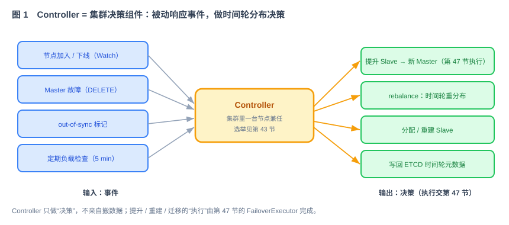
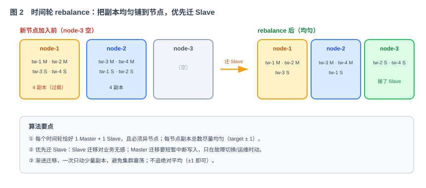

# 第 48 节：故障恢复——Controller：需求、原理、拆解（Loop 原料）

> 第 47 节实现副本同步和故障切换的执行能力。本节实现 Controller：根据节点和副本状态决定何时切换、提升哪个副本，以及如何重新分配时间轮。rebalance 指在节点之间重新分配副本，使负载保持基本均衡。
>
> 十一段模板，引用第 39 节公共契约 + 42 集群契约 + 43 选举/感知 + 47 切换执行。**本节产出 Controller 决策接口。**

---

## 1. 这一节做什么

一句话：**实现 Controller 的事件处理、故障切换决策和时间轮副本分配。**

Controller 是由某个普通 When 节点兼任的集群角色，选举过程由第 43 节实现。Controller 只生成切换和分配决策；数据恢复、启动调度和副本重建由第 47 节的执行器完成。

---

## 2. 为什么这么设计

**为什么需要 Controller。** 时间轮副本分布必须由单一决策者统一计算，否则多个节点可能同时写入互相冲突的分配结果。Controller 由普通 When 节点兼任，不需要部署专用进程（技术方案 §3.1）。

**Controller 的输入输出。**



Controller 采用**事件驱动**方式：输入包括节点加入、节点下线、Master 故障、副本不同步和定期负载检查；输出包括提升 Slave、重新分配副本和更新 ETCD 元数据。`FailoverExecutor` 负责执行这些决策。out-of-sync 表示副本未同步到最新状态，不能直接提升为 Master。

**rebalance 算法为什么这么设计。**



目标是把所有时间轮的副本（Master+Slave）均匀铺到节点上。三个要点：每个时间轮 1 Master + 1 Slave 且异节点；**优先迁 Slave**（对业务无感，Master 迁移要中断写入）；渐进迁移、不追绝对平均（±1 即可），避免集群震荡（技术方案 §7.3）。

**为什么故障切换决策在这里。** Master 故障时（第 47 节检测到），"提升哪个 Slave、给它再配哪个新 Slave"是决策，归 Controller；Controller 先用 ETCD 事务提交新分配，第 47 节再负责恢复数据、停止旧角色和启动新角色。

这里的“执行”需要说得更准确：Controller 通过 ETCD 事务提交新的分配关系；第 47 节的执行器 Watch 到新版本后，负责恢复数据和启停调度。执行器不能绕过 Controller 自行改 Master。这样只有一个地方可以改变分配关系，也便于处理 Controller 切换和重复事件。

---

## 3. 它和 Loop 的关系

本节是提供给 Loop 的模块任务规格：Loop 实现 Controller 的事件循环 + rebalance 算法 + 故障切换决策。

- **明确输入**：Controller 职责与事件（第 5 节）、rebalance 算法（第 5、6 节）、决策接口（第 6 节）、要存的数据（第 7 节）。
- **自动化验收**：第 8 节——新节点加入会 rebalance、Master 故障会决策提升、分布均匀、Master/Slave 异节点、决策幂等可重放。
- **边界**：第 9 节——只做决策，执行调第 47 节；选举在第 43 节。

---

## 4. 依赖与被依赖

**本节依赖（上游）**

- 第 43 节：Controller 选举（谁当）、集群成员 Watch（事件源）。
- 第 47 节：`FailoverExecutor`（提升/重建执行）、时间轮 Master/Slave 元数据 + `sync_state`。
- 第 42 节：ETCD 封装、`/when/timewheels`、`/when/config`。

**本节产出、被谁消费（下游）**

| 本节产出 | 被哪节消费 | 怎么用 |
|---|---|---|
| Controller 事件循环 + 决策 | 第 47 节执行器 | 决策后调 promote/assign/rebuild |
| rebalance 算法（时间轮分布） | 第 45 节路由、第 53 节联调 | 决定 tw→节点映射，路由据此转发；补上第 46 节多节点分发的未完成依赖 |
| 时间轮元数据的权威写入 | 全集群 | 各节点 Watch `/when/timewheels` 得到最新分布 |
| 创建时间轮的分配决策 | 第 51 节管理台"创建时间轮" | 管理台请求创建 → Controller 分配 Master/Slave |

---

## 5. 功能与交互

**上任过程**：节点当选后先读取 Controller 选举记录、当前 ETCD revision、节点列表和全部时间轮分配，生成一份一致的 `ClusterState`。加载完成前不处理迁移；加载完成后从记录的 revision 继续 Watch，避免“先读列表、后开 Watch”之间漏掉事件。如果 Watch 因历史压缩失效，就重新读取快照并从新 revision 开始。

**事件循环**：事件放入单线程决策队列，按 ETCD revision 处理。同一个 key 的短时间连续变化先合并，默认等待 500ms，避免节点抖动触发多次迁移。处理过的 `event_id` 和最后 revision 写入 Controller 状态，重复事件直接跳过。

- **节点加入（PUT）**：触发 rebalance，把部分时间轮的 Slave 迁到新节点。
- **节点下线 / Master 故障（DELETE）**：查该节点上有哪些 Master → 决策提升对应 Slave（调第 47 节执行）→ 为受影响时间轮分配新 Slave。
- **out-of-sync 标记**：决策触发该 Slave 重建（调第 47 节）。
- **定期负载检查（默认 5 分钟）**：发现严重不均则 rebalance。
- **创建时间轮请求（来自管理台）**：给新时间轮分配 Master/Slave 节点，写入元数据。

**故障切换**：如果故障节点是 Master，优先选择版本一致且 `in_sync` 的 Slave。Controller 使用 ETCD 事务同时检查三件事：自己仍是 Controller、时间轮记录没有被别人修改、故障节点仍是旧 Master。检查通过后增加 `assignment_version`，把 Slave 写成新 Master，并把状态改为 `recovering`。没有可直接提升的 Slave 时，选择一个存活节点从 Redis 完整恢复，但仍要先提交新的分配版本。

**rebalance 算法**（伪代码见第 6 节）：算每个节点的目标副本数 → 找过载和过空节点 → 从过载节点挑副本（优先 Slave）迁到过空节点 → 每次最多并行迁移 2 个时间轮。新 Slave 完成重建并变成 `in_sync` 后，才能移除旧 Slave。普通 rebalance 不迁 Master；只有故障切换或明确的运维操作可以改变 Master。

**防止反复搬动**：节点加入后等待 30 秒稳定期再参与分配；同一时间轮完成迁移后 60 秒内不再次迁移。只要每个节点的副本数与目标值相差不超过 1，就不继续调整。

---

## 6. 接口 / 契约设计（本节新增 Controller 决策接口）

```java
public interface Controller {
    void onControllerElected(ControllerTerm term);
    void onClusterEvent(ClusterEvent event);
    TimeWheelAssignment createTimeWheel(TimeWheelSpec spec);
}

// rebalance 决策（纯计算，产出迁移动作，交第 47 节执行）
public interface RebalancePlanner {
    List<MoveAction> plan(ClusterState state, RebalancePolicy policy);
}

// 所有分配变化都通过这里提交，内部使用 ETCD transaction
public interface AssignmentStore {
    CommitResult compareAndSet(AssignmentDecision decision);
}
```

一次决策至少包含：

```java
public record AssignmentDecision(
    String decisionId,
    long controllerTerm,
    String twId,
    long expectedModRevision,
    long nextAssignmentVersion,
    AssignmentAction action,
    String fromNode,
    String toNode
) {}
```

`decision_id` 用于日志和重复检查；`expected_mod_revision` 是 ETCD 记录的预期版本，用于保证“记录没被别人改过”；`controller_term` 是 Controller 任期号，用于拒绝旧 Controller 的迟到决定。

rebalance 伪代码：

```text
plan(state):
  candidates = healthy_nodes_after_stable_period(state)
  target = ceil(total_replicas / candidates.size)
  while exists node with replicas > target:
      src = most_loaded_node()
      dst = least_loaded_node_not_hosting_same_tw()
      tw = pick_slave_not_in_cooldown(src)
      if no legal tw or dst: break
      emit MoveSlave(tw, src, dst)
      apply_move_to_local_copy()
  return at_most(max_parallel_moves, planned_moves)
```

Planner 必须是确定性的：输入状态和策略相同，输出顺序也相同。节点排序使用 `node_id`，时间轮排序使用 `tw_id`，不能依赖 HashMap 遍历顺序。

---

## 7. 字段 / 要存的数据

| 数据 | 存哪 | 说明 |
|---|---|---|
| 时间轮分布 | `/when/timewheels/{tw_id}` = `{master, slave, status, sync_state}` | Controller 权威写入 |
| 集群配置 | `/when/config/*` = 副本数、时间轮总数、rebalance 阈值 | 持久、可调 |
| 集群状态视图 | 内存（由 43 成员 + 42 元数据构成） | Controller 决策依据 |
| Controller 进度 | `/when/controller/progress` = `{term,last_revision}` | 新 Controller 判断从哪里重新加载 |

约定：

- Controller 的每个决策都通过 ETCD 事务更新元数据。事务同时比较 Controller term、目标 key 的 `mod_revision` 和旧分配内容；任一比较失败就重新读取，不覆盖较新的结果。
- 时间轮记录增加 `assignment_version`、`decision_id` 和可选的 `candidate_slave`。迁 Slave 时先写 candidate，重建完成后再替换正式 Slave。
- Master/Slave 异节点是硬约束，rebalance/创建/切换都必须满足。
- 节点必须处于 `ready`，且不在稳定等待期或排空状态，才可以接收新副本。

---

## 8. 验收标准 + 必须有的测试（自动化验收）

**功能验收**

- [ ] 新节点加入 → Controller 触发 rebalance，部分 Slave 迁到新节点，分布趋于均匀（±1）。
- [ ] 节点下线 → Controller 决策提升对应 Slave 为新 Master，并补新 Slave（执行由第 47 节，端到端 10 秒内）。
- [ ] rebalance 优先迁 Slave；Master 仅在故障/运维时动。
- [ ] 任何决策后，所有时间轮仍满足 1M+1S 且 M/S 异节点。
- [ ] Controller 挂掉 → 新 Controller（第 43 节选出）加载状态后能接着决策，无重复/遗漏。
- [ ] 管理台"创建时间轮"请求 → Controller 分配 M/S 并写入元数据。
- [ ] 旧 Controller 恢复后提交的迟到决策因 term 不匹配被 ETCD 拒绝。
- [ ] Slave 迁移必须经过 candidate→rebuilding→in_sync→替换旧 Slave，重建失败时保留旧 Slave。
- [ ] 节点短暂上下线不会反复触发迁移；处于冷却期的时间轮不会再次移动。

**必须有的测试**

- [ ] rebalance 单元测试：给定集群状态，plan 产出的迁移使分布均匀、满足硬约束、优先 Slave。
- [ ] 故障决策测试：注入节点 DELETE，断言提升 + 补 Slave 决策正确。
- [ ] Controller 切换连续性测试：杀 Controller，新 Controller 接管后决策不重不漏（幂等可重放）。
- [ ] CAS 冲突测试：在提交前修改目标时间轮记录，断言旧决策失败并重新计算。
- [ ] 旧 Controller 测试：隔离旧 Controller、选出新 Controller、恢复网络，断言旧 term 无法写入。
- [ ] Watch 恢复测试：制造 revision compacted，断言 Controller 重新加载快照后没有漏掉节点变化。
- [ ] 迁移中断测试：新 Slave 重建过程中停止目标节点，断言旧 Slave 仍保留，稍后可以重新规划。
- [ ] 稳定性测试：同一组节点反复上下线，断言并行迁移数、稳定等待期和冷却期生效。

---

## 9. 边界（本节不做什么）

- **不做**执行（提升/重建/迁移的实际动作）——调第 47 节 `FailoverExecutor`。
- **不做** Controller 自身选举——第 43 节。
- **不做**消息路由本身——第 45 节（但本节产出的 tw 分布是路由的依据）。
- **只做**：Controller 事件循环 + rebalance 决策 + 故障切换决策 + 创建时间轮分配 + 元数据权威写入。
- **停止条件**：加入/下线/out-of-sync/定期检查/创建 五类事件的决策正确、幂等可重放、验收全部通过。

---

## 10. 专属 Harness（叠加在公共 Harness 之上）

**代码**

- 放在 `cluster/controller` 包；决策是纯计算（`RebalancePlanner` 无副作用），执行经第 47 节。
- 只有当选的节点跑 Controller 逻辑；非 Controller 节点不执行决策。

**正确性强制约束**

- 每个决策必须通过带 Controller term 和 `mod_revision` 的 ETCD 事务提交，失败后重新读取，不能盲目覆盖。
- 任何决策产出都必须满足"1M+1S、M/S 异节点"，违反即拒绝。
- Planner 只做计算，不访问 ETCD、不调用执行器；这样可以用固定输入完整测试。
- 迁移默认最多并行 2 个时间轮，参数可配置但不能无限制并发。

**依赖**

- 复用 42 ETCD、43 成员/选举、47 执行器；不新引组件。

---

## 11. 交付物清单（这节结束应产出）

- [ ] `Controller` 实现：一致快照加载、Watch 恢复、事件去重和五类事件处理。
- [ ] `RebalancePlanner` 实现：确定性输出、优先 Slave、均匀、稳定期、冷却期和并行上限。
- [ ] `AssignmentStore`：带 term、revision 和旧值比较的 ETCD 事务。
- [ ] 故障切换、Slave 安全迁移和创建时间轮分配逻辑。
- [ ] rebalance、CAS 冲突、旧 Controller、Watch 恢复、迁移中断和连续性测试。
- [ ] 本文档第 4—11 节作为该模块的 Loop 输入规格。

> 第 47、48 节共同完成副本同步、故障切换和自动均衡。下一节实现 HTTP/Kafka 真实投递，并替换第 46 节的测试 Sink。
