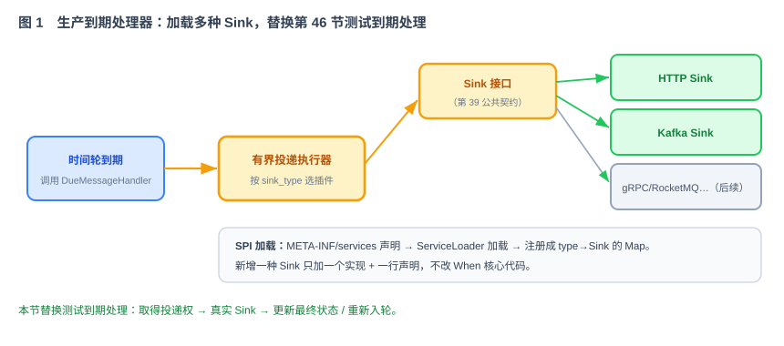
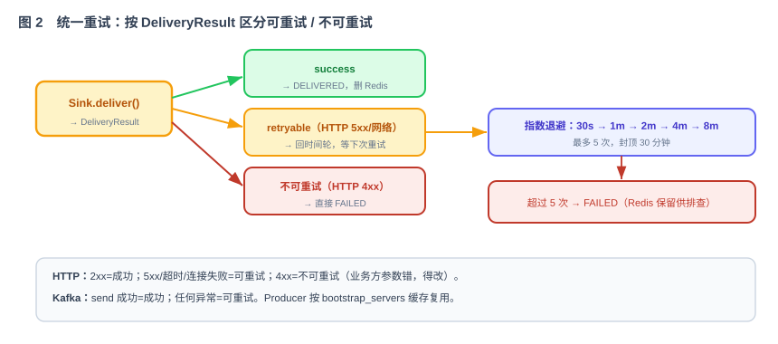

# 第 49 节：Sink 投递插件化——HTTP + Kafka（Loop 原料）

> 本节实现第 39 节的 `Sink` 与 `DueMessageHandler` 接口，提供 HTTP 和 Kafka 两种真实投递实现，并定义统一的失败分类与重试策略。完成后，整体替换第 46 节的 `TestDueMessageHandler + RecordingTestSink`。
>
> 十一段模板，引用第 39 节公共契约（`Sink`/`DeliveryResult`/`SinkConfig`/`DueMessageHandler`）+ 44 时间轮（报告到期）+ 45 状态机。

---

## 1. 这一节做什么

一句话：**实现真正的投递——到期消息按 sink_type 投到 HTTP 回调或 Kafka topic，失败按统一策略重试。**

第 44 节时间轮触发消息后，只异步调用 `DueMessageHandler.onDue(messageId)`。本节提供生产实现：取得原子投递权、按 `sink_type` 选择 HTTP/Kafka Sink、执行投递、根据结果更新状态或重新入轮。

---

## 2. 为什么这么设计

**为什么投递要插件化（SPI）。**



下游类型很多（HTTP、Kafka，以后还有 gRPC/RocketMQ/NATS）。把投递抽象成 `Sink` 接口（第 39 节公共契约），用 Java SPI 加载：实现类在 `META-INF/services` 声明，`ServiceLoader` 加载，注册成 `type→Sink` 的 Map。新增一种 Sink 只加一个实现 + 一行声明，不改 When 核心代码（技术方案 §11.2）。

**为什么先做 HTTP 和 Kafka。** HTTP 最通用——任何业务方给个回调地址就能收，`curl` 就能测，可以直接调用。Kafka 适合已经用 Kafka 做消息总线的业务方。这两个覆盖绝大多数场景（技术方案 §11.3、§11.4）。

**为什么重试要区分可重试 / 不可重试。**



`DeliveryResult.retryable` 决定下一步：HTTP 5xx、408、429、超时和连接失败通常是临时问题；其他 4xx 多数是地址、权限或参数错误。Kafka 的超时和可重试异常可以再试，认证、序列化和非法配置不能靠重试解决。可重试失败走指数退避（30s→1m→2m→4m→8m，最多重试 5 次），超次数转 `FAILED`，Redis 保留记录供排查（技术方案 §11.5）。

**为什么 Kafka Producer 要缓存复用。** 多条消息可能投同一个 Kafka 集群，每条都新建 Producer 太浪费。按 `bootstrap_servers` 做 key 缓存 Producer 实例，复用（技术方案 §11.4）。

---

## 3. 它和 Loop 的关系

本节是提供给 Loop 的模块任务规格：Loop 实现 `HttpSink` / `KafkaSink`、SPI 注册、生产 `DueMessageHandler` 和统一重试，并替换第 46 节的测试到期处理。

- **明确输入**：Sink 接口（公共契约）、SPI 加载、两种实现要点、重试策略（第 5、6 节）。
- **自动化验收**：第 8 节——HTTP/Kafka 投递成功、4xx/5xx 分类正确、指数退避正确、Kafka Producer 复用、测试到期处理器被完整替换。
- **边界**：第 9 节——只做投递插件 + 重试，不碰时间轮/存储/集群。

---

## 4. 依赖与被依赖

**本节依赖（上游）**

- 第 39 节公共契约：`Sink`、`DeliveryResult`、`SinkConfig`、`SinkType`、`DueMessageHandler`、`TimeWheelRegistry`。
- 第 44 节：到期后异步调用 `DueMessageHandler` 的钩子。
- 第 45 节：投递成功/失败后的状态流转（DELIVERING→DELIVERED/FAILED）。

**本节产出、被谁消费（下游）**

| 本节产出 | 被哪节消费 | 怎么用 |
|---|---|---|
| `HttpSink` / `KafkaSink`（实现 `Sink`） | `DefaultDueMessageHandler` | 到期按 sink_type 选插件执行真实投递 |
| `DefaultDueMessageHandler` | 第 44 节时间轮、`when-app` | 替换测试实现，闭合投递权、Sink、状态和重试 |
| SPI 注册（type→Sink Map） | 全系统 | 启动时加载所有 Sink |
| 统一重试策略 | 第 44 节 / 状态机 | 可重试回时间轮、超次数转 FAILED |
| HTTP/Kafka Sink | 第 53 节联调 | 使用真实下游验证投递和重试 |
| `DeliveryStateStore` 与最近投递记录 | 第 51 节管理 API | 查询投递租约、错误码和最近 20 次尝试 |

---

## 5. 功能与交互

**SPI 加载**：`META-INF/services/com.when.core.Sink` 声明实现类 → `ServiceLoader.load(Sink.class)` → 注册成 `type→Sink` Map。投递器按 `message.sinkType` 查 Map 拿到对应 Sink。

**生产到期处理**：`DefaultDueMessageHandler.onDue(messageId)` 先读取消息并原子执行 `PENDING → DELIVERING`。只有转换成功者可以调用 Sink；转换失败直接结束。成功投递后转 `DELIVERED`；可重试失败转回 `PENDING`、写入 `nextAttemptAt` 并通过 `TimeWheelRegistry` 重新入轮；不可重试或耗尽后转 `FAILED`。

取得投递权时同时写入 `delivery_owner`、`delivery_attempt_id` 和 `delivery_lease_until`。节点在调用下游前停止时，消息不会永久停在 `DELIVERING`：后台恢复任务会扫描租约已过期的记录，确认当前没有有效持有者后重新进入 `PENDING`。每次投递使用新的 `delivery_attempt_id`，但对下游始终携带同一个 `message_id` 作为幂等键。

**HTTP Sink**：用 Java HttpClient 或 OkHttp，项目内只选一种。请求体是 payload 原始字节，`method/content_type/headers/timeout` 来自 `HttpSinkConfig`。请求必须带 `X-When-Message-Id`、`X-When-Attempt-Id` 和 `X-When-Trace-Id`。默认不自动跟随重定向，响应体最多读取 64 KiB，连接、读取和整体投递都设置超时。

HTTP 地址只允许 `http/https`。生产环境默认拒绝 loopback、link-local、云元数据地址和未在允许范围内的私网地址；DNS 解析后还要检查实际 IP，防止域名解析到内网。开发环境访问本机 mock 服务必须通过明确配置开启，不能靠关闭全部检查实现。

**Kafka Sink**：用官方 Producer；消息体是 payload，key 使用配置值或 `message_id`。Producer 按“不含明文密码的配置指纹”缓存复用，不只按 `bootstrap_servers`，避免两个租户错误共用认证配置。缓存有上限和空闲回收，应用停止时统一 `flush/close`。`acks`、Kafka 客户端重试和超时由配置决定，When 仍以 Producer 最终回调作为本次投递结果。

**重试**：投递器根据 `DeliveryResult` 更新状态。成功时执行 `DELIVERING → DELIVERED`；可重试失败时执行 `DELIVERING → PENDING`，写入 `nextAttemptAt` 并重新加入时间轮；不可重试或超过次数时转为 `FAILED`。终态记录按第 41 节的保留策略清理。

---

## 6. 接口 / 契约设计

实现第 39 节公共契约 `Sink`（本节不重定义，只实现）：

```java
public interface Sink {                       // 第 39 节公共契约
    SinkType type();
    void validateConfig(SinkConfig cfg) throws InvalidConfigException;
    DeliveryResult deliver(Message m);
    default boolean healthCheck() { return true; }
}
```

两个实现 + 重试器：

```java
public class HttpSink  implements Sink { /* type()=HTTP;  deliver 用 HttpSinkConfig */ }
public class KafkaSink implements Sink { /* type()=KAFKA; Producer 按 bootstrap_servers 缓存 */ }

// 统一重试
public interface RetryPolicy {
    boolean shouldRetry(DeliveryResult r, int retryCount); // retryable && retryCount<5
    Duration nextDelay(int nextRetryNumber);               // 1..5 对应 30s..8m
}

public class DefaultDueMessageHandler implements DueMessageHandler {
    // 注入 StoragePlugin、Sink 注册表、RetryPolicy、TimeWheelRegistry
    public void onDue(String messageId) { /* 抢投递权 → 调 Sink → 更新最终状态/重试入轮 */ }
}
```

`DeliveryResult` 至少要区分：`SUCCESS`、`RETRYABLE_FAILURE`、`PERMANENT_FAILURE`，并带稳定的 `error_code`，例如 `HTTP_5XX`、`HTTP_4XX`、`HTTP_TIMEOUT`、`KAFKA_TIMEOUT`、`KAFKA_AUTH`。`error_message` 只保存经过清理的摘要，不能保存响应正文、认证信息或 payload。

投递租约和最近尝试记录使用单独的存储接口，避免把 Redis 调用写进投递流程：

```java
public interface DeliveryStateStore {
    Optional<DeliveryLease> tryAcquire(String messageId, String nodeId, Instant leaseUntil);
    void complete(String messageId, String attemptId, DeliveryResult result);
    List<String> findExpiredLeases(Instant now, int limit);
    void appendAttempt(DeliveryAttempt attempt);
    List<DeliveryAttempt> recentAttempts(String messageId, int limit); // limit <= 20
}
```

Redis 实现放在独立适配器中。每次尝试使用独立小 key，最近记录列表最多保存 20 个 attempt ID，并与消息主记录使用相同 TTL。第 51 节管理 API 通过该接口查询投递记录，不直接读取 Redis key。

---

## 7. 字段 / 策略定义

**重试默认策略**

| 项 | 值 |
|---|---|
| 最大次数 | 首次投递之外最多重试 5 次，总调用次数最多 6 次 |
| 退避 | 第 1—5 次重试依次等待 30s、1m、2m、4m、8m；更大配置仍封顶 30 分钟 |
| 可重试判定 | HTTP 5xx/408/429/超时/连接失败；Kafka 的可重试异常与超时 |
| 超次数 | 状态 FAILED，Redis 保留供排查 |

**HTTP 结果映射**：2xx→成功；5xx/408/429/超时/连接失败→可重试；其他 3xx/4xx→不可重试。响应码和截断后的错误摘要可以记录，响应正文不能原样进入日志。

**Kafka 结果映射**：Broker 返回成功→成功；`RetriableException`、超时、临时网络错误→可重试；认证、授权、序列化、非法 topic 或非法配置→不可重试。

状态字段补充：

| 字段 | 作用 |
|---|---|
| `delivery_owner` | 当前持有投递权的节点 |
| `delivery_attempt_id` | 本次调用下游的唯一 ID |
| `delivery_lease_until` | 投递权过期时间，供故障恢复 |
| `retry_count` | 已安排或完成的重试次数，不含首次投递 |
| `next_attempt_at` | 下一次进入时间轮的时间 |
| `last_error_code` | 稳定错误码，不保存敏感正文 |

可重试失败时，`DELIVERING → PENDING`、`retry_count`、`next_attempt_at` 必须在 Redis 中一次原子更新成功，之后才能重新加入时间轮。原子更新失败时不能只把任务加入时间轮，否则会造成存储状态和内存调度不一致。

---

## 8. 验收标准 + 必须有的测试（自动化验收）

**功能验收**

- [ ] SPI 能加载 HTTP、Kafka 两个 Sink，注册成 type→Sink Map。
- [ ] HTTP Sink：向真实回调端点 POST payload，2xx→成功；5xx→可重试；4xx→不可重试。
- [ ] Kafka Sink：payload 真的进了指定 topic；相同配置指纹复用 Producer，不同认证配置不能共用实例。
- [ ] 可重试失败走指数退避，首次投递之外最多重试 5 次；超次数转 FAILED、Redis 仍保留。
- [ ] 投递前通过原子转换获得 `DELIVERING`；成功后转为 `DELIVERED`，终态记录在保留期内仍可查询。
- [ ] `DefaultDueMessageHandler` 已在 `when-app` 中替换 `TestDueMessageHandler`；生产 profile 不包含 `when-test-support`。
- [ ] 第 44 节仍只依赖 `DueMessageHandler`，没有反向依赖 HTTP/Kafka 实现。
- [ ] 节点在 `DELIVERING` 状态停止后，租约到期的消息能被重新取得投递权，不会永久卡住。
- [ ] HTTP 请求携带稳定的消息幂等键和本次尝试 ID，默认不跟随重定向、不读取超大响应体。
- [ ] HTTP 地址校验能拦截云元数据和未授权内网地址；开发环境可以显式允许本机 mock。
- [ ] Kafka 认证、序列化和非法配置错误直接失败，不进入无意义重试。
- [ ] 每次投递保存开始时间、结束时间、结果和清理后的错误码；每条消息最多保留最近 20 次记录。

**必须有的测试**

- [ ] 集成测试：起一个 HTTP 回调 mock 服务 + Testcontainers Kafka，端到端投递成功。
- [ ] 重试测试：mock 返回 5xx N 次后 2xx → 断言退避次数与最终成功；持续 5xx → FAILED。
- [ ] 4xx 测试：断言不重试、直接 FAILED。
- [ ] Producer 复用测试：相同配置只创建一个 Producer；同地址不同认证配置使用不同实例；空闲回收和应用关闭会释放资源。
- [ ] 并发投递权测试：同一 `message_id` 同时触发 N 次，只有一次调用真实 Sink。
- [ ] 集成测试：生产 profile 使用 `DefaultDueMessageHandler`，测试 profile 才允许使用第 46 节替身。
- [ ] 投递租约恢复测试：取得投递权后停止节点，推进时钟超过租约，断言其他节点可以重新投递。
- [ ] HTTP 安全测试：重定向、超大响应体、loopback、link-local、云元数据地址和 DNS 解析到私网均按配置处理。
- [ ] Kafka 错误分类测试：分别注入超时、认证失败、序列化失败，断言只有临时错误重试。
- [ ] 原子重试测试：模拟 Redis 状态更新失败，断言消息不会提前重新加入时间轮。
- [ ] 投递记录测试：连续产生 25 次尝试，只保留最近 20 次，TTL 与消息一致，记录中没有 payload、响应正文和凭据。

---

## 9. 边界（本节不做什么）

- **不做**时间轮、存储和集群实现；到期触发属于第 44 节，原子状态存储和终态清理属于第 41 节。
- **不做** gRPC/RocketMQ/NATS 等其它 Sink——SPI 已留口，后续按标准流程加。
- **不做**死信队列 / 每调用方自定义重试——扩展阶段。
- **只做**：`Sink` SPI 加载、HttpSink、KafkaSink、`DefaultDueMessageHandler` 和统一重试，并替换测试到期处理流程。
- **停止条件**：两种 Sink 的真实投递、失败分类、重试和状态转换测试全部通过。

---

## 10. 专属 Harness（叠加在公共 Harness 之上）

**代码**

- 放在 `sink-spi`、`sink-http`、`sink-kafka` 与投递编排包；通过公共接口依赖 Storage、Registry 和 Sink，不反向依赖具体 Redis 或时间轮实现。
- `DeliveryStateStore` 接口放在投递模块，Redis 实现放独立适配器模块；第 51 节只依赖接口，不拼 Redis key。
- SPI 声明文件规范；Producer/HttpClient 等资源集中管理、可关闭。

**安全**（强制约束）

- `HttpSinkConfig.headers` 里的 token、Kafka 的凭据等**从环境变量注入、绝不硬编码、绝不落日志**。
- 投递日志只记 `message_id`、目标概要（如 host/topic）、结果码，不打 payload、不打敏感头。
- HTTP Sink 必须执行目标地址检查并限制重定向、响应体大小和超时；不能成为访问内网管理接口的跳板。

**依赖**

- OkHttp/HttpClient、Kafka 官方 Producer；测试用 mock HTTP + Testcontainers Kafka。

---

## 11. 交付物清单（这节结束应产出）

- [ ] `HttpSink`、`KafkaSink` 实现 + `META-INF/services` SPI 声明。
- [ ] SPI 加载注册（type→Sink Map），由 `DefaultDueMessageHandler` 调用；第 44 节仍只调用公共到期接口。
- [ ] `DefaultDueMessageHandler implements DueMessageHandler`，在 `when-app` 生产 profile 中替换第 46 节测试实现。
- [ ] `RetryPolicy` 实现（明确计数口径、指数退避、错误分类和超次数 FAILED）。
- [ ] 带租约的投递权和过期恢复任务。
- [ ] `DeliveryStateStore` 接口、Redis 适配器和最近 20 次投递记录。
- [ ] HTTP 地址、重定向、响应大小和超时保护。
- [ ] Kafka Producer 按配置指纹缓存，支持上限、空闲回收和应用关闭。
- [ ] 集成、重试、错误分类、租约恢复、HTTP 安全和 Producer 复用测试。
- [ ] 本文档第 4—11 节作为该模块的 Loop 输入规格。

> 完成本节后，消息可以投递到 HTTP 或 Kafka，并按统一策略处理失败和重试。下一节增加指标、日志和健康检查。
