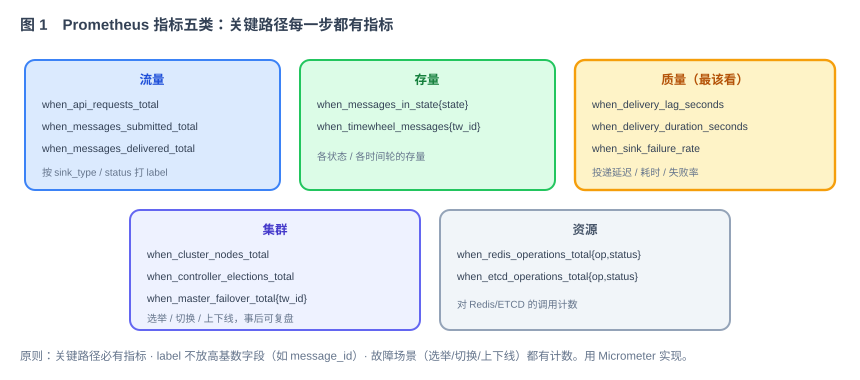
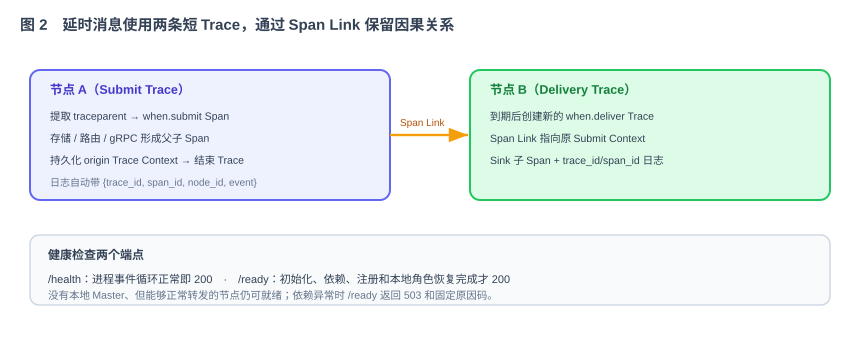

# 第 50 节：可观测体系搭建——Metrics 体系（Loop 原料）

> 本节为 When 增加 Prometheus 指标、包含 `trace_id` 的结构化日志，以及存活与就绪检查，使流量、延迟、失败和故障切换能够被观测。
>
> 十一段模板，横切各模块（40–49）。可观测是运行与联调（第 51–53 节）能"看见问题"的前提。

---

## 1. 这一节做什么

一句话：**建立指标、日志和健康检查，让运行状态与故障可以被查询和验证。**

三样东西：Prometheus 指标（`/metrics` 端点，量化流量/存量/质量/集群/资源）、结构化 JSON 日志（用 trace_id 把一条消息的跨节点一生串起来）、健康检查（`/health`、`/ready` 供 K8s 探针）。

---

## 2. 为什么这么设计

**指标为什么分五类。**



流量（进来多少、投出去多少）、存量（各状态/各时间轮堆了多少）、质量（投递延迟/耗时/失败率——最该盯）、集群（选举/切换/上下线次数，事后复盘）、资源（Redis/ETCD 调用）。原则：关键路径每步都有指标；label 不放高基数字段（如 message_id，会撑爆时序库）；故障场景都有计数（技术方案 §13.1）。用 Micrometer 实现（Java 事实标准，兼容 Prometheus/Spring Boot Actuator）。

**日志为什么要 trace_id 串联。**



一条消息可能在节点 A 接入，在节点 B 调度和投递。接入层优先沿用调用方传入的合法 `trace_id`，没有时再生成，并随消息一起保存。MDC 是日志框架保存请求上下文字段的机制；gRPC metadata 是随 RPC 请求传递的元数据。发送方把 `trace_id` 放入 metadata，接收方再写入本地 MDC，异步线程也通过统一包装器传递，相关日志因此包含同一个 `trace_id`（技术方案 §13.2）。

**为什么要 `/health` 和 `/ready` 两个端点。** `/health` 只回答进程是否仍在运行，不检查 Redis、ETCD 等外部依赖，避免依赖短暂波动导致进程被反复重启。`/ready` 判断节点能否接收新请求：初始化完成、ETCD 与 Redis 可用、节点注册有效、本地承担的时间轮角色已经恢复。节点从 Redis 重建期间，`/health` 可以成功，但 `/ready` 应返回 503（技术方案 §13.3）。没有分配到时间轮的健康节点仍可以转发请求，不能仅因本地没有 Master 就判定未就绪。

---

## 3. 它和 Loop 的关系

本节是提供给 Loop 的模块任务规格：为各模块增加指标采集、结构化日志上下文和健康检查端点。

- **明确输入**：五类指标清单、trace_id 串联做法、健康检查内容（第 5、6、7 节）。
- **自动化验收**：第 8 节——`/metrics` 有这些指标、trace_id 跨节点连得上、`/ready` 语义正确。
- **边界**：第 9 节——只做可观测，不改业务逻辑。

---

## 4. 依赖与被依赖

**本节依赖（上游）**

- 40–49 各模块的关键路径（在这些点埋指标/日志）。
- 第 40 节 gRPC（metadata 传 trace_id）、第 42/43 节集群（选举/切换指标）。

**本节产出、被谁消费（下游）**

| 本节产出 | 被哪节消费 | 怎么用 |
|---|---|---|
| `/metrics` 指标 | 第 51 管理台、第 52 部署（Prometheus）、第 53 联调 | 看流量/延迟/失败/切换 |
| trace_id 结构化日志 | 第 53 联调排障 | 按 trace_id 拉全链路 |
| `/health` `/ready` | 第 52 部署（K8s 探针）、第 53 | 探针摘挂节点 |

---

## 5. 功能与交互

**指标**：用 Micrometer 在关键路径埋点，`/metrics` 暴露 Prometheus 格式。五类见图 1 与第 7 节。

**结构化日志**：JSON 格式，每条至少含 `timestamp/level/logger/trace_id/node_id/event/message`，可选 `message_id/tw_id/assignment_version/duration_ms/error_code`。接入层接受合法的上游 trace ID；没有时生成新的。trace ID 随消息保存，并通过 MDC、线程池任务包装和 gRPC metadata 继续传递。任务完成后必须清理 MDC，避免线程复用时把上一条消息的 trace ID 带给下一条消息。

**健康检查**：`/health` 在进程事件循环仍工作时返回 200；`/ready` 检查初始化、ETCD、Redis、节点注册以及本地角色恢复情况，全满足才返回 200，否则返回 503，并用固定 reason code 说明原因，例如 `ETCD_UNAVAILABLE`、`REDIS_UNAVAILABLE`、`ROLE_RECOVERING`。

**管理端点保护**：`/metrics`、运行时日志级别和健康详情应放在独立管理端口，或只允许集群管理网络访问。`/health` 可以只返回简单状态；带依赖详情的响应不能暴露密码、连接串或内部异常堆栈。

---

## 6. 接口 / 契约设计

```java
// 指标统一封装（各模块调用，底层使用 Micrometer）
public interface Metrics {
    void incr(String name, String... tags);
    void observe(String name, double value, String... tags);  // 直方图/摘要
    void gauge(String name, Supplier<Number> value, String... tags);
}

// 端点
GET /metrics   // Prometheus 抓取
GET /health    // liveness
GET /ready     // readiness（初始化、依赖、注册和本地角色恢复）
POST /actuator/loggers/{logger}  // 运行时调日志级别
```

trace 传播：接入读取或生成 → 随消息保存 → MDC → 异步任务上下文 → gRPC metadata（key `x-trace-id`）→ 对端 MDC。

业务代码不能任意拼指标名和标签。`Metrics` 实现维护允许的指标名、标签名和标签值长度；出现未登记标签时测试直接失败。异步任务使用统一的 `TraceContext` 包装器复制并清理上下文，不能在每个线程池里各写一套 MDC 代码。

---

## 7. 字段 / 指标定义（节选自技术方案 §13.1）

| 指标 | 类型 | label |
|---|---|---|
| `when_messages_submitted_total` | counter | sink_type |
| `when_sink_deliveries_total` | counter | sink_type, result |
| `when_messages_in_state` | gauge | state |
| `when_delivery_lag_seconds` | histogram | sink_type |
| `when_sink_delivery_duration_seconds` | histogram | sink_type |
| `when_master_failover_total` | counter | result, reason |
| `when_controller_elections_total` | counter | result |
| `when_replica_sync_queue_size` | gauge | node_id |
| `when_replica_rebuild_total` | counter | result |
| `when_redis_operations_total` / `when_etcd_operations_total` | counter | operation, status |
| `when_redis_operation_duration_seconds` / `when_etcd_operation_duration_seconds` | histogram | operation |

`result`、`reason`、`operation` 等标签必须来自有限枚举。`node_id` 的数量受集群规模限制，可以使用；`message_id`、`trace_id`、`tw_id`、URL、topic、异常文本不能作为标签。具体时间轮和消息信息放在结构化日志里。

失败率不由应用维护一个容易失真的 gauge，而是在 Prometheus 中根据计数器计算：

```promql
sum(rate(when_sink_deliveries_total{result="failure"}[5m])) by (sink_type)
/
sum(rate(when_sink_deliveries_total[5m])) by (sink_type)
```

延迟直方图要固定 bucket，例如投递延迟使用 `0.1、0.5、1、2、5、10、30、60` 秒；不能让不同节点自行使用不同 bucket。

结构化日志示例：

```json
{
  "timestamp":"2026-08-17T10:30:15.123Z",
  "level":"INFO",
  "event":"message_delivered",
  "trace_id":"01J...",
  "message_id":"msg_...",
  "tw_id":"tw-7",
  "node_id":"when-2",
  "sink_type":"HTTP",
  "duration_ms":42
}
```

`event` 和 `error_code` 使用稳定值，方便查询；`message` 给人阅读，不作为程序判断依据。

---

## 8. 验收标准 + 必须有的测试（自动化验收）

**功能验收**

- [ ] `/metrics` 暴露五类核心指标，Prometheus 能抓。
- [ ] 提交/投递/切换/选举等动作会让对应计数增加。
- [ ] 一条跨节点消息的日志能用同一个 trace_id 串起来（A 接入、B 投递）。
- [ ] `/ready` 在 ETCD/Redis 未连上、节点注册失效或本地角色恢复中返回 503；恢复后返回 200。没有分配到时间轮但可以正常转发的节点仍可就绪。
- [ ] 运行时调日志级别立即生效、不重启。
- [ ] 无高基数 label（自动检查指标不含 message_id 维度）。
- [ ] 异步时间轮任务、投递线程池和跨节点 gRPC 都保留同一个 trace ID，任务结束后 MDC 被清理。
- [ ] `/health` 不因 Redis 短暂中断而失败；`/ready` 返回固定原因码，依赖恢复后自动回到 200。
- [ ] 管理端点不会在业务公开端口匿名暴露日志级别修改和内部依赖详情。

**必须有的测试**

- [ ] 指标测试：触发各动作，断言对应指标变化。
- [ ] trace 串联测试：两节点端到端，断言日志含同一 trace_id。
- [ ] readiness 测试：断开 Redis/ETCD → `/ready` 503；恢复 → 200。
- [ ] label 检查：扫描 MeterRegistry，断言不存在未登记标签和 `message_id/trace_id/tw_id/url/topic`。
- [ ] MDC 泄漏测试：在同一线程连续执行两条消息，断言第二条不会继承第一条 trace ID。
- [ ] 指标一致性测试：所有节点对同名 histogram 使用相同 bucket，失败率可以由计数器计算。

---

## 9. 边界（本节不做什么）

- **不改**业务逻辑——只在关键路径旁埋点、加日志、加端点。
- **不做**告警规则 / 大盘搭建（那是运维侧，可在部署节给示例）。
- **只做**：Micrometer 指标 + trace_id 结构化日志 + /health /ready。
- **停止条件**：五类指标齐、trace 串联、健康端点语义正确、验收全部通过。

---

## 10. 专属 Harness（叠加在公共 Harness 之上）

**代码**

- `Metrics` 统一封装指标，各模块不直接依赖 Micrometer。
- 埋点不影响主逻辑正确性、不显著拖慢关键路径。

**安全**（强制约束）

- 日志/指标里**不含** payload、密钥、sink_config 敏感值；trace_id、message_id 可记（非敏感）。
- 指标 label 不放高基数字段。
- 日志中的 URL 只记录 host 或经过清理的目标名，不记录 query、认证信息和完整连接串。
- 运行时日志级别接口只允许管理网络访问，生产默认关闭匿名修改。

**依赖**

- Micrometer + Prometheus registry；Spring Boot Actuator（健康/日志级别）。

---

## 11. 交付物清单（这节结束应产出）

- [ ] `Metrics` 统一封装、指标和标签白名单、固定 histogram bucket，覆盖 40–49 关键路径。
- [ ] 结构化 JSON 日志、稳定事件名，以及 trace ID 的存储、MDC、异步线程和 gRPC 传播。
- [ ] `/metrics`、`/health`、`/ready` 端点和受保护的运行时日志级别调整。
- [ ] 指标、标签基数、trace 串联、MDC 清理、端点访问和 readiness 测试。
- [ ] 本文档第 4—11 节作为该模块的 Loop 输入规格。

> 交齐以上，When 跑起来看得见了。下一节（第 51 节 Web 管理台）在这些指标和 API 之上，做一个能查看/创建时间轮、查看延时消息的运维控制台。
