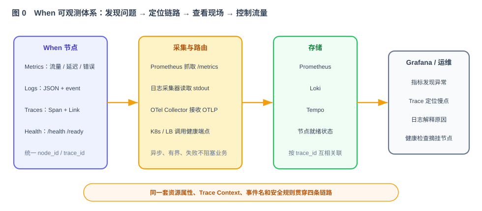

# 第 50 节：可观测体系搭建——指标、日志、链路追踪与健康检查（Loop 原料）

> 本节为 When 建立完整的可观测体系：Prometheus 指标、结构化日志、基于 OpenTelemetry 的链路追踪，以及存活与就绪检查。四部分使用同一套服务、节点、消息和追踪上下文，能够从告警找到异常节点，再从指标跳到 Trace，最后用日志定位具体问题。
>
> 十一段模板，横切各模块（40–49）。可观测是运行与联调（第 51–53 节）能"看见问题"的前提。

---

## 1. 这一节做什么

一句话：**一次性搭好指标、日志、链路追踪和健康检查，让系统是否健康、哪里变慢、哪一步失败、为什么失败都能被查询和验证。**

本节交付四部分：

1. **Metrics**：通过 `/metrics` 暴露 Prometheus 指标，量化流量、存量、延迟、错误、集群事件和依赖调用。
2. **Logging**：输出结构化 JSON 日志，统一事件名、错误码和公共字段。
3. **Tracing**：使用 Micrometer Tracing + OpenTelemetry 建立 Span、传播上下文并通过 OTLP 导出；日志自动带 `trace_id` 和 `span_id`。
4. **Health**：提供 `/health`、`/ready`，分别服务于存活检查和流量准入。

这四部分不是四套互不相干的功能：指标负责发现问题，Trace 负责找到慢在哪一段，日志负责解释这一段发生了什么，健康检查负责决定节点能不能继续接收流量。



本节同时给出最小可运行的观测链路：Prometheus 抓取 Metrics，结构化日志进入 Loki，OTLP Trace 经 OpenTelemetry Collector 写入 Tempo，Grafana 统一查询并配置 Metrics → Trace → Logs 的关联。观测组件及其配置由本节负责；第 52 节只负责打包 When，并允许为 When 注入外部观测服务地址。

---

## 2. 为什么这么设计

**指标为什么分五类。**


流量（进来多少、投出去多少）、存量（各状态/各时间轮堆了多少）、质量（投递延迟/耗时/失败率——最该盯）、集群（选举/切换/上下线次数，事后复盘）、资源（Redis/ETCD 调用）。原则：关键路径每步都有指标；label 不放高基数字段（如 message_id，会撑爆时序库）；故障场景都有计数（技术方案 §13.1）。用 Micrometer 实现（Java 事实标准，兼容 Prometheus/Spring Boot Actuator）。

**日志为什么要结构化。**

日志首先要解决“机器能不能稳定查询”。所有节点统一输出 JSON，公共字段和 `event/error_code` 使用固定名称，敏感字段统一脱敏。日志不能只写一句自然语言，也不能依靠解析自由文本来统计错误。

**为什么还需要链路追踪，不能只有 trace_id 日志。**

只有 `trace_id` 的日志只能把记录筛到一起，不能显示父子调用关系、每一步耗时和错误落点。本节使用 Micrometer Tracing 接入 OpenTelemetry：HTTP 使用 W3C `traceparent/tracestate`，gRPC 使用 OpenTelemetry propagator 自动注入和提取上下文；存储、路由、调度和 Sink 投递建立独立 Span。日志框架从当前 Span 自动写入 `trace_id/span_id`，因此 Trace 和日志可以互相跳转。

延时消息可能等待几小时甚至几个月，不能创建一个跨越整个等待期的长 Span。Submit Trace 在消息持久化并成功接收后结束；消息中只保存原始 Trace Context。消息到期时创建新的 Delivery Trace，并用 **Span Link** 关联 Submit Trace。这样既保留因果关系，也不会制造超长 Span。


**为什么要 `/health` 和 `/ready` 两个端点。** `/health` 只回答进程是否仍在运行，不检查 Redis、ETCD 等外部依赖，避免依赖短暂波动导致进程被反复重启。`/ready` 判断节点能否接收新请求：初始化完成、ETCD 与 Redis 可用、节点注册有效、本地承担的时间轮角色已经恢复。节点从 Redis 重建期间，`/health` 可以成功，但 `/ready` 应返回 503（技术方案 §13.3）。没有分配到时间轮的健康节点仍可以转发请求，不能仅因本地没有 Master 就判定未就绪。

---

## 3. 它和 Loop 的关系

本节是提供给 Loop 的横切任务规格：为各模块增加指标、结构化日志、链路追踪和健康检查。

- **明确输入**：五类指标清单、日志字段、Span 设计、上下文传播和健康检查语义（第 5、6、7 节）。
- **自动化验收**：第 8 节——指标可抓取、JSON 日志字段完整、Trace 跨节点可还原、Submit 与 Delivery 有 Span Link、`/ready` 语义正确。
- **边界**：第 9 节——只做可观测，不改业务逻辑。

---

## 4. 依赖与被依赖

**本节依赖（上游）**

- 40–49 各模块的关键路径（在这些点埋指标、日志并创建 Span）。
- 第 40 节 gRPC（传播 W3C Trace Context）、第 42/43 节集群（选举/切换观测）、第 49 节 Sink（向下游传播 Trace Context）。

**本节产出、被谁消费（下游）**

| 本节产出 | 被哪节消费 | 怎么用 |
|---|---|---|
| `/metrics` 指标 | 第 51 管理台、第 52 部署（Prometheus）、第 53 联调 | 看流量/延迟/失败/切换 |
| 结构化日志 | 第 53 联调排障 | 按 event、error_code、message_id、trace_id 查询现场 |
| OpenTelemetry Trace | 第 53 联调与性能分析 | 查看跨节点调用树、耗时、错误 Span 和 Submit/Delivery 关联 |
| `/health` `/ready` | 第 52 部署（K8s 探针）、第 53 | 探针摘挂节点 |
| Collector、Prometheus、Loki、Tempo、Grafana 配置 | 第 52 部署、第 53 联调 | 部署观测后端，并在一个入口联查指标、Trace 和日志 |

---

## 5. 功能与交互

**指标**：用 Micrometer 在关键路径埋点，`/metrics` 暴露 Prometheus 格式。五类见图 1 与第 7 节。延迟和耗时直方图在当前 Trace 被采样时附带 exemplar，Grafana 可以从异常时间点直接跳到对应 Trace。

**结构化日志**：JSON 格式，每条至少含 `timestamp/level/service/node_id/logger/event/message`；处于 Trace 中时自动增加 `trace_id/span_id`，业务事件按需增加 `message_id/tw_id/assignment_version/duration_ms/error_code`。`event` 和 `error_code` 使用稳定枚举，异常使用结构化字段记录。任务完成后必须清理 Trace Scope 和 MDC，避免线程复用时串上下文。

**链路追踪**：HTTP 与 gRPC 入口提取 W3C Trace Context，没有合法上游上下文时创建新 Trace；出站 gRPC、HTTP Sink 自动注入 `traceparent/tracestate`。Redis、ETCD、路由、跨节点转发、时间轮交接和 Sink 投递建立语义清楚的 Span。异步任务通过统一的 Context 包装器传播上下文，禁止只复制一个字符串形式的 `trace_id`。

**延时边界**：Submit Trace 在请求完成时关闭。消息持久化 `origin_traceparent/origin_tracestate`；到期后创建新的 Delivery Trace，并以 Span Link 关联原 Submit Context。取消、恢复、重试和故障接管也创建各自的短 Trace 或 Span Event，不能让 Span 跨越消息等待期。

**导出与采样**：Trace 通过 OTLP 导出，应用线程不得同步等待 Collector。开发和自动化测试使用 100% 采样；生产默认使用 parent-based ratio 采样，比例由配置提供。Exporter 不可用时只记录受限告警和丢弃计数，不能阻塞投递主链路，也不能让 `/health` 失败。

**采集、存储与查询**：Prometheus 抓取 `/metrics`；When 输出 JSON 日志到 stdout，由日志采集器写入 Loki；OpenTelemetry Collector 接收 OTLP Trace 并写入 Tempo；Grafana 预置 Prometheus、Loki、Tempo 数据源。Trace 中带 `service.name/node_id` 等有限属性，日志中带 `trace_id`，Grafana 因此可以从指标面板跳到对应 Trace，再从 Trace 跳到同一 `trace_id` 的日志。仓库在 `observability/` 下交付采集器、数据源、关联配置和独立运行说明；这些文件不进入第 52 节的 When TGZ、镜像或 K8s 清单。

**健康检查**：`/health` 在进程事件循环仍工作时返回 200；`/ready` 检查初始化、ETCD、Redis、节点注册以及本地角色恢复情况，全满足才返回 200，否则返回 503，并用固定 reason code 说明原因，例如 `ETCD_UNAVAILABLE`、`REDIS_UNAVAILABLE`、`ROLE_RECOVERING`。

**管理端点保护**：`/metrics`、运行时日志级别和健康详情应放在独立管理端口，或只允许集群管理网络访问。`/health` 可以只返回简单状态；带依赖详情的响应不能暴露密码、连接串或内部异常堆栈。

---

## 6. 接口 / 契约设计

```java
// 指标统一封装（各模块调用，底层使用 Micrometer）
public interface Metrics {
    void incr(String name, String... tags);
    void observe(String name, double value, String... tags);  // 直方图/摘要
    void gauge(String name, Supplier<Number> value, String... tags);
}

// 业务代码通过统一门面创建观测范围，底层接 Micrometer Tracing / OpenTelemetry
public interface TraceOperations {
    <T> T inSpan(String spanName, TraceAttributes attributes, Supplier<T> action);
    TraceLink parseLink(String traceparent, String tracestate);
    Runnable wrap(Runnable task);  // 传播 Context，并在执行后恢复/清理
}

// 端点
GET /metrics   // Prometheus 抓取
GET /health    // liveness
GET /ready     // readiness（初始化、依赖、注册和本地角色恢复）
POST /actuator/loggers/{logger}  // 运行时调日志级别
```

关键配置：

| 配置 | 默认值 | 说明 |
|---|---|---|
| `OTEL_SERVICE_NAME` | `when` | Trace 和资源属性中的服务名 |
| `OTEL_EXPORTER_OTLP_ENDPOINT` | 空 | OTLP Collector 地址；为空时不导出 |
| `OTEL_TRACES_SAMPLER` | `parentbased_traceidratio` | 继承上游采样决定，否则按比例采样 |
| `OTEL_TRACES_SAMPLER_ARG` | `0.1` | 生产默认采样比例，测试固定为 `1.0` |
| `WHEN_MANAGEMENT_PORT` | `8081` | metrics、health、ready 和日志级别端点 |

Trace 传播：HTTP/gRPC 入口提取 W3C Context → 创建入口 Span → 通过 Context 进入异步任务 → 出站调用注入 `traceparent/tracestate` → 对端继续子 Span。消息等待边界不延续活动 Span，而是保存原始 Context，在 Delivery Trace 上建立 Span Link。

业务代码不能任意拼指标名、标签、Span 名或属性。统一封装维护允许的名称、属性和值长度；出现未登记的高基数字段时测试直接失败。日志的 `trace_id/span_id` 从当前 OpenTelemetry Context 注入，不手工生成。异步任务统一包装 Context，不能在每个线程池里各写一套 MDC 复制代码。

---

## 7. 指标、日志与 Trace 约定

| 指标 | 类型 | label |
|---|---|---|
| `when_messages_submitted_total` | counter | sink_type |
| `when_sink_deliveries_total` | counter | sink_type, result |
| `when_messages_in_state` | gauge | state |
| `when_delivery_lag_seconds` | histogram | sink_type |
| `when_sink_delivery_duration_seconds` | histogram | sink_type |
| `when_master_failover_total` | counter | result, reason |
| `when_controller_elections_total` | counter | result |
| `when_replica_sync_queue_size` | gauge | node_id |
| `when_replica_rebuild_total` | counter | result |
| `when_redis_operations_total` / `when_etcd_operations_total` | counter | operation, status |
| `when_redis_operation_duration_seconds` / `when_etcd_operation_duration_seconds` | histogram | operation |

`result`、`reason`、`operation` 等标签必须来自有限枚举。`node_id` 的数量受集群规模限制，可以使用；`message_id`、`trace_id`、`tw_id`、URL、topic、异常文本不能作为标签。具体时间轮和消息信息放在结构化日志里。

失败率不由应用维护一个容易失真的 gauge，而是在 Prometheus 中根据计数器计算：

```promql
sum(rate(when_sink_deliveries_total{result="failure"}[5m])) by (sink_type)
/
sum(rate(when_sink_deliveries_total[5m])) by (sink_type)
```

延迟直方图要固定 bucket，例如投递延迟使用 `0.1、0.5、1、2、5、10、30、60` 秒；不能让不同节点自行使用不同 bucket。

结构化日志示例：

```json
{
  "timestamp":"2026-08-17T10:30:15.123Z",
  "level":"INFO",
  "service":"when",
  "event":"message_delivered",
  "trace_id":"4bf92f3577b34da6a3ce929d0e0e4736",
  "span_id":"00f067aa0ba902b7",
  "message_id":"msg_...",
  "tw_id":"tw-7",
  "node_id":"when-2",
  "sink_type":"HTTP",
  "duration_ms":42
}
```

`event` 和 `error_code` 使用稳定值，方便查询；`message` 给人阅读，不作为程序判断依据。

核心 Span 约定：

| Span 名称 | 类型 | 关键属性 | 说明 |
|---|---|---|---|
| `when.submit` | SERVER | `when.sink.type`、`when.route.result` | 接收提交请求，持久化成功后结束 |
| `when.route` | INTERNAL | `when.route.local`、`when.target.node` | 选择时间轮与目标节点 |
| `when.forward` | CLIENT/SERVER | `rpc.system=grpc`、`server.address` | 跨节点转发，使用 W3C Context 传播 |
| `when.storage` | CLIENT | `db.system=redis`、`db.operation.name` | Redis 操作；不记录 key、payload 和连接凭据 |
| `when.metadata` | CLIENT | `db.system=etcd`、`db.operation.name` | ETCD 操作 |
| `when.schedule` | INTERNAL | `when.timewheel.level` | 入轮和层级迁移；不把 `tw_id` 设为指标标签 |
| `when.deliver` | INTERNAL | `when.sink.type`、`when.delivery.attempt` | 新 Delivery Trace 的根 Span，Link 到 Submit Context |
| `when.sink.send` | CLIENT | `server.address`、`http.request.method` 或 messaging 语义属性 | 向 HTTP/Kafka 下游投递并传播 Context |
| `when.failover` | INTERNAL | `when.failover.reason`、`when.failover.result` | 记录故障发现、提升和恢复阶段 |
| `when.rebalance` | INTERNAL | `when.rebalance.result`、`when.assignment.version` | 记录 Controller 调整时间轮分布的过程 |

Span 属性使用 OpenTelemetry 语义约定；`message_id`、完整 URL、Kafka 消息内容、Redis key 和异常文本不作为通用 Span 属性。排查单条消息依靠结构化日志和受控查询，避免 Trace 后端出现无界高基数。

---

## 8. 验收标准 + 必须有的测试（自动化验收）

**功能验收**

- [ ] `/metrics` 暴露五类核心指标，Prometheus 能抓。
- [ ] 提交/投递/切换/选举等动作会让对应计数增加。
- [ ] 同步的跨节点调用出现在同一条 Trace 中，父子 Span、节点、耗时和错误状态正确。
- [ ] Submit Trace 正常结束；消息到期时建立新的 Delivery Trace，并通过 Span Link 指向原 Submit Context，不存在跨越等待期的长 Span。
- [ ] 结构化日志为合法 JSON，包含稳定的 `service/node_id/event/error_code`；处于 Span 中的日志自动含 `trace_id/span_id`，并能从 Trace 跳到对应日志。
- [ ] `/ready` 在 ETCD/Redis 未连上、节点注册失效或本地角色恢复中返回 503；恢复后返回 200。没有分配到时间轮但可以正常转发的节点仍可就绪。
- [ ] 运行时调日志级别立即生效、不重启。
- [ ] 无高基数 label（自动检查指标不含 message_id 维度）。
- [ ] 同一执行链中的异步任务和跨节点 gRPC 正确传播完整 Context；跨延时等待边界使用 Span Link；任务结束后 Scope 与 MDC 被清理。
- [ ] OTLP Exporter 不可用时业务请求与投递仍能继续，丢弃/导出失败可通过受限日志和指标发现。
- [ ] Prometheus 能查询 When 指标，Tempo 能查询完整 Trace，Loki 能按 `trace_id` 查询日志；Grafana 数据源和 Trace-to-Logs 关联配置有效。
- [ ] 被采样请求产生的延迟/耗时直方图带 exemplar，能够从 Grafana 指标跳到 Tempo Trace。
- [ ] `/health` 不因 Redis 短暂中断而失败；`/ready` 返回固定原因码，依赖恢复后自动回到 200。
- [ ] 管理端点不会在业务公开端口匿名暴露日志级别修改和内部依赖详情。

**必须有的测试**

- [ ] 指标测试：触发各动作，断言对应指标变化。
- [ ] Trace 拓扑测试：使用内存 Span Exporter 跑两节点链路，断言入口、路由、gRPC、存储 Span 的父子关系、状态和必要属性。
- [ ] 延时边界测试：断言 Submit Span 已结束，Delivery 使用新 Trace ID，并存在指向 Submit Context 的 Span Link。
- [ ] 日志关联测试：断言 Span 内日志含正确 `trace_id/span_id`，普通后台日志不会继承旧 Context。
- [ ] 传播测试：HTTP、gRPC 和 HTTP Sink 正确注入/提取标准 `traceparent/tracestate`，非法上游 Context 被拒绝并重新创建 Trace。
- [ ] readiness 测试：断开 Redis/ETCD → `/ready` 503；恢复 → 200。
- [ ] label 检查：扫描 MeterRegistry，断言不存在未登记标签和 `message_id/trace_id/tw_id/url/topic`。
- [ ] MDC 泄漏测试：在同一线程连续执行两条消息，断言第二条不会继承第一条 trace ID。
- [ ] Exporter 故障测试：OTLP 端点不可用时不阻塞业务线程、不改变业务结果，队列与失败指标有界。
- [ ] 观测链路测试：启动最小测试后端或等价 Harness，发送一条跨节点延时消息，断言 Prometheus、Tempo、Loki 都能查到数据，并能通过 `trace_id` 对应起来。
- [ ] 配置测试：校验 OpenTelemetry Collector、Prometheus、Loki、Tempo 和 Grafana 数据源配置可加载，所有数据目录、端口和保留策略都有明确配置。
- [ ] 指标一致性测试：所有节点对同名 histogram 使用相同 bucket，失败率可以由计数器计算。

---

## 9. 边界（本节不做什么）

- **不改**业务逻辑——只在关键路径旁埋点、加日志、加端点。
- **不做**生产环境容量规划、长期保留、值班制度、告警阈值运营和大盘美化；这些属于后续运维工作。
- **要做**最小完整链路及其配置：Prometheus、日志采集、Loki、OpenTelemetry Collector、Tempo、Grafana 数据源与 Trace-to-Logs 关联；它们作为独立观测环境交付，不混入 When 发布制品。
- **不做**跨越延时等待期的长 Span，也不承诺每条生产消息都被采样。
- **只做**：Micrometer 指标、JSON 日志、Micrometer Tracing + OpenTelemetry、OTLP 导出、`/health` 和 `/ready`。
- **停止条件**：指标、日志、Trace、健康检查四部分齐全且能够互相关联，自动化验收全部通过。

---

## 10. 专属 Harness（叠加在公共 Harness 之上）

**代码**

- `Metrics` 统一封装指标，各模块不直接依赖 Micrometer。
- `TraceOperations` 统一建立 Span、Span Link 和异步 Context，各模块不直接操作 OpenTelemetry 全局对象。
- 日志编码器从当前 Context 自动写入 `trace_id/span_id`，业务代码只负责稳定的事件字段。
- 埋点不影响主逻辑正确性、不显著拖慢关键路径。

**安全**（强制约束）

- 日志、指标和 Span 属性里**不含** payload、密钥、sink_config 敏感值；`trace_id/message_id` 只允许出现在受控日志中。
- 指标 label 不放高基数字段。
- 日志中的 URL 只记录 host 或经过清理的目标名，不记录 query、认证信息和完整连接串。
- 运行时日志级别接口只允许管理网络访问，生产默认关闭匿名修改。

**依赖**

- Micrometer + Prometheus registry；Spring Boot Actuator（健康/日志级别）。
- Micrometer Tracing、OpenTelemetry bridge、OTLP exporter；Logback JSON encoder 或等价结构化日志实现。

---

## 11. 交付物清单（这节结束应产出）

- [ ] `Metrics` 统一封装、指标和标签白名单、固定 histogram bucket，覆盖 40–49 关键路径。
- [ ] 结构化 JSON 日志、稳定事件名和错误码，以及自动注入的 `trace_id/span_id`。
- [ ] `TraceOperations`、核心 Span、HTTP/gRPC/Sink 上下文传播、异步 Context 包装、OTLP 导出和采样配置。
- [ ] Submit Context 的持久化与 Delivery Span Link；不存在跨越延时等待期的长 Span。
- [ ] `observability/`：Prometheus、日志采集、OpenTelemetry Collector、Loki、Tempo、Grafana 数据源及查询关联配置。
- [ ] `/metrics`、`/health`、`/ready` 端点和受保护的运行时日志级别调整。
- [ ] 指标与标签基数、JSON 日志、Trace 拓扑、Span Link、Context 清理、Exporter 故障、观测后端查询、端点访问和 readiness 测试。
- [ ] 本文档第 4—11 节作为该模块的 Loop 输入规格。

> 交齐以上，When 跑起来看得见了。下一节（第 51 节 Web 管理台）在这些指标和 API 之上，做一个能查看/创建时间轮、查看延时消息的运维控制台。
