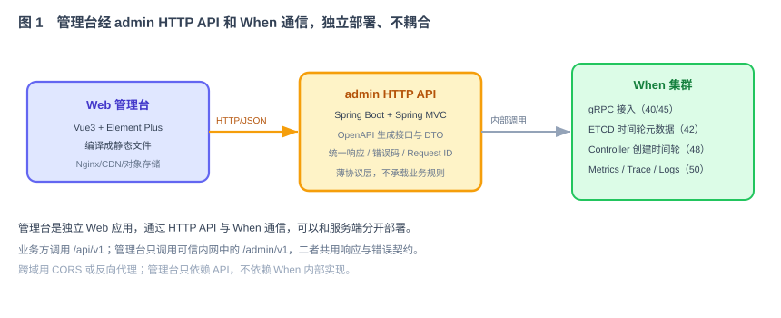
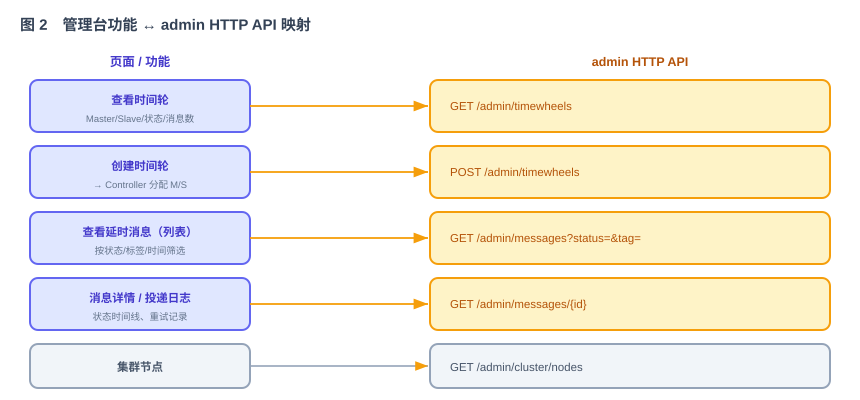

# 第 51 节：Web 管理台（Loop 原料）

> 本节交付两部分：HTTP API 和 Vue 运维控制台。HTTP API 分为业务消息接口 `/api/v1` 和管理接口 `/admin/v1`；控制台只调用管理接口。
>
> 十一段模板，引用第 42（ETCD 元数据）+ 45（接入/查询）+ 48（Controller 创建时间轮）+ 50（Metrics）。

---

## 1. 这一节做什么

一句话：**提供业务 HTTP API 和管理 HTTP API，并实现使用管理 API 的 Vue 运维控制台。**

业务 HTTP API 向调用方提供 Submit、Query、Cancel；管理 API 提供时间轮、消息和集群视图。控制台是独立 Web 应用，通过管理 API 查看时间轮、创建时间轮、筛选消息和查看集群节点。

---

## 2. 为什么这么设计

**为什么在本节提供 HTTP API。**



第 40 节提供 gRPC 传输契约，第 45 节提供消息操作的应用处理接口。本节把这些能力映射为 HTTP：业务路由调用第 45 节的 Submit、Query、Cancel；管理路由读取 ETCD 元数据并调用 Controller。HTTP 层只处理协议转换、参数映射和错误码映射，不重复实现业务流程。

**为什么前端选 Vue3 + Element Plus。** 上手快、组件齐、打包简单，适合 MVP 阶段快速做出可用界面；对中小团队/单人项目友好（技术方案 §12.1）。React 也行，不是重点。

**为什么"创建时间轮"是控制台功能。** 时间轮的增减是运维动作。控制台发一个创建请求，交给 Controller（第 48 节）分配 Master/Slave 节点、写入 ETCD 元数据。运维不必手动改 ETCD。

**为什么管理台不与服务端耦合。** 编译成静态文件，放 Nginx/CDN/对象存储都行，跨域用 CORS 或反向代理。它只依赖 API 契约，不依赖 When 内部实现，When 升级不影响它（技术方案 §12.1）。

**消息列表从哪里查。** 第 41 节的消息 key 适合按 `message_id` 查询和按时间轮恢复，不适合直接列出全量消息。管理 API 不能对 Redis 执行全库 `KEYS`，也不能每翻一页就 `SCAN` 全库。本节增加一个只用于管理查询的分桶索引：按小时和固定分片保存 `deliver_at → message_id`，单个桶达到上限后继续分片。查询先按时间范围读取候选 ID，再批量读取消息并按状态、标签过滤。这个索引不是调度依据，短暂更新失败不影响投递，但必须有后台修复任务。

---

## 3. 它和 Loop 的关系

本节作为 Loop 输入，产出 HTTP API（后端）和 Vue 控制台（前端）两部分。

- **明确输入**：功能↔API 映射（第 5、6 节）、核心页面状态、API 字段和管理查询索引（第 7 节）。
- **自动化验收**：第 8 节——业务和管理 API 返回正确、创建时间轮后可查询到对应元数据、页面能够查询、筛选和创建。
- **边界**：第 9 节——只做控制台 + admin API，不改核心业务逻辑。

---

## 4. 依赖与被依赖

**本节依赖（上游）**

- 第 45 节：查询消息、取消（admin API 映射到它）。
- 第 42 节：`/when/timewheels` 元数据（查看时间轮）。
- 第 48 节：`Controller.createTimeWheel`（创建时间轮）。
- 第 50 节：Metrics（可在控制台展示概要）。
- 第 43 节：集群节点视图。

**本节产出、被谁消费（下游）**

| 本节产出 | 被哪节消费 | 怎么用 |
|---|---|---|
| 业务 HTTP API | 第 53 节联调、业务调用方 | HTTP 提交、查询和取消消息 |
| admin HTTP API | 第 53 节联调、管理台 | 查看消息、时间轮和集群，创建时间轮 |
| Vue 控制台（静态） | 第 53 联调（看页面） | 打开页面看时间轮、消息、集群 |
| 时间轮/消息的只读视图 | 运维 | 日常巡检 |

---

## 5. 功能与交互

**功能 ↔ API 映射**：



- **业务消息操作**：`POST /api/v1/messages`、`GET /api/v1/messages/{id}`、`DELETE /api/v1/messages/{id}` → 调用第 45 节应用处理接口。
- **查看时间轮**：`GET /admin/v1/timewheels` → 读 ETCD `/when/timewheels/*` 和消息数。
- **创建时间轮**：`POST /admin/v1/timewheels` → 调 `Controller.createTimeWheel` → 返回分配结果。
- **查看延时消息**：`GET /admin/v1/messages?status=&tag=&sink_type=&from=&to=&cursor=&limit=` → 列表和筛选结果。
- **消息详情/投递记录**：`GET /admin/v1/messages/{id}` → 状态、时间和最近 20 次投递尝试；每次只返回清理后的结果码与错误摘要。
- **集群节点**：`GET /admin/v1/cluster/nodes` → 返回第 43 节维护的节点列表。

**管理查询索引**：消息创建成功后，异步写入有界 ZSet `when:admin:idx:{yyyyMMddHH}:{shard}:{part}`，score 是 `deliver_at`，member 是 `message_id`。`shard=hash(message_id)%16`，每个 part 最多 10,000 条，索引按终态保留期设置 TTL。查询默认最近 24 小时，最大跨度 7 天，每页最多 100 条。API 使用游标翻页，避免页码越大查询越慢。

**索引修复**：写管理索引失败时记录指标和待修复任务。后台任务按时间轮的小 key 索引补写最近时间窗口。管理页面需要提示“列表可能延迟”，但按 ID 查询始终直接读取消息主记录。管理索引绝不能参与提交、调度、取消或故障恢复。

**核心页面**：

- **任务列表页**：顶部筛选（状态/时间/sink_type/business_tag）+ 表格（message_id/状态/创建/到期/sink/操作）+ 游标分页。
- **消息详情页**：消息基本信息 + 最近 20 次投递时间线（尝试时间、结果、稳定错误码、清理后的错误摘要）。
- **时间轮与集群页**：查看 Master/Slave、同步状态、分配版本、消息数量和节点就绪状态；创建时间轮前显示数量和分配预览。

所有页面都要有加载中、空数据、失败和数据可能延迟四种状态。请求失败不能只在控制台打印错误；取消消息、创建时间轮等写操作必须禁用重复点击，并显示服务端返回的 `request_id`，便于查日志。

---

## 6. 接口 / 契约设计（admin HTTP API）

```text
POST   /api/v1/messages                → Submit
GET    /api/v1/messages/{id}           → Query
DELETE /api/v1/messages/{id}           → Cancel
GET  /admin/v1/timewheels              → [{tw_id, master, slave, status, sync_state, message_count}]
POST /admin/v1/timewheels              body:{count,request_id} → {created:[tw_id...], assignments:[...]}
GET  /admin/v1/messages?status=&tag=&sink_type=&from=&to=&cursor=&limit=
                                       → {items:[...], next_cursor, index_updated_at}
GET  /admin/v1/messages/{id}           → {..., retry_count, last_error_code, delivery_attempts:[...]}
GET  /admin/v1/cluster/nodes           → [{node_id, endpoint, ready, roles, load, is_controller}]
GET  /metrics                          → Prometheus（第 50 节）
```

- 业务 API 和 gRPC 都委托第 45 节的应用处理接口，不互相调用，也不重复实现业务逻辑。
- 管理列表使用不透明 `cursor`，客户端不能解析或修改；`limit` 默认 50、最大 100。
- `from/to` 表示 `deliver_at` 范围，使用 Unix 毫秒；默认最近 24 小时，最大跨度 7 天。超出范围返回 400，不执行大范围扫描。
- `POST /admin/v1/timewheels` 的 `request_id` 是幂等键。相同请求重复提交返回第一次结果，不能重复创建。
- OpenAPI 文件是 HTTP 契约的一部分，后端路由、前端类型和集成测试都从同一份定义检查。

统一错误结构：

```json
{
  "code": "INVALID_TIME_RANGE",
  "message": "查询时间范围不能超过 7 天",
  "request_id": "req_...",
  "details": {}
}
```

错误 `code` 稳定，前端按 code 显示提示；`message` 可以调整，不作为程序判断条件。服务端异常返回 500 和 request ID，不把堆栈传给浏览器。

---

## 7. 字段 / 页面元素

**任务列表页字段**：message_id、status、created_at、deliver_at、sink_type、business_tag、操作（详情/取消）。
**消息详情页**：message_id、status、created_at、deliver_at、sink_type、business_tag；时间线包含 attempt_id、started_at、finished_at、result、error_code，最多 20 条。
**时间轮页**：tw_id、master、slave、status、sync_state、assignment_version、message_count。

约定：时间用 Unix 毫秒，前端 date picker 转换；状态用枚举直传；列表不返回 payload、完整目标地址和 Sink 密钥。投递记录只保留最近 20 次，和消息主记录使用相同 TTL。

---

## 8. 验收标准 + 必须有的测试（自动化验收）

**功能验收**

- [ ] `GET /admin/v1/timewheels` 返回时间轮列表，字段含 master/slave/status/assignment_version/message_count。
- [ ] `POST /admin/v1/timewheels` 经 Controller 创建时间轮；同一个 `request_id` 重复提交不会重复创建。
- [ ] `GET /admin/v1/messages` 支持按 status/tag/sink_type/时间筛选和游标分页，不使用 Redis `KEYS` 或全库 `SCAN`。
- [ ] `GET /admin/v1/messages/{id}` 返回状态、最近错误和最多 20 次投递记录，不返回 payload 和敏感配置。
- [ ] 控制台任务列表、消息详情、时间轮和集群页面能正常渲染、筛选和翻页，并处理加载、空数据、失败与数据延迟状态。
- [ ] 管理台可独立部署（静态文件），经 CORS/反代访问 API，不与服务端同进程。
- [ ] 管理查询索引写入失败不影响消息投递，后台修复后列表可以查到该消息。

**必须有的测试**

- [ ] API 集成测试：各 admin 端点返回结构正确。
- [ ] 创建时间轮端到端：POST → Controller 分配 → GET 能查到新时间轮。
- [ ] 游标分页测试：跨小时、跨分片连续翻页，没有重复或遗漏；非法/过期 cursor 返回明确错误。
- [ ] 索引修复测试：故意让索引写入失败，确认业务提交成功，修复任务运行后管理列表可见。
- [ ] OpenAPI 契约测试：后端响应和前端类型与定义一致。
- [ ] 前端组件测试：四种页面状态、筛选、翻页、重复点击保护和服务端错误提示。

---

## 9. 边界（本节不做什么）

- **不改**核心业务逻辑——HTTP API 是协议转换层，委托第 45 节应用服务、ETCD 查询和 Controller。
- **不做**用户、角色和权限管理；MVP 使用部署侧身份代理或一个从环境变量注入的管理令牌。没有保护时，管理 API 只能监听本地或受信管理网络。
- **不做**无限投递历史；每条消息只保留最近 20 次投递记录。
- **只做**：业务 HTTP API、admin HTTP API 和 Vue 控制台。
- **停止条件**：功能↔API 全通、创建时间轮生效、页面可用、独立部署验收全部通过。

---

## 10. 专属 Harness（叠加在公共 Harness 之上）

**代码**

- 后端 admin HTTP 层放 `api/admin`，协议转换层只做映射，不写业务逻辑。
- 管理查询经 `AdminQueryService`，使用分桶、分片、带 TTL 的只读索引；禁止 Redis `KEYS` 和无边界 `SCAN`。
- 前端独立工程，产物为静态文件；只通过 API 契约依赖后端。

**安全**（强制约束）

- admin API 不回显 payload 原文、不回显 sink_config 敏感值；跨域白名单化，不用 `*`。
- 管理令牌从环境或密钥管理注入，不硬编码；日志只记录认证结果和 request ID，不记录令牌。
- 写操作要求 `request_id` 并做幂等处理；前端同时禁用重复点击。

**依赖**

- 后端复用已有 gRPC/ETCD/Controller 客户端；前端 Vue3 + Element Plus。

---

## 11. 交付物清单（这节结束应产出）

- [ ] 业务 HTTP API（Submit、Query、Cancel）。
- [ ] admin HTTP API（timewheels 查/建、messages 查/详情、cluster/nodes）及 OpenAPI 定义。
- [ ] `AdminQueryService`、分桶索引、游标分页和索引修复任务。
- [ ] 每条消息最近 20 次投递记录的查询与脱敏。
- [ ] Vue3 + Element Plus 控制台：任务列表、消息详情、时间轮和集群页面。
- [ ] 独立部署配置（静态产物 + CORS/反代说明）。
- [ ] API 集成、OpenAPI 契约、游标分页、索引修复、创建时间轮幂等和前端组件测试。
- [ ] 本文档第 4—11 节作为该模块的 Loop 输入规格。

> 完成本节后，业务方可以通过 HTTP 操作消息，运维人员可以通过管理台查看消息、时间轮和集群状态。下一节提供部署和 CI 配置。
