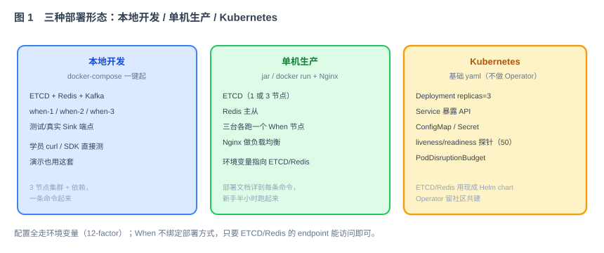
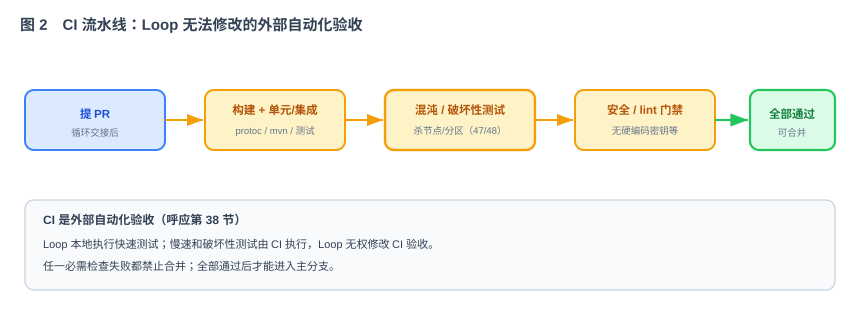

# 第 52 节：When 打包与部署——TGZ、Docker、Kubernetes 与 CI（Loop 原料）

> 本节只打包和部署 When 本身。Redis、ETCD、Kafka、HTTP 下游、Prometheus、Loki、Tempo 等都是外部服务，不进入 When 的 TGZ、Docker 镜像或 Kubernetes 清单。
>
> 十一段模板，引用第 50 节的健康检查与可观测配置、第 51 节的 HTTP 服务，以及各模块的运行参数。

---

## 1. 这一节做什么

一句话：**从同一份代码产出三种 When 制品：可解压启动的 TGZ、只包含 When 的容器镜像、只部署 When 的 Kubernetes 清单，并用 Makefile 统一构建入口。**

学员最终只需要记住三个核心命令：

```bash
make release       # 构建、测试并生成 TGZ 发布包
make image         # 构建 When 容器镜像
make k8s-validate  # 校验只包含 When 的 Kubernetes 清单
```

三种形态使用同一套配置项，连接部署方已经准备好的 Redis、ETCD，以及按需使用的 Kafka、可观测后端和 HTTP 下游。发布包不负责安装、启动或管理这些外部服务。

---

## 2. 为什么这么设计



**为什么先有 `make release`。** TGZ 是最容易理解和检查的发布形式。使用方不需要 Maven、Node 或源码，解压、填写配置、执行启动脚本即可运行 When。Docker 镜像也应复用同一个服务端构建结果，避免 TGZ 和镜像实际装了两套不同内容。

**为什么不把 Redis、ETCD 放进发布包。** 它们是 When 的运行依赖，不是 When 制品的一部分。开发、测试、生产对依赖的地址、认证、拓扑和可用性要求不同，When 只声明连接契约并在启动时检查，不能替部署方决定依赖如何安装和运维。

**为什么 Kubernetes 只部署 When。** 本项目维护 When 的 StatefulSet、Service、ConfigMap、Secret 引用、探针和 PDB，不维护 Redis、ETCD、Kafka 的 StatefulSet、Helm Chart 或 Operator。组织可以连接已有中间件、托管服务或平台统一提供的实例。

**为什么使用 Makefile。** Makefile 把本地、CI 和发布过程收敛成同一组可执行目标。命令名称、依赖关系、输出目录和失败行为都固定，避免文档写一套、CI 再拼一套 Shell。



---

## 3. 它和 Loop 的关系

本节是提供给 Loop 的发布任务规格，产出 Makefile、TGZ、Dockerfile、Kubernetes 清单、CI 和部署文档。

- **明确输入**：制品边界、Make 目标、TGZ 目录、外部依赖配置、容器和 K8s 规则（第 5、6、7 节）。
- **自动化验收**：第 8 节验证 `make release`、解压启动、镜像内容、K8s 清单和 CI。
- **边界**：第 9 节明确禁止把 Redis、ETCD、Kafka、观测后端或测试下游放入 When 制品。

---

## 4. 依赖与被依赖

**本节依赖（上游）**

- 第 50 节：`/health`、`/ready`、`/metrics`、日志和 OTLP 配置。
- 第 51 节：Spring Boot 服务端和独立的管理台静态产物。
- 第 39—49 节：所有服务端模块及其运行配置。

**本节产出、被谁消费（下游）**

| 本节产出 | 被哪节消费 | 怎么用 |
|---|---|---|
| `when-server-{version}.tgz` | 本地、传统主机、第 53 节 | 解压并连接外部依赖启动 |
| `when-admin-web-{version}.tgz` | 静态 Web 服务器 | 独立部署管理台，不嵌入服务端进程 |
| When OCI 镜像 | Docker / Kubernetes / 第 53 节 | 只启动 When Server |
| When K8s 清单 | Kubernetes / 第 53 节 | 部署 When StatefulSet 与 Service |
| Makefile 与 CI | 开发者、发布流程 | 使用相同目标构建和验收 |

---

## 5. 功能与交互

### 5.1 Makefile 基础语法

Makefile 的基本形式是：

```makefile
目标: 前置目标
	命令
```

- `目标` 是用户执行的名字，例如 `release`；
- `前置目标` 会先执行，例如 `release: verify server`；
- 命令行必须以 **Tab** 开头，不是空格；
- `.PHONY` 表示目标不是同名文件；
- `?=` 表示外部没有传值时才使用默认值；
- `$@` 表示当前目标，`$<` 表示第一个依赖文件；
- 任一命令退出码非 0，Make 立即失败，不能继续产出“看起来成功”的制品。

项目 Makefile 至少包含：

```makefile
SHELL := /usr/bin/env bash
VERSION ?= $(shell git describe --tags --always --dirty)
DIST_DIR := $(CURDIR)/dist
IMAGE_REPO ?= whenproject/when

.PHONY: help clean clean-dist verify server admin-web release release-server release-web \
        check-release image k8s-validate

help:
	@printf '%s\n' 'make release' 'make image' 'make k8s-validate'

clean:
	./mvnw -q clean
	$(MAKE) clean-dist

clean-dist:
	rm -rf -- "$(CURDIR)/dist"

verify:
	./mvnw -B -ntp verify

server:
	./mvnw -B -ntp -pl when-app -am package -DskipTests

admin-web:
	corepack pnpm --dir when-admin-web install --frozen-lockfile
	corepack pnpm --dir when-admin-web build

release-server: server
	./build/package-server.sh "$(VERSION)" "$(DIST_DIR)"

release-web: admin-web
	./build/package-web.sh "$(VERSION)" "$(DIST_DIR)"

check-release:
	./build/check-release.sh "$(VERSION)" "$(DIST_DIR)"

release: verify
	$(MAKE) clean-dist
	$(MAKE) release-server VERSION="$(VERSION)"
	$(MAKE) release-web VERSION="$(VERSION)"
	$(MAKE) check-release VERSION="$(VERSION)"

image: server
	docker build --build-arg VERSION="$(VERSION)" \
	  -t "$(IMAGE_REPO):$(VERSION)" .

k8s-validate:
	kubectl kustomize deploy/k8s/base >/dev/null
```

`release-server`、`release-web` 和 `check-release` 的具体命令可以调用 `build/` 下的固定脚本，避免在 Makefile 中堆积大量 Shell；这些脚本同样必须有明确输入、输出、超时和退出码。

### 5.2 TGZ 发布包

执行：

```bash
make release VERSION=1.0.0
```

固定产出：

```text
dist/
├── when-server-1.0.0.tgz
├── when-admin-web-1.0.0.tgz
├── checksums.txt
└── sbom/
```

服务端 TGZ 解压后必须是：

```text
when-server-1.0.0/
├── bin/
│   └── when                 # run / start / stop / status
├── lib/
│   └── when-server.jar
├── conf/
│   ├── application.example.yml
│   └── logback.xml
├── licenses/
├── VERSION
└── README.md
```

`bin/when run` 前台运行，供 systemd 和容器使用；`start/stop/status` 供本地与传统主机使用。脚本只管理当前 When 进程和自己的 PID 文件，不能启动或停止 Redis、ETCD、Kafka。

本地启动示例：

```bash
tar -xzf dist/when-server-1.0.0.tgz
cd when-server-1.0.0
cp conf/application.example.yml conf/application.yml
# 填写外部 Redis、ETCD 等连接信息
bin/when start --config conf/application.yml
bin/when status
curl -fsS http://127.0.0.1:8081/ready
bin/when stop
```

### 5.3 Docker 镜像

执行：

```bash
make image VERSION=1.0.0 IMAGE_REPO=registry.example.com/when
```

镜像只包含 JRE、When Server、默认非敏感配置和许可证，不包含 Maven、Node、源码、Redis、ETCD、Kafka、Grafana 或测试工具。入口固定执行 `bin/when run`，配置通过环境变量或只读挂载文件注入。

启动示例：

```bash
docker run --rm --name when-1 \
  --env-file ./conf/when.env \
  -p 8080:8080 -p 8081:8081 -p 9090:9090 \
  registry.example.com/when:1.0.0
```

`when.env` 必须填写外部 Redis、ETCD 地址；使用 Kafka Sink 或 OTLP 导出时再填写对应外部地址。依赖不可用时容器可以继续运行并重连，但 `/ready` 必须返回 503。

### 5.4 Kubernetes 部署

`deploy/k8s/` 只允许出现 When 相关资源：

- StatefulSet：默认 3 个 When Pod；
- Headless Service：节点稳定地址；
- 业务 Service：HTTP API；
- 管理 Service：Admin、Metrics 和健康检查，只在管理网络开放；
- ConfigMap：非敏感 When 配置；
- Secret 引用：引用部署方预先创建的凭据；
- PDB、PodAntiAffinity/TopologySpread、ServiceAccount 和安全上下文。

清单不得创建 Redis、ETCD、Kafka、Prometheus、Loki、Tempo、Grafana 或 HTTP Mock。`ConfigMap` 与 `secretKeyRef` 只保存或引用连接信息。

部署示例：

```bash
kubectl -n when apply -k deploy/k8s/base
kubectl -n when rollout status statefulset/when --timeout=300s
kubectl -n when get pods,svc
```

### 5.5 启动、停止与升级

启动顺序：加载配置 → 校验必填连接信息 → 初始化客户端 → 注册节点 → 恢复本地角色 → `/ready=200`。外部依赖未就绪时保持重连和非就绪状态，不通过重启风暴解决。

收到 SIGTERM 时先让 `/ready` 返回 503、停止接收新请求，再停止本地调度和续约，等待正在执行的投递结束，最长 30 秒后退出。StatefulSet 逐个滚动升级，前一个 Pod 恢复就绪后才更新下一个。

---

## 6. 配置契约

TGZ、Docker 和 Kubernetes 使用同一套配置名。非敏感配置可以写入 `application.yml` 或环境变量；密码、Token 和证书只能通过环境变量、Kubernetes Secret 或平台密钥系统注入。

| 变量 | 必填 | 默认值 | 说明 |
|---|---|---|---|
| `WHEN_NODE_ID` | 是 | — | 集群内唯一稳定节点名；K8s 使用 Pod 名 |
| `WHEN_WORKER_ID` | 是 | — | Snowflake worker ID，范围 0—1023且存活节点不重复 |
| `WHEN_HTTP_PORT` | 否 | `8080` | 业务 HTTP 端口 |
| `WHEN_MANAGEMENT_PORT` | 否 | `8081` | Admin、Metrics 和健康检查端口 |
| `WHEN_GRPC_PORT` | 否 | `9090` | 节点间 gRPC 端口 |
| `WHEN_ETCD_ENDPOINTS` | 是 | — | 外部 ETCD 地址列表 |
| `WHEN_ETCD_USERNAME` | 按环境 | — | 外部 ETCD 用户名 |
| `WHEN_ETCD_PASSWORD` | 按环境 | — | 外部 ETCD 密码，只能从 Secret 注入 |
| `WHEN_REDIS_HOST` | 是 | — | 外部 Redis 主机 |
| `WHEN_REDIS_PORT` | 否 | `6379` | 外部 Redis 端口 |
| `WHEN_REDIS_USERNAME` | 按环境 | — | 外部 Redis 用户名 |
| `WHEN_REDIS_PASSWORD` | 按环境 | — | 外部 Redis 密码，只能从 Secret 注入 |
| `WHEN_REDIS_TLS` | 否 | `false` | 是否使用 TLS |
| `WHEN_KAFKA_BOOTSTRAP_SERVERS` | 使用 Kafka Sink 时 | — | 外部 Kafka 地址 |
| `OTEL_EXPORTER_OTLP_ENDPOINT` | 使用 Trace 导出时 | — | 外部 OpenTelemetry Collector 地址 |
| `WHEN_LOG_LEVEL` | 否 | `INFO` | 根日志级别 |
| `WHEN_LOG_FORMAT` | 否 | `json` | `json` 或 `plain` |
| `WHEN_SHUTDOWN_TIMEOUT` | 否 | `30s` | 优雅退出最长等待时间 |

`conf/application.example.yml` 必须把外部依赖写清楚，并只使用环境变量占位：

```yaml
when:
  node-id: ${WHEN_NODE_ID}
  worker-id: ${WHEN_WORKER_ID}
  ports:
    http: ${WHEN_HTTP_PORT:8080}
    management: ${WHEN_MANAGEMENT_PORT:8081}
    grpc: ${WHEN_GRPC_PORT:9090}
  cluster:
    etcd:
      endpoints: ${WHEN_ETCD_ENDPOINTS}
      username: ${WHEN_ETCD_USERNAME:}
      password: ${WHEN_ETCD_PASSWORD:}
  storage:
    redis:
      host: ${WHEN_REDIS_HOST}
      port: ${WHEN_REDIS_PORT:6379}
      username: ${WHEN_REDIS_USERNAME:}
      password: ${WHEN_REDIS_PASSWORD:}
      tls: ${WHEN_REDIS_TLS:false}
  sinks:
    kafka:
      bootstrap-servers: ${WHEN_KAFKA_BOOTSTRAP_SERVERS:}
  observability:
    otlp-endpoint: ${OTEL_EXPORTER_OTLP_ENDPOINT:}
```

空默认值只适用于可选能力。`WHEN_ETCD_ENDPOINTS`、`WHEN_REDIS_HOST` 等必填变量没有默认地址，尤其不能默认指向 `localhost`。

配置优先级固定为：命令行 `--config` 指定文件中的值 < 环境变量。缺少 Redis 或 ETCD 必填项时启动失败并指出变量名；不能偷偷连接 localhost。日志和错误响应不得打印密码或完整带凭据连接串。

Kubernetes 从 StatefulSet Pod 名末尾序号计算默认 worker ID，并允许用显式环境变量覆盖。启动后仍要通过 ETCD 原子登记 node ID 与 worker ID；冲突时节点必须启动失败。

---

## 7. 制品与 CI 阶段

**仓库交付结构**：

```text
Makefile
Dockerfile
.dockerignore
build/package-server.sh
build/package-web.sh
build/check-release.sh
deploy/k8s/base/
deploy/examples/application.yml
deploy/examples/when.env
.github/workflows/ci.yml
DEPLOY.md
```

不存在 `deploy/compose/`，也不提供依赖组件的安装清单。

**CI 阶段**：

| Job | 主要命令 | 验收重点 |
|---|---|---|
| `verify` | `make verify` | 编译、单元、契约和集成测试 |
| `release` | `make release` | TGZ 目录、版本、校验和、SBOM |
| `tgz-smoke` | 解压 TGZ 后执行 `bin/when run` | 使用 CI 注入的外部测试依赖验证启动和 `/ready` |
| `image` | `make image` | 镜像可启动、非 root、内容边界正确 |
| `k8s-validate` | `make k8s-validate` | 只包含 When 资源、配置与探针有效 |
| `security` | 依赖、密钥、镜像和 SBOM 扫描 | 无明文 Secret、无高危漏洞 |

CI 可以由测试 Harness 临时提供依赖地址，但这些测试设施不进入 TGZ、镜像、K8s 清单或发布附件。失败时上传构建日志、测试报告和制品检查结果；清理只处理本次 CI 创建的测试资源。

---

## 8. 验收标准与必须有的测试

**功能验收**

- [ ] `make release VERSION=1.0.0` 一条命令完成测试和打包，并生成 Server TGZ、Web TGZ、校验和与 SBOM。
- [ ] Server TGZ 解压后无需 Maven、Node 或源码，通过配置外部 Redis/ETCD 后可执行 `bin/when start`。
- [ ] TGZ 不包含 Redis、ETCD、Kafka、观测后端的二进制、镜像、数据目录或启动脚本。
- [ ] `make image` 生成只包含 When 运行时的镜像；通过环境变量或挂载配置连接外部依赖并成功就绪。
- [ ] Kubernetes 清单只创建 When StatefulSet、Service 和配套配置，不创建任何外部依赖资源。
- [ ] 外部 Redis/ETCD 不可用时 `/health` 与 `/ready` 语义符合第 50 节；恢复后节点自动重新就绪。
- [ ] TGZ、镜像和 K8s 使用完全相同的配置名和默认值。
- [ ] 镜像使用明确版本、非 root 用户、只读根文件系统和最小权限，并有 CPU/内存 requests 与 limits。
- [ ] CI 使用 Make 目标，不另外维护一套构建命令；任一必需检查失败都不能发布。
- [ ] 第 52 阶段可以创建 CI 文件；阶段通过后，第 53 节不能修改 CI 来降低验收标准。

**必须有的测试**

- [ ] Makefile 测试：`help/clean/verify/release/image/k8s-validate` 目标存在，依赖关系正确，失败能向上传递退出码。
- [ ] TGZ 内容测试：目录、权限、版本、许可证、校验和正确；不存在外部依赖文件和构建缓存。
- [ ] TGZ 冒烟：连接预先准备的 Redis/ETCD，执行 start → ready → Submit/Query → stop。
- [ ] 镜像冒烟：连接相同外部依赖启动 When，验证端口、探针、非 root 和只读文件系统。
- [ ] K8s 静态测试：渲染清单并断言没有 Redis/ETCD/Kafka/观测后端资源，Secret 只被引用且没有明文值。
- [ ] K8s 部署测试：在已有外部依赖地址的测试环境只部署 3 个 When Pod，验证就绪、滚动升级和优雅退出。
- [ ] 配置一致性测试：三种形态缺少必填项时产生相同错误；凭据不会出现在日志、制品和清单中。
- [ ] 可重复构建测试：同一源码和版本生成相同文件清单；归档时间戳和顺序规范化。

---

## 9. 边界

- **不打包、不部署、不管理** Redis、ETCD、Kafka、HTTP Mock、Prometheus、Loki、Tempo、Grafana 和 OpenTelemetry Collector。
- **不提供** docker-compose 完整环境或依赖组件 Helm Chart。
- **不做** K8s Operator、自动扩缩容和外部中间件高可用方案。
- **不自动创建**生产 Secret、镜像仓库、负载均衡器或代码托管平台分支保护。
- **只做** When Server TGZ、独立管理台静态包、When 镜像、When K8s 清单、Makefile、CI 和部署文档。
- **停止条件**：三种 When 制品都能连接同一组外部依赖启动，内容边界和安全验收全部通过。

---

## 10. 专属 Harness

**制品边界**

- 制品内容使用白名单生成，不从工作目录直接整体打包。
- `check-release.sh` 扫描归档和镜像层，发现 Redis/ETCD/Kafka 二进制、compose 文件、测试数据或凭据立即失败。
- K8s 清单按资源 Kind、镜像和名称做白名单检查，只允许 When 相关资源。
- TGZ 冒烟、镜像冒烟和 K8s 测试都使用 Harness 注入的外部依赖地址。

**构建与安全**

- Dockerfile 使用多阶段构建，运行阶段只保留 JRE 和 When 文件。
- `.dockerignore` 排除 Git、构建缓存、测试输出、凭据和本地配置。
- 所有脚本使用严格错误处理、明确工作目录和安全的临时目录；只能清理自己创建的路径和进程。
- CI 对外部 PR 使用只读权限，不向构建步骤暴露生产 Secret；第三方 Action 固定版本或 commit。
- 发布制品生成 SHA-256 校验和和 SBOM，镜像标签不得使用 `latest`。

**配置**

- 示例只填写变量名、格式和假地址，不包含可用凭据。
- 外部依赖地址必须显式提供；没有配置时不能回退 localhost 或内置实例。
- Secret 值不进入命令行参数、进程列表、日志、报告和 Git。

---

## 11. 交付物清单

- [ ] Makefile：`help/clean/verify/server/admin-web/release/check-release/image/k8s-validate`。
- [ ] `when-server-{version}.tgz`：启动脚本、Jar、示例配置、许可证、版本说明。
- [ ] `when-admin-web-{version}.tgz`：独立静态管理台。
- [ ] 多阶段 Dockerfile、`.dockerignore` 和只包含 When Server 的 OCI 镜像。
- [ ] `deploy/k8s/base/`：只部署 When 的 StatefulSet、Service、ConfigMap、Secret 引用、探针、PDB 和安全上下文。
- [ ] `deploy/examples/`：连接外部 Redis、ETCD、Kafka 和 OTLP Collector 的配置示例。
- [ ] `build/`：打包、制品检查和可重复构建脚本。
- [ ] `.github/workflows/ci.yml`：verify、release、TGZ smoke、image、K8s validate/deploy 和 security。
- [ ] `DEPLOY.md`：TGZ、Docker、K8s 的前置外部依赖、配置、启动、升级、回退和排错。
- [ ] Make、TGZ、镜像、K8s、配置一致性和制品边界测试。
- [ ] 本文档第 4—11 节作为该模块的 Loop 输入规格。

> 完成本节后，When 可以作为一个独立组件发布：使用方自行提供 Redis、ETCD 等基础设施，When 用统一配置接入，不把依赖一起带走。
