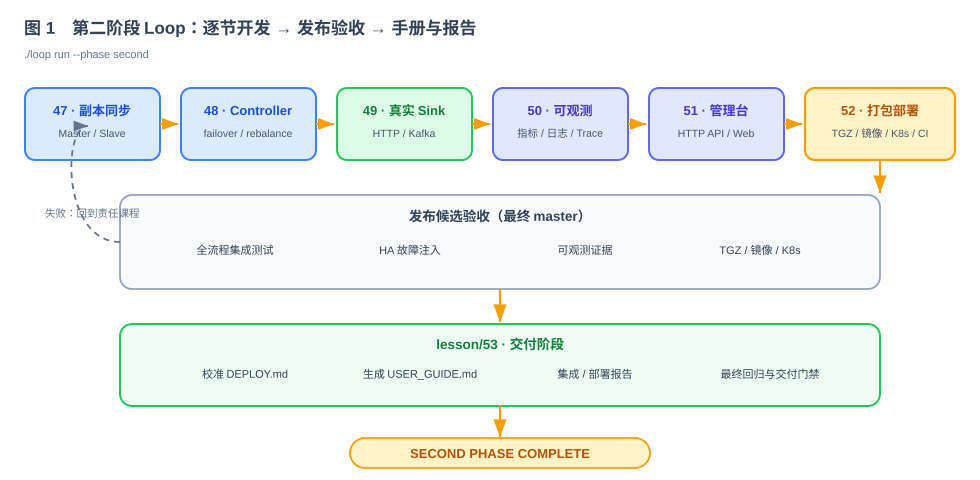
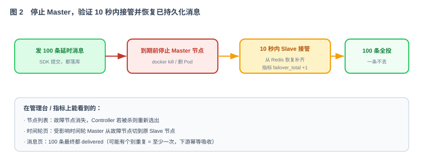

# 第 53 节：Loop 运行演示·联调（第二次跑 · 完整 HA）

> 第 46 节验证了单节点核心链路。本节集成第 47—52 节的输出，运行完整的高可用（HA）场景：部署三节点集群、验证 HTTP/Kafka 投递、查看管理台，并执行故障切换测试。
>
> 运行手册结构（同第 46 节），不是模块原料。

---

## 1. 这一节做什么

一句话：**部署完整集群，验证消息操作、真实投递、管理台和节点故障切换。**

本节不再生成模块代码，而是执行完整验收：部署集群 → 通过业务 HTTP API 或 SDK 提交、查询和取消消息 → 验证 HTTP/Kafka 下游收到消息 → 查看管理台 → 停止 Master 节点并检查 10 秒内完成切换。

---

## 2. 相比第 46 节，本次增加了哪些真实能力

- 测试 Sink → **HTTP/Kafka 真实投递**（49）。
- 单副本 → **Master/Slave + 10 秒故障切换**（47）。
- 静态时间轮分布 → **Controller 动态 rebalance + 多节点分发**（48）。
- 看不见 → **指标 / 日志 / 健康检查**（50）。
- 手工起 → **一键自动部署**（52）。
- 无界面 → **可查询和操作的管理台**（51）。

第 46 节明确排除的高可用、真实投递、可观测、部署和管理台能力，在本次联调中全部纳入验收。

---

## 3. 跑之前要具备什么

- 40–52 原料全部产出、各自验收通过。
- 整体 Harness 升级：把 47–52 的验收并进第 46 节的总验收；CI 加上故障测试（停止节点、网络分区）。第 52 节生成的 CI 文件在本节已经冻结，不能临时修改检查规则。
- 部署制品就绪（52 的 compose / K8s yaml）。
- 一个真实下游：HTTP 回调 mock 端点 + 一个 Kafka topic（替换第 46 节的测试 Sink）。

---

## 4. 怎么跑（四步）

**① 自动部署集群**：执行第 52 节的 `docker compose`、`wait-ready.sh` 和 `smoke.sh`；也可以使用 `kubectl apply -k deploy/k8s/overlays/dev`。环境包含 ETCD、Redis、Kafka、HTTP Mock 和 3 个 When 节点，必须等 `/ready` 全部通过。

**② 验证消息操作**：用客户端 SDK 或第 51 节业务 HTTP API 依次执行：
- `Submit` 一批不同延时的消息（HTTP Sink 指向 mock、Kafka Sink 指向 topic）。
- `Query` 看状态从 PENDING → 到点 DELIVERING → DELIVERED。
- `Cancel` 一条 PENDING，确认变 CANCELLED、不再投。
- 验证真实投递：HTTP 测试端点收到回调，Kafka topic 收到消息。

**③ 看管理台页面**（51）：
- 时间轮页：看 tw 分布（Master/Slave/状态）；点"创建时间轮"，看 Controller 分配、列表刷新。
- 消息页：看列表、按状态/标签筛选；看某条从 pending 变 delivered；看投递日志。
- 集群页：看 3 个节点、谁是 Controller。

**④ 验证高可用切换**：

发 100 条延时消息 → 到期前 `docker kill` 掉某个 Master 节点 → 看：管理台里该节点消失、受影响时间轮 Master 切到原 Slave、指标 `when_master_failover_total` +1；到点后 100 条**全部投递**（可能个别重复 = 至少一次，下游幂等吸收）。

---

## 5. 该跑出什么（第二次跑的成功标准 = 完整 HA）

- 端到端真实投递：Submit → 落库 → 路由 → 到点 → **HTTP/Kafka 真实投递** → 状态流转正确。
- 多节点：消息按一致性 hash 分到不同节点的时间轮，跨节点转发正常（Controller 分布 + 45 路由）。
- 可恢复：停止 Master 前已成功持久化的 100 条消息最终全部进入终态；允许按“至少一次”语义出现重复。
- 10 秒切换：故障到接管 < 10 秒（指标/日志可证）。
- 可观察：指标、`trace_id` 日志和管理台都能显示切换过程及结果。
- 可部署：compose 和 Kubernetes 部署成功，健康探针符合预期。

---

## 6. 发现问题怎么办：修订 47–52 原料，再跑

和第 46 节采用同一处理方式：先修订任务规格，再从干净状态重新执行：

- 切换超 10 秒 / 丢消息 → 第 47。
- 分布不均 / 决策错 → 第 48。
- 投递失败 / 重试不对 → 第 49。
- 看不到 / 指标缺 → 第 50。
- 页面错 / API 错 → 第 51。
- 起不来 / 探针错 → 第 52。

改完从干净状态再跑，直到第 5 节成功标准全部通过。

---

## 7. 验收（本节自动化验收 = 完整 HA 是否跑通）

- [ ] 一键部署 3 节点集群，`/ready` 全部通过。
- [ ] SDK：Submit/Query/Cancel 正确；真实投递到 HTTP mock 与 Kafka topic。
- [ ] 管理台：时间轮可查可建；消息可查可筛；能看到 pending→delivered；集群节点/Controller 正确。
- [ ] 杀 Master：10 秒内切换、100 条不丢；指标/日志/页面三处可证。
- [ ] 多节点分发：消息落在不同节点时间轮，跨节点转发通。
- [ ] 全部测试（含 CI 故障测试）通过。
- [ ] 冒出的问题都以"修订任务规格 + 重跑"解决，无手工补丁。

---

## 8. 边界（本节不做什么）

- **不产新模块原料**——只整合、部署、运行、演示、修订。
- **不做**扩展能力（更多 Sink、鉴权限流、死信、优先级、跨地域、Operator、MCP）——那些在总结的"后续规划"里，社区接力。
- **停止条件**：部署、消息操作、真实投递、管理台和故障切换的验收项目全部通过，发现的规格问题已经修订。

---

## 9. 产出

- [ ] 升级后的整体 Harness（并入 47–52 验收和 CI 故障测试）。
- [ ] 一次可复现的完整 HA 运行：部署 → SDK 测 → 看页面 → HA 演示，全程记录。
- [ ] 修订记录：问题 → 修订到哪一节 → 改了什么。
- [ ] 结论：When 达到"生产可用的分布式延时投递组件"——集群、多副本、自动故障切换、不丢消息，作为可被引用的 AI 编程真实样本。

> 到这里，When 从"一份技术方案"变成"一个能部署、能演示、生产可用的组件"。最后一节（第 54 节）用一份总结 PPT 完成项目回顾：做成了什么、用 Loop Engineering 怎么做的、后续规划与社区推进。
