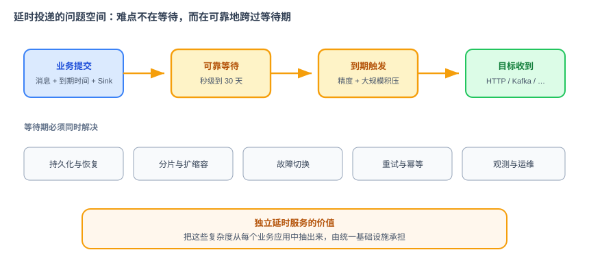
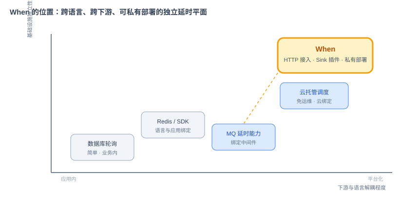

# 项目篇 When：业界调研

> 本文档是 When 项目立项与设计前的业界调研，回答三个问题：延时投递为什么是独立问题，工业界有哪些解法，各类方案的边界在哪里。本文档不定义 When 的功能和实现；项目范围见《When 项目需求文档》，技术取舍见《When 项目技术方案文档》。
>
> 调研口径：截至 2026 年 8 月，优先引用官方文档与项目仓库。本文档讨论的是“把一条消息可靠地保留到指定时刻，再投递到目标系统”，不是通用定时任务编排。

## 1. 问题是什么

延时投递广泛存在于交易、营销、通知和运维系统中：订单在 30 分钟后仍未支付则关闭，优惠券到期前提醒，注册后第 3 天触达，风控观察期结束后继续处理，设备离线后延时告警。

这些场景表面不同，抽象后都有同一条链路：

1. 业务方提交消息，并指定到期时间或延时时长；
2. 系统在等待期间可靠保存消息；
3. 到期后把消息交给 HTTP、Kafka 等目标；
4. 投递失败时按策略重试，并允许查询和取消；
5. 节点故障、重启或扩缩容时，消息仍然不丢。

真正困难的不是“等 N 秒”，而是同时满足长时间跨度、较高精度、大规模积压、故障恢复、至少一次投递、异构下游和可运维性。单机定时器能解决触发问题，却不能独立解决这些工程问题。

## 2. 六类主流方案

### 2.1 业务数据库轮询

最常见的自建方案是在业务表中保存 `deliver_at` 和状态，由定时任务扫描到期记录。

优点是依赖少、事务关系直观、适合低吞吐和已有业务表。缺点也很明确：轮询会制造数据库压力；索引和分片需要随数据量演进；扫描周期限制精度；多个 worker 的抢占、幂等和故障恢复最终都会变成一套调度系统。

它适合规模不大、场景单一、容忍分钟级精度的业务，不适合作为企业共享的延时基础设施。

### 2.2 Redis 延时队列与语言 SDK

常见做法是 Redis ZSet、过期通知，或 BullMQ、Celery 等语言生态队列。它们上手快，适合单一语言团队和局部应用。

边界在于：

- SDK 与语言、进程生命周期绑定，难以成为跨团队公共服务；
- 大 ZSet、大 Hash 或集中扫描容易形成热点和大 Key；
- Redis 故障恢复、任务抢占、重复投递和监控仍需业务方自行补齐；
- 更换语言或下游时，接入逻辑容易重复建设。

因此 SDK 更像“应用内能力”，而不是独立的延时投递平面。

### 2.3 消息队列自带延时能力

RocketMQ 5.0 提供专门的 Delay Topic，并支持按投递时间发送延时消息；其官方文档说明默认时间粒度为 1 秒，消息状态可以持久化。它适合已经标准化使用 RocketMQ 的组织。[RocketMQ Delay Message](https://rocketmq.apache.org/docs/featureBehavior/02delaymessage/)

Kafka、RabbitMQ、Pulsar 也能通过定时能力、插件、重试 Topic 或外围调度服务组合出延时效果。共同边界是：方案会绑定特定消息中间件及其 Topic、客户端、运维体系；而企业内的目标不只有 MQ，还可能是 HTTP 回调或其他系统。

如果组织已经统一中间件，并且延时消息只是其附属能力，直接使用中间件通常最经济；如果目标是提供跨语言、跨下游的统一延时服务，中间件绑定就会成为边界。

### 2.4 任务队列与调度平台

Celery、Sidekiq、XXL-JOB 等工具解决的是“什么时候执行一段任务”。它们擅长 worker 管理、周期任务、失败重试或任务编排，但任务往往绑定代码、执行器或特定语言。

延时投递更关心“什么时候把这份数据可靠地交给指定 Sink”。二者有交集，但不是同一抽象：When 不执行任意业务代码，不承担 DAG、日历调度、资源编排和批处理工作流。

### 2.5 云厂商托管调度

Amazon EventBridge Scheduler 支持一次性、固定频率和 Cron 三种计划，并可调用大量 AWS API；它提供重试和失败保留等托管能力。[AWS EventBridge Scheduler](https://docs.aws.amazon.com/eventbridge/latest/userguide/using-eventbridge-scheduler.html)

Google Cloud Tasks 的任务模型包含 `scheduleTime`，用于指定首次尝试或重试的时间。[Google Cloud Tasks API](https://cloud.google.com/tasks/docs/reference/rest/v2/projects.locations.queues.tasks)

托管方案省运维、弹性好，适合已经深度使用对应云生态的团队。它们的边界是云绑定、权限模型、目标范围、费用与私有化要求。需要在本地、混合云或多云统一运行时，组织仍需要自己的抽象层。

### 2.6 独立延时服务

Airbnb Dynein、Netflix Dyno-queues、滴滴 DDMQ/Chronos 等项目证明了独立延时系统的工程价值：把存储、调度、分片、恢复和投递从业务应用中抽离。[Airbnb Dynein](https://github.com/airbnb/dynein) · [Netflix Dyno-queues](https://github.com/Netflix/dyno-queues) · [滴滴 DDMQ](https://github.com/didi/DDMQ)

但这些项目往往服务于特定公司的技术背景，采用不同的存储、队列和运维假设；有些项目活跃度有限，有些仍然与原有 MQ 体系耦合。它们提供了可靠的设计素材，却没有形成一个面向普通 Java 企业、可独立部署、以 HTTP 接入和插件化 Sink 为核心的通用答案。

## 3. 方案横向比较

| 方案 | 接入成本 | 跨语言 | 下游解耦 | 私有部署 | 高可用责任 | 适合场景 |
|---|---:|---:|---:|---:|---:|---|
| 数据库轮询 | 低 | 中 | 低 | 是 | 业务团队 | 低吞吐、单一业务 |
| Redis/SDK | 低 | 低 | 中 | 是 | 业务团队 | 单语言、局部系统 |
| MQ 延时能力 | 中 | 中 | 低 | 是 | MQ 平台 | 已统一消息中间件 |
| 任务调度平台 | 中 | 中 | 中 | 是 | 平台团队 | 执行任务、批处理、Cron |
| 云托管调度 | 低 | 高 | 中 | 否 | 云厂商 | 云内应用、免运维 |
| 独立延时服务 | 中 | 高 | 高 | 是 | 平台团队 | 多团队、跨语言、异构下游 |

这里不存在绝对最优方案。选择的核心是组织约束：已有基础设施、消息规模、精度、下游类型、私有化要求和愿意承担的运维复杂度。

## 4. 算法与存储的真实取舍

### 4.1 数据库扫描

按时间索引分页扫描直观、持久性好，但扫描成本会随积压量增长，热点时间段容易产生数据库压力。它适合中低规模，或作为最终兜底存储，不适合承担高频内存调度。

### 4.2 Redis ZSet

以到期时间为 score 的 ZSet 很容易实现，但当大量消息集中到一个或少量 key 时，会形成热点和大 Key。可以通过分桶、分片缓解，但系统会逐渐长出路由、迁移和恢复逻辑。

### 4.3 最小堆

最小堆能快速取最近到期消息，但插入和删除为 `O(log n)`，大量长周期任务会长期占据内存；分布式分片和重建也需要额外设计。

### 4.4 时间轮

时间轮通过槽位换取接近 `O(1)` 的插入、删除和推进成本。多层时间轮可以同时覆盖秒级精度和最长 30 天跨度，适合大量延时消息。代价是层级、降级、时钟漂移、持久化恢复和故障切换需要被严格设计。

When 选择“Redis 保存消息事实 + 内存多层时间轮调度”，把可靠保存和高效触发拆开：Redis 负责不丢，时间轮负责到点。

## 5. 市场空位与 When 的位置

调研得到的不是“行业没有延时能力”，而是以下组合仍然稀缺：

- 独立服务，不绑定某一种 MQ 或业务语言；
- HTTP 门面，任何语言都能提交、查询和取消；
- HTTP、Kafka 等 Sink 插件化扩展；
- 私有部署，适配企业现有 Redis、ETCD、Prometheus 和 Kubernetes；
- 从一开始就包含集群、多副本、自动故障切换与可观测；
- 保持足够小的概念和运维面，不发展成通用任务编排平台。

When 占据的就是这个位置：**一个面向企业内部的、可私有部署的分布式延时投递组件**。

## 6. When 不与谁竞争

When 不试图替代所有方案：

- 已经统一使用 RocketMQ，且只需 MQ 延时消息的团队，无须迁移到 When；
- 只有少量定时记录的系统，数据库轮询更简单；
- 需要执行任意代码、DAG 和复杂日历的场景，应使用任务调度或工作流平台；
- 完全运行在单一公有云且接受绑定的团队，托管服务通常更省心。

When 的价值只在一种情况下成立：多个业务、多个语言和多个下游都需要延时投递，并且组织希望由一套统一基础设施承担可靠性和运维责任。

## 7. 对产品设计的结论

调研最终转化成七条产品约束：

1. 接入必须跨语言，MVP 提供 HTTP 门面；
2. 投递目标必须插件化，MVP 先做 HTTP 和 Kafka；
3. 消息必须先持久化再确认，节点重启后可恢复；
4. 调度采用多层时间轮，默认覆盖 1 秒到 30 天；
5. 集群必须具备多副本和自动切换，不能停留在单节点 Demo；
6. 交付语义采用至少一次，并明确要求下游幂等；
7. 产品边界保持克制：不做 MQ、不做通用任务平台、不做工作流引擎。

这七条结论进入《When 项目需求文档》，再由《When 项目技术方案文档》回答如何实现。

## 8. 参考资料

- [Apache RocketMQ：Delay Message](https://rocketmq.apache.org/docs/featureBehavior/02delaymessage/)
- [Amazon EventBridge Scheduler](https://docs.aws.amazon.com/scheduler/latest/userguide/using-eventbridge-scheduler.html)
- [Google Cloud Tasks REST API](https://cloud.google.com/tasks/docs/reference/rest/v2/projects.locations.queues.tasks)
- [Airbnb Dynein](https://github.com/airbnb/dynein)
- [Netflix Dyno-queues](https://github.com/Netflix/dyno-queues)
- [滴滴 DDMQ](https://github.com/didi/DDMQ)
- [Apache Kafka](https://kafka.apache.org/documentation/)
- [Celery](https://docs.celeryq.dev/)
- [Sidekiq](https://github.com/sidekiq/sidekiq)
- [XXL-JOB](https://github.com/xuxueli/xxl-job)
